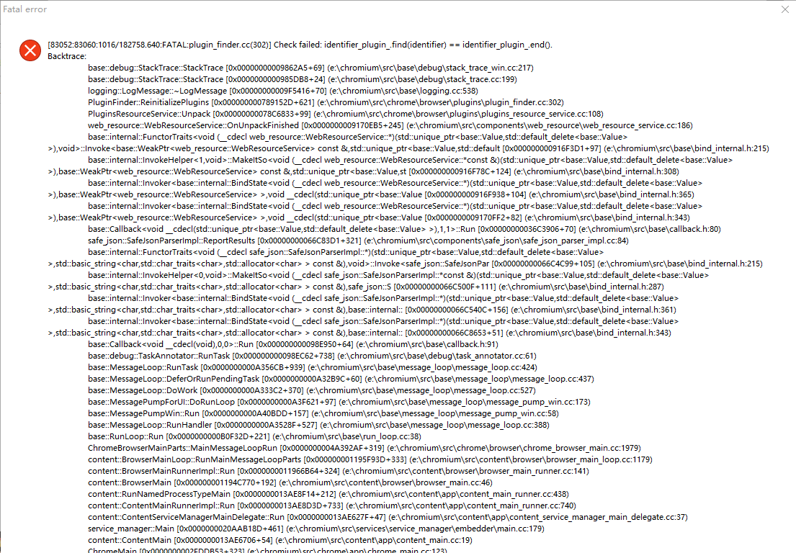

# Win10编译Chromium

**Author:wnagzihxa1n
E-Mail:wnagzihxa1n@gmail.com**

之前写过一篇在Linux下编译Chromium的文章，本文是在Windows下进行编译的，大致思路相同，但是部分操作以及环境变量配置不同

- 系统：Win10
- 编译器：Visual Studio 2017

## 0x00 获取源码
首先依旧是从下面这个地址下载所需版本的Chromium源码压缩包
- https://github.com/zcbenz/chromium-source-tarball/releases

我们这里以`59.0.3071.104`版本为例进行描述
- https://github.com/zcbenz/chromium-source-tarball/releases/download/59.0.3071.104/chromium-59.0.3071.104.tar.xz

下载完成后，我们去查询该版本Chromium对应的V8版本
- https://omahaproxy.appspot.com/

查询到对应的V8版本为`5.9.211.35`
```
Commit: 98a3a7375652f76d056123496d91a1acc9dc819e
Branch Base Commit: a106f0abbf69dad349d4aaf4bcc4f5d376dd2377
Branch Base Position: 464641
V8 Commit: c7fae8b9e56616d71d4f6d5c6160a75c52900ffa
V8 Version: 5.9.211.35
V8 Position: 74
Skia Commit: ef6f9c65527412ec4057ea0551f2e051beb94d32
```

到下面这个地址去下载对应版本的V8源码
- https://chromium.googlesource.com/v8/v8/+refs

本次需要下载的地址如下，点击页面的`[tgz]`即可下载
https://chromium.googlesource.com/v8/v8/+/c7fae8b9e56616d71d4f6d5c6160a75c52900ffa

此时我们已经有了Chromium和V8的源码，创建一个文件夹，命名为CHROMIUM，进入创建两个文件，这两个文件需要在Linux下面创建：`.gclient`和`.gclient_entries`

第一个文件内容
```
solutions = [
  {
    "url": "https://chromium.googlesource.com/chromium/src.git",
    "managed": False,
    "name": "src",
    "custom_deps": {
        "src/webkit/data/layout_tests/LayoutTests":None,
        "src/third_party/WebKit/LayoutTests":None,
    },
  },
]
```

第二个文件内容
```
entries = {
  'src': 'https://chromium.googlesource.com/chromium/src.git',
  'src/breakpad/src': 'https://chromium.googlesource.com/breakpad/breakpad/src.git@2dadd64db9965d8a621d52712abe95f96c4a1e0a',
  'src/buildtools': 'https://chromium.googlesource.com/chromium/buildtools.git@991f459071f96102b7bcb5fb5db6757b52d4238f',
  'src/chrome/test/data/perf/canvas_bench': 'https://chromium.googlesource.com/chromium/canvas_bench.git@a7b40ea5ae0239517d78845a5fc9b12976bfc732',
  'src/chrome/test/data/perf/frame_rate/content': 'https://chromium.googlesource.com/chromium/frame_rate/content.git@c10272c88463efeef6bb19c9ec07c42bc8fe22b9',
  'src/media/cdm/api': 'https://chromium.googlesource.com/chromium/cdm.git@6a62dcef02523e2d5be4defb68a7d9363c7389d2',
  'src/native_client': 'https://chromium.googlesource.com/native_client/src/native_client.git@163dfeb43e76995b4265ecd4e78670f7dd432e44',
  'src/sdch/open-vcdiff': 'https://chromium.googlesource.com/external/github.com/google/open-vcdiff.git@2b9bd1fe548520e9355e457a134bab7e2f9c56c0',
  'src/testing/gmock': 'https://chromium.googlesource.com/external/googlemock.git@0421b6f358139f02e102c9c332ce19a33faf75be',
  'src/testing/gtest': 'https://chromium.googlesource.com/external/github.com/google/googletest.git@6f8a66431cb592dad629028a50b3dd418a408c87',
  'src/third_party/SPIRV-Tools/src': 'https://chromium.googlesource.com/external/github.com/KhronosGroup/SPIRV-Tools.git@9166854ac93ef81b026e943ccd230fed6c8b8d3c',
  'src/third_party/angle': 'https://chromium.googlesource.com/angle/angle.git@a4aaa2de57dc51243da35ea147d289a21a9f0c49',
  'src/third_party/bidichecker': 'https://chromium.googlesource.com/external/bidichecker/lib.git@97f2aa645b74c28c57eca56992235c79850fa9e0',
  'src/third_party/bison': 'https://chromium.googlesource.com/chromium/deps/bison.git@083c9a45e4affdd5464ee2b224c2df649c6e26c3',
  'src/third_party/boringssl/src': 'https://boringssl.googlesource.com/boringssl.git@e1cc35e581a6d42f618d8c783f36faebc6023bb7',
  'src/third_party/catapult': 'https://chromium.googlesource.com/external/github.com/catapult-project/catapult.git@81f71e551ef237558bda54ba8f84509e1a36977a',
  'src/third_party/ced/src': 'https://chromium.googlesource.com/external/github.com/google/compact_enc_det.git@9012c0ab648025dd0f8df14294bf5d6d73793ac9',
  'src/third_party/cld_2/src': 'https://chromium.googlesource.com/external/github.com/CLD2Owners/cld2.git@84b58a5d7690ebf05a91406f371ce00c3daf31c0',
  'src/third_party/cld_3/src': 'https://chromium.googlesource.com/external/github.com/google/cld_3.git@ae02d6b8a2af41e87c956c7c7d3f651a8b7b9e79',
  'src/third_party/colorama/src': 'https://chromium.googlesource.com/external/colorama.git@799604a1041e9b3bc5d2789ecbd7e8db2e18e6b8',
  'src/third_party/cygwin': 'https://chromium.googlesource.com/chromium/deps/cygwin.git@c89e446b273697fadf3a10ff1007a97c0b7de6df',
  'src/third_party/dom_distiller_js/dist': 'https://chromium.googlesource.com/external/github.com/chromium/dom-distiller-dist.git@241e65eb93dd3e0dec2e0d3e0e0cac7a0e74e82c',
  'src/third_party/ffmpeg': 'https://chromium.googlesource.com/chromium/third_party/ffmpeg.git@4c35fe00477f20343294cc5827cc5abab6c005fd',
  'src/third_party/flac': 'https://chromium.googlesource.com/chromium/deps/flac.git@d0c35f878ec26f969c1631350b1d36fbd88ad8bb',
  'src/third_party/flatbuffers/src': 'https://chromium.googlesource.com/external/github.com/google/flatbuffers.git@e92ae5199d52fd59540a800bec7eef46cd778257',
  'src/third_party/glslang/src': 'https://chromium.googlesource.com/external/github.com/google/glslang.git@210c6bf4d8119dc5f8ac21da2d4c87184f7015e0',
  'src/third_party/gnu_binutils': 'https://chromium.googlesource.com/native_client/deps/third_party/gnu_binutils.git@f4003433b61b25666565690caf3d7a7a1a4ec436',
  'src/third_party/gperf': 'https://chromium.googlesource.com/chromium/deps/gperf.git@d892d79f64f9449770443fb06da49b5a1e5d33c1',
  'src/third_party/hunspell_dictionaries': 'https://chromium.googlesource.com/chromium/deps/hunspell_dictionaries.git@dc6e7c25bf47cbfb466e0701fd2728b4a12e79d5',
  'src/third_party/icu': 'https://chromium.googlesource.com/chromium/deps/icu.git@85817893162f4fdcc30ccdd288d43540d4a2b358',
  'src/third_party/jsoncpp/source': 'https://chromium.googlesource.com/external/github.com/open-source-parsers/jsoncpp.git@f572e8e42e22cfcf5ab0aea26574f408943edfa4',
  'src/third_party/leveldatabase/src': 'https://chromium.googlesource.com/external/leveldb.git@a7bff697baa062c8f6b8fb760eacf658712b611a',
  'src/third_party/libFuzzer/src': 'https://chromium.googlesource.com/chromium/llvm-project/llvm/lib/Fuzzer.git@2ed967ccadb496a1e916d9bd33a41386900dfb6a',
  'src/third_party/libaddressinput/src': 'https://chromium.googlesource.com/external/libaddressinput.git@4d18a0d4be9add0dc479e7b939ed8d39f6ec0d73',
  'src/third_party/libjpeg_turbo': 'https://chromium.googlesource.com/chromium/deps/libjpeg_turbo.git@7260e4d8b8e1e40b17f03fafdf1cd83296900f76',
  'src/third_party/libphonenumber/dist': 'https://chromium.googlesource.com/external/libphonenumber.git@a4da30df63a097d67e3c429ead6790ad91d36cf4',
  'src/third_party/libsrtp': 'https://chromium.googlesource.com/chromium/deps/libsrtp.git@0e0936f3013fe5884eac82f95e370c8d460a179f',
  'src/third_party/libvpx/source/libvpx': 'https://chromium.googlesource.com/webm/libvpx.git@3219aac9dfb0a087c9e79c02ebe4704b97769c8c',
  'src/third_party/libwebm/source': 'https://chromium.googlesource.com/webm/libwebm.git@9a235e0bc94319c5f7184bd69cbe5468a74a025c',
  'src/third_party/libyuv': 'https://chromium.googlesource.com/libyuv/libyuv.git@97fb18b846c52ef3596763184cf1f2686eed5f3c',
  'src/third_party/lighttpd': 'https://chromium.googlesource.com/chromium/deps/lighttpd.git@9dfa55d15937a688a92cbf2b7a8621b0927d06eb',
  'src/third_party/mesa/src': 'https://chromium.googlesource.com/chromium/deps/mesa.git@ef811c6bd4de74e13e7035ca882cc77f85793fef',
  'src/third_party/mingw-w64/mingw/bin': 'https://chromium.googlesource.com/native_client/deps/third_party/mingw-w64/mingw/bin.git@3cc8b140b883a9fe4986d12cfd46c16a093d3527',
  'src/third_party/nacl_sdk_binaries': 'https://chromium.googlesource.com/chromium/deps/nacl_sdk_binaries.git@759dfca03bdc774da7ecbf974f6e2b84f43699a5',
  'src/third_party/openh264/src': 'https://chromium.googlesource.com/external/github.com/cisco/openh264@0fd88df93c5dcaf858c57eb7892bd27763f0f0ac',
  'src/third_party/openmax_dl': 'https://chromium.googlesource.com/external/webrtc/deps/third_party/openmax.git@57d33bee7823e76393692f8d58e0478d6b79d153',
  'src/third_party/pdfium': 'https://pdfium.googlesource.com/pdfium.git@75c2af49705f99267ef74e742d536c7327aeb452',
  'src/third_party/pefile': 'https://chromium.googlesource.com/external/pefile.git@72c6ae42396cb913bcab63c15585dc3b5c3f92f1',
  'src/third_party/perl': 'https://chromium.googlesource.com/chromium/deps/perl.git@ac0d98b5cee6c024b0cffeb4f8f45b6fc5ccdb78',
  'src/third_party/psyco_win32': 'https://chromium.googlesource.com/chromium/deps/psyco_win32.git@f5af9f6910ee5a8075bbaeed0591469f1661d868',
  'src/third_party/py_trace_event/src': 'https://chromium.googlesource.com/external/py_trace_event.git@dd463ea9e2c430de2b9e53dea57a77b4c3ac9b30',
  'src/third_party/pyftpdlib/src': 'https://chromium.googlesource.com/external/pyftpdlib.git@2be6d65e31c7ee6320d059f581f05ae8d89d7e45',
  'src/third_party/pywebsocket/src': 'https://chromium.googlesource.com/external/github.com/google/pywebsocket.git@2d7b73c3acbd0f41dcab487ae5c97c6feae06ce2',
  'src/third_party/re2/src': 'https://chromium.googlesource.com/external/github.com/google/re2.git@dba3349aba83b5588e85e5ecf2b56c97f2d259b7',
  'src/third_party/scons-2.0.1': 'https://chromium.googlesource.com/native_client/src/third_party/scons-2.0.1.git@1c1550e17fc26355d08627fbdec13d8291227067',
  'src/third_party/sfntly/src': 'https://chromium.googlesource.com/external/github.com/googlei18n/sfntly.git@64f78562d2003eb7cacaaa86a398cbd41881ba6f',
  'src/third_party/shaderc/src': 'https://chromium.googlesource.com/external/github.com/google/shaderc.git@cd8793c34907073025af2622c28bcee64e9879a4',
  'src/third_party/skia': 'https://skia.googlesource.com/skia.git@dd45f8195783efc7b8044b006eae5ea5ac127cc2',
  'src/third_party/smhasher/src': 'https://chromium.googlesource.com/external/smhasher.git@e87738e57558e0ec472b2fc3a643b838e5b6e88f',
  'src/third_party/snappy/src': 'https://chromium.googlesource.com/external/snappy.git@762bb32f0c9d2f31ba4958c7c0933d22e80c20bf',
  'src/third_party/swiftshader': 'https://swiftshader.googlesource.com/SwiftShader.git@a6e99c02de6162a6a55f5de3d42c2e8c190cf3f2',
  'src/third_party/usrsctp/usrsctplib': 'https://chromium.googlesource.com/external/github.com/sctplab/usrsctp@7f9228152ab3d70e6848cc9c67389a0d4218740e',
  'src/third_party/visualmetrics/src': 'https://chromium.googlesource.com/external/github.com/WPO-Foundation/visualmetrics.git@1edde9d2fe203229c895b648fdec355917200ad6',
  'src/third_party/webdriver/pylib': 'https://chromium.googlesource.com/external/selenium/py.git@5fd78261a75fe08d27ca4835fb6c5ce4b42275bd',
  'src/third_party/webgl/src': 'https://chromium.googlesource.com/external/khronosgroup/webgl.git@d12037a99155a7d884845759d0f7461c3e12ac96',
  'src/third_party/webpagereplay': 'https://chromium.googlesource.com/external/github.com/chromium/web-page-replay.git@3cd3a3f6f06a1b87b14b9162c7eb16d23d141241',
  'src/third_party/webrtc': 'https://chromium.googlesource.com/external/webrtc/trunk/webrtc.git@f141d331e4a42bfd7755cf8011b9c2220718a723',
  'src/third_party/yasm/binaries': 'https://chromium.googlesource.com/chromium/deps/yasm/binaries.git@52f9b3f4b0aa06da24ef8b123058bb61ee468881',
  'src/third_party/yasm/source/patched-yasm': 'https://chromium.googlesource.com/chromium/deps/yasm/patched-yasm.git@7da28c6c7c6a1387217352ce02b31754deb54d2a',
  'src/tools/gyp': 'https://chromium.googlesource.com/external/gyp.git@e7079f0e0e14108ab0dba58728ff219637458563',
  'src/tools/page_cycler/acid3': 'https://chromium.googlesource.com/chromium/deps/acid3.git@6be0a66a1ebd7ebc5abc1b2f405a945f6d871521',
  'src/tools/swarming_client': 'https://chromium.googlesource.com/external/swarming.client.git@ebc8dab6f8b8d79ec221c94de39a921145abd404',
  'src/v8': 'https://chromium.googlesource.com/v8/v8.git@93947afa548945132d5069544f881257d36df5f8',
  'src\\buildtools\\clang_format\\script': 'https://chromium.googlesource.com/chromium/llvm-project/cfe/tools/clang-format.git@6a413e91d56d6fd0a6ff2f97c905c6dc5ca5d789',
  'src\\buildtools\\third_party\\libc++\\trunk': 'https://chromium.googlesource.com/chromium/llvm-project/libcxx.git@b1ece9c037d879843b0b0f5a2802e1e9d443b75a',
  'src\\buildtools\\third_party\\libc++abi\\trunk': 'https://chromium.googlesource.com/chromium/llvm-project/libcxxabi.git@0edb61e2e581758fc4cd4cd09fc588b3fc91a653',
}
```

然后解压缩Chromium的源码，因为是`.tar.xz`，所以需要解压两次，把解压出来的`chromium-59.0.3071.104`，放到CHROMIUM下，并重命名为`src`文件夹，相对的路径像这样`CHROMIUM\src\android_webview`

之所以需要下载V8的源码是因为我们下载的Chromium缺少文件，用我们单独下载的V8这个目录的文件`v8-5.9.211.35\test`覆盖Chromium的对应文件`CHROMIUM\src\v8\test`

进入src目录，将当前src文件夹初始化为一个git工程，这一点很重要，不初始化的话后续执行会报错
```
E:\CHROMIUM\src>git init
```

## 0x01 搭建梯子
源码准备好后，我们开始搭梯子

依旧是ss，代理为本地`127.0.0.1:1080`，给git配置本地代理，注意务必如下执行，不要将`localhost`换成`127.0.0.1`
```
git config --global https.proxy 'http://localhost:1080'
```

下载`dopot_tools`
```
E:\>git clone https://chromium.googlesource.com/chromium/tools/depot_tools.git
```

将`depot_tools`的路径写入环境变量`Path`，并且放在第一位

## 0x02 配置编译环境
添加以下环境变量
```
DEPOT_TOOLS_WIN_TOOLCHAIN = 0
GYP_MSVS_VERSION = 2017
GYP_MSVS_OVERRIDE_PATH = D:\Program Files (x86)\Microsoft Visual Studio\2017\Community
```

## 0x03 编译
常规情况下，编译过程是比较痛苦的，我在编译的时候，结合了网上一些解决方案，同时自己研究了一些错误原因，按照我下面的步骤编译，应该可以少走很多弯路

我遇到的第一个问题就是`gs://无法下载`
```
> Error: Command download_from_google_storage --no_resume --platform=win32 --no_auth --bucket chromium-gn -s src/buildtools/win/gn.exe.sha1 returned non-zero exit status 1 
```

这个问题可以手动解决，直接通过浏览器下载对应的文件就行，拼接的方式很简单，比如我们现在需要下载`gn.exe`(从报错信息里看当前下载的是什么)，在`CHROMIUM\src\DEPS`进行搜索，根据下面的信息，我们可以拼接出一个路径`https://storage.googleapis.com/chromium-gn/`，前面是固定的，`chromium-gn`是根据`'--bucket`后面那个字段来确定的，最后还有一个字段的值，需要根据文本`src/buildtools/win/gn.exe.sha1`来确定，找到指定路径的文本，里面有一串字母，取出拼接到最后：`https://storage.googleapis.com/chromium-gn/9ee641a7a6a547727524969a15d15d877d4096f6`，通过浏览器访问，即可下载到一个文件，重命名为`gn.exe`，放到`src/buildtools/win/gn.exe.sha1`同目录下即可
```
{
    'action': [
      'download_from_google_storage',
      '--no_resume',
      '--platform=win32',
      '--no_auth',
      '--bucket',
      'chromium-gn',
      '-s',
      'src/buildtools/win/gn.exe.sha1'
    ],
    'pattern':
      '.',
    'name':
      'gn_win'
},
```

第二个问题就是更新clang的时候会一直卡住，我们修改源码
- CHROMIUM\src\tools\clang\scripts\update.py

拉到源码最后面，直接`pass`
```
if __name__ == '__main__':
  pass
  # sys.exit(main())
```

第三个问题是警告被当做错误，导致编译中断，在编译了19000+个文件的时候，出现了中断
```
e:\chromium\src\content\renderer\render_thread_impl.h(797): error C2220: 警告被视为错误 - 没有生成“object”文件
```

因为Chromium编译出现的任何警告都会被当做错误，所以我们需要在编译前修改一个编译选项，使用一个拥有全局搜索文本替换的工具打开`out\Default`文件夹，全局搜索` /WX `，前后的空格别忘了，因为这个是配置参数，前后有空格，搜索完毕后，替换成一个空格` `，一定记得至少一个空格，不然原本的命令行俩参数合在一起就会报错了

第四个问题是不支持的MSVC版本，编译到最后的时候，出现了一个版本不支持的错误
```
e:\chromium\src\chrome\browser\ui\webui\version_ui.cc(156): fatal error C1189: #error:  "Unsupported version of MSVC."
```

我们找到对应的文件，看到有这么一段，进行修改，强行进行支持
```
#if defined(OS_WIN)
#if defined(__clang__)
  html_source->AddString(version_ui::kCompiler, "clang");
#elif defined(_MSC_VER) && _MSC_VER == 1900
#if BUILDFLAG(PGO_BUILD)
  html_source->AddString(version_ui::kCompiler, "MSVC 2015 (PGO)");
#else
  html_source->AddString(version_ui::kCompiler, "MSVC 2015");
#endif
#elif defined(_MSC_VER) && _MSC_VER == 1910
#if BUILDFLAG(PGO_BUILD)
  html_source->AddString(version_ui::kCompiler, "MSVC 2017 (PGO)");
#else
  html_source->AddString(version_ui::kCompiler, "MSVC 2017");
#endif
#elif defined(_MSC_VER)
  html_source->AddString(version_ui::kCompiler, "MSVC 2017"); // 我们修改的代码
#else
  html_source->AddString(version_ui::kCompiler, "Unknown");
#endif
```

第五个问题是`syzygy`，这个依旧是手动下载，然后解压到`CHROMIUM\src\third_party\syzygy\binaries`，根据`swapimport.exe`这个文件的位置来构造即可，同时需要修改`CHROMIUM\src\build\win\reorder-imports.py`的一句代码，让其指向我们的`swapimport.exe`
```
swap_exe = os.path.join(__file__, '..\\..\\..\\third_party\\syzygy\\binaries\\swapimport.exe')
```

准备好上面的几个问题后，我们开始运行，遇到错误按照我上面的方法解决就行
```
E:\CHROMIUM\src>gclient runhooks
```

生成ninja编译文件
```
E:\CHROMIUM\src>gn gen out\Default
```

进行编译
```
E:\CHROMIUM\src>ninja -C out\Default chrome
```

最后生成chrome.exe二进制文件

## 后续报错处理
生成的chrome.exe在`src\out\Default\chrome.exe`，运行后一小会儿就会报错崩溃



根据报错找到对应的文件
```
for (base::DictionaryValue::Iterator plugin_it(*plugin_list);
      !plugin_it.IsAtEnd(); plugin_it.Advance()) {
    const base::DictionaryValue* plugin = NULL;
    const std::string& identifier = plugin_it.key();
    if (plugin_list->GetDictionaryWithoutPathExpansion(identifier, &plugin)) {
      // DCHECK(identifier_plugin_.find(identifier) == identifier_plugin_.end());
      identifier_plugin_[identifier] = CreatePluginMetadata(identifier, plugin);

      if (installers_.find(identifier) == installers_.end())
        installers_[identifier] = base::MakeUnique<PluginInstaller>();
    }
}
```

如果还有错都可以像上面这样进行处理

目前这种方法仅能保证Debug版本编译成功，我和其他师傅讨论发现了一些还未解决的问题：
1. 无法编译生成Release版本，不确定是环境问题还是该方法本身问题
2. Debug版本下断点异常，调试异常困难
3. WinDbg加载符号有问题，不加载私有符号目录

如果各位师傅对这些问题有好的解决方法，欢迎联系，邮箱在最上面，也可以和我们一起学习浏览器安全相关知识